# Lec.1 引言

> **_Introduction_**
>
> Lecture @ 2026-3-30

## 课程安排

- 每周三个课时的 Lecture
- 一共四个 Lab，占比 $15\%$
  - 电路参数测量，PWM 生成器
  - 整流电路
  - DC-DC 变换器
  - 单相 PWM 逆变器
- 在 Moodle 上有课件，作业和答案
  - 作业占比 $10\%$
- 最终有期末考试，占比 $75\%$

## 所谓 “电”

电网可能是 1896 年以来最大的机器。它分作两种形式：直流电 (Direct Current, DC) 和交流电 (Alternating Current, AC)。他们分别有不同的使用场景。许多设备在直流电下才正常运行，而交流电在传输时解决方案更简单——直接使用变压器 (Transformer) 就可以改变电压，使用高压传输，减小损耗。变压器和多相交流电机是交流电的两大优势。

电网传输过程主要是这样的过程：

- 发电厂使用发电机产生交流电，
- 经过变压器转化成适合长距离运输的高压交流点，
- 通过电网分发到不同终端，
- 直到用户负载处转换成特定的电压、频率、波形和相数。

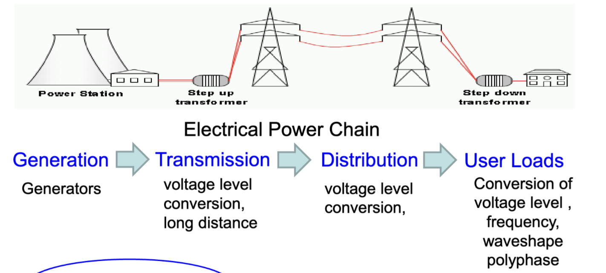

用户端的各个参数有不同的标准，如

- 中国 220V 50Hz
- 英国 230V/240V 50Hz
- 美国 120V/240V 60Hz

## 电力转换器

电力转换器 (Power Converter) 可以看作是一个黑盒，它的作用是把电力从一种形式转换成另一种形式。这里的形式包括

- 电力类型
  - 直流电
  - 交流电
- 电力形式
  - 电压等级
  - 频率
  - 波形
  - 相数

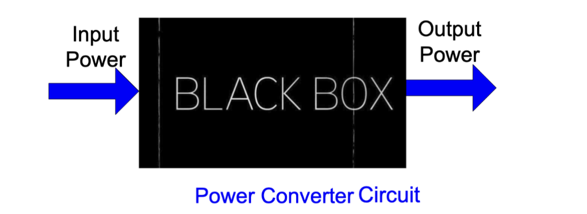

通常，我们认为一共有四种基本的电力转换：

- DC-DC 转换
  - 输入是直流电，输出也是直流电
- AC-DC 转换
  - 输入是交流电，输出是直流电
- DC-AC 转换
  - 输入是直流电，输出是交流电
- AC-AC 转换
  - 输入是交流电，输出也是交流电

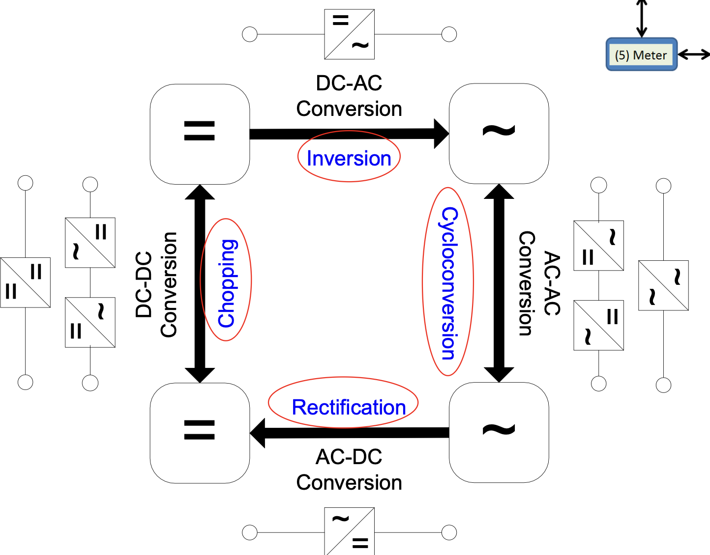

### 传统电力转换器

传统的转换器大概有这么几种，常见的有

- 直流分压

  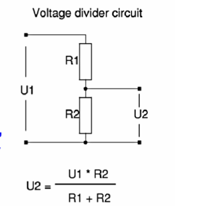

  适用于 DC-DC 转换，高功耗，低效率，只适用于降压

- 运算放大器

  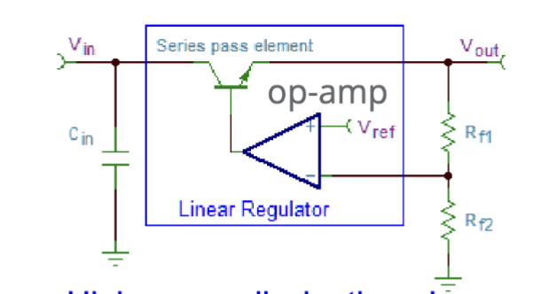

  高功率消耗，低效率，只适用于 DC-DC 降压

- 变压器

  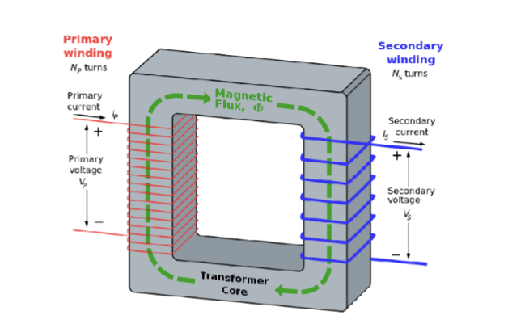

  只适用于 AC-AC 转换，体积大，重量大，效率较高

- AC-DC 转换

  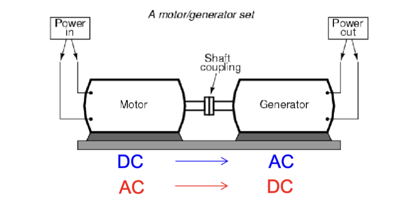

  适用于 AC-DC 双向转换

  有旋转机械结构，笨重，沉重，噪音大，响应慢，效率和可靠性不高

> 这个对比法是不是有点过分了

### 电力电子转换器

电力电子转换器是一种使用开关半导体来转换/处理电力的装置。

它的特点在于拥有相当高的效率，低发热，体积小，同时支持升压、降压，双向转换等功能。

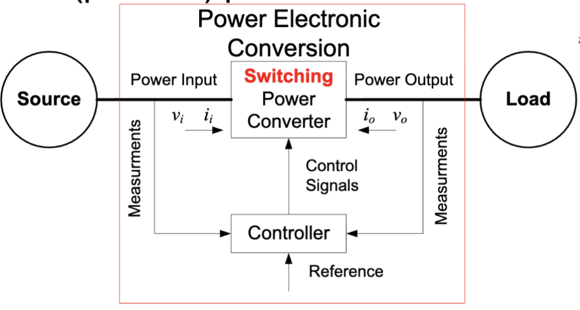

---

这是一个 DC-DC Buck 降压转换器的例子。输入的电源预期是 100V DC，输出预期是 50V 10A DC。

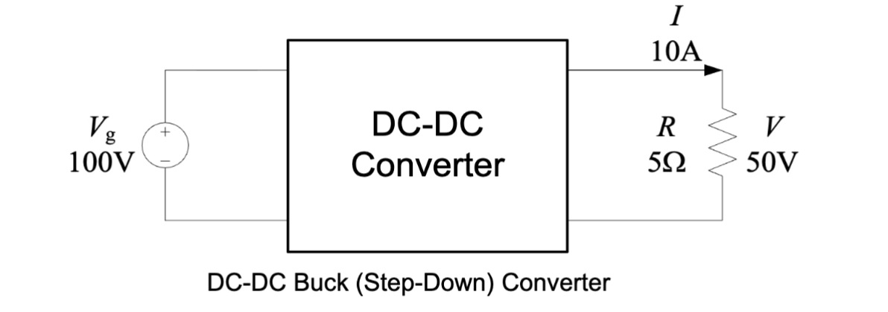

如果是非电力电子转换器，可能的实现可能是这样的

- **电阻分压**

  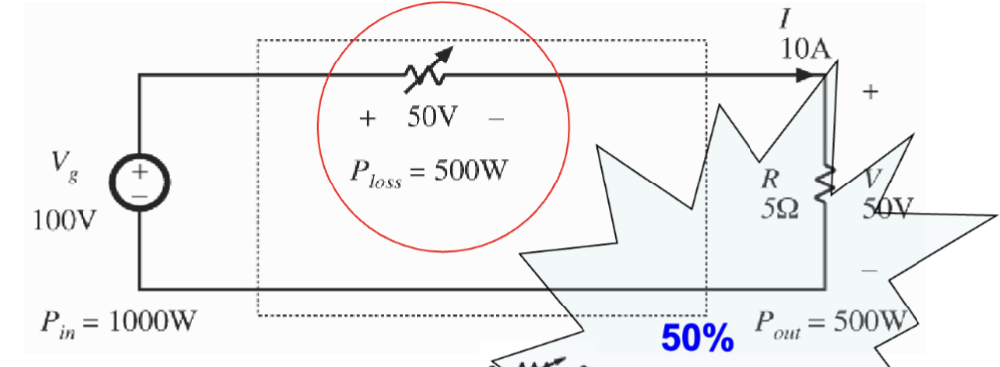

  在电路中串联一个和负载相同的电阻，来分压。

  缺点是效率低，发热大，有一半的功率都在电阻上消耗掉了。

  同时，这是一个开环系统，输出电压不稳定，无法适应负载变化。

- **线性稳压器**

  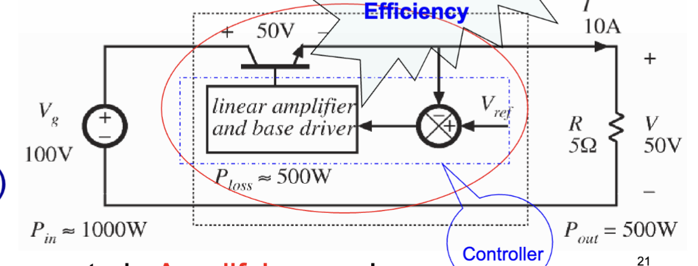

  原理是通过输出电压和运算放大器的参考电压比较，调整晶体管的导通程度来稳定输出电压。此时晶体管工作在放大模式

  这是一个闭环系统，输出电压稳定，但是效率仍然很低，发热大。

---

如果使用的是电力电子转换器，则方案是这样

- **开关电源转换器**

  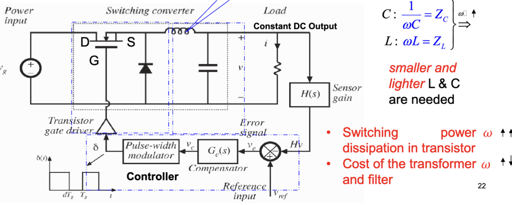

  开关电源的原理是通过开关元件（如晶体管）的快速切换来控制电流的流动，创造出一个 PWM 输出信号，然后使用 LC 低通滤波器来平滑输出电压，使其接近于理想的 DC 输出。

  理想的开关电源不消耗功率。

> 更具体的对比：相同输入输出参数的线性电源和开关电源
>
> 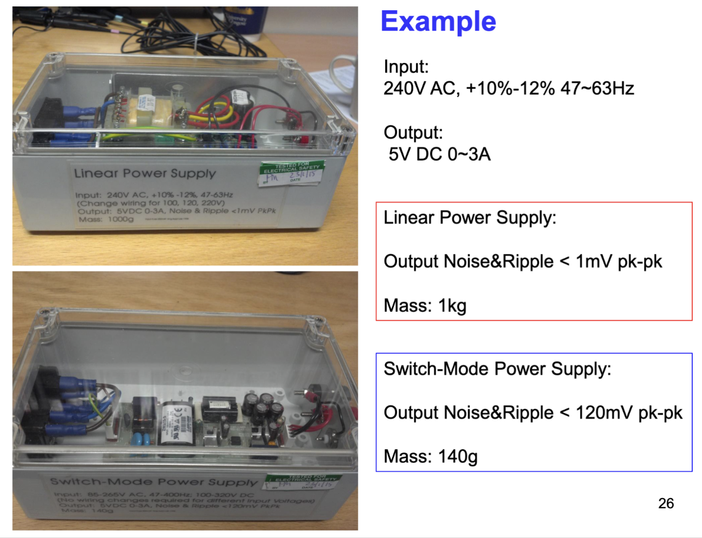
>
> 线性电源提供了小于 1mV 峰峰值的纹波电压，重量 1kg
>
> 开关电源提供了小于 120mV 峰峰值的纹波电压，重量 140g

---

更通用的来说，一个典型的电力电子电路的结构如图：

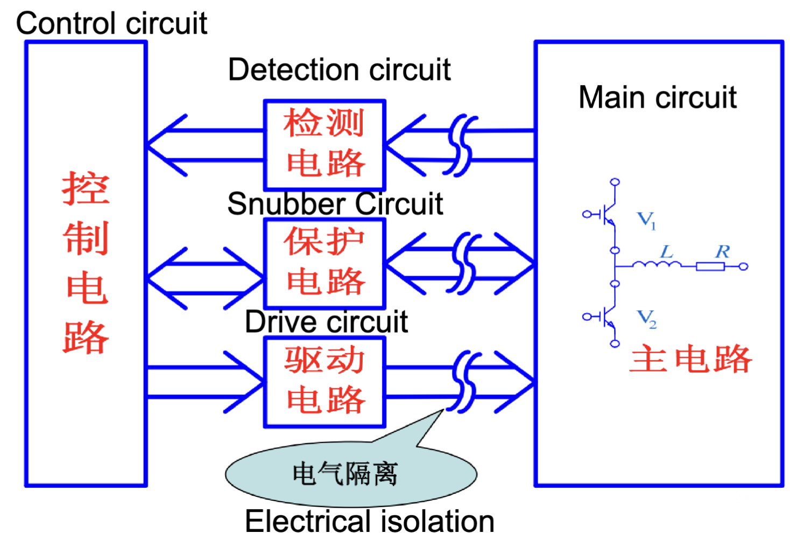

## 为什么需要电力电子？

和传统的电力转换器相比，电力电子转换器有着更加先进的特性，如

- 更高的效率
  - $>90%$，大型系统可达 $98\%$
- 更灵活的转换
  - 支持 DC-DC 升压/降压，AC-DC 双向转换，DC-AC 双向转换，AC-AC 转换等多种模式
- 高功率密度
  - 体积小，重量轻，适合便携式设备和空间受限的应用
- 高性能调节
  - 快速响应负载变化，提供稳定的输出电压和电流
- 静态且安静
  - 没有旋转机械部件，运行安静，维护需求低
- 可靠性高
  - 半导体器件在寿命内表现稳定，且没有机械磨损问题。
- 开关频率
  - 可以高达 1MHz，允许使用更小的滤波器组件，进一步减小体积和重量。
- 功率等级
  - 适用于从毫瓦到千兆瓦的各种功率等级，满足不同应用的需求。

---

因为这些优秀特性，电力电子已经在多种领域广泛引用了，如

- 自动化
- 工业
- 运输
- 能源
- 通信
- 家用/消费电子

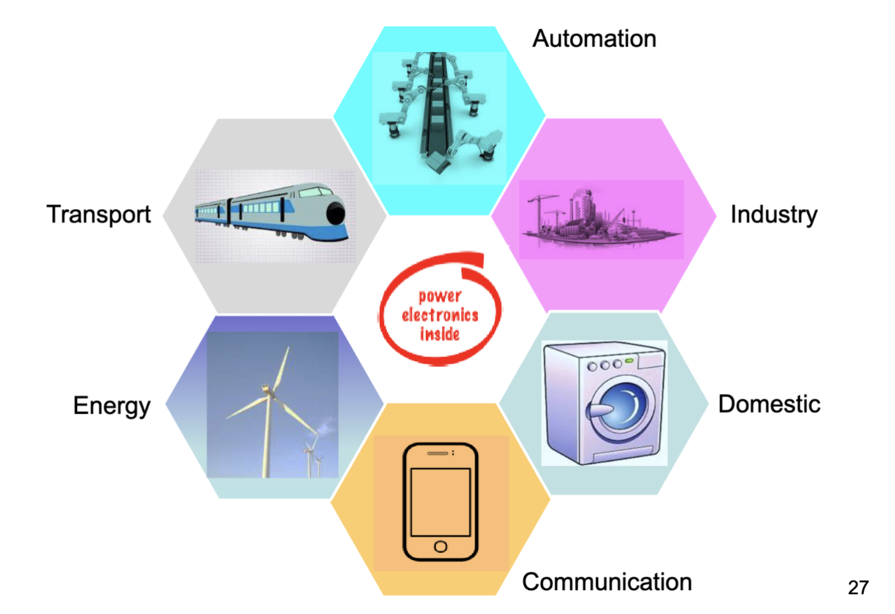

同时，在电力系统中，电力电子转换器用于提供必要的适配功能，将不同的微电网组件集成到共同的电网系统中。

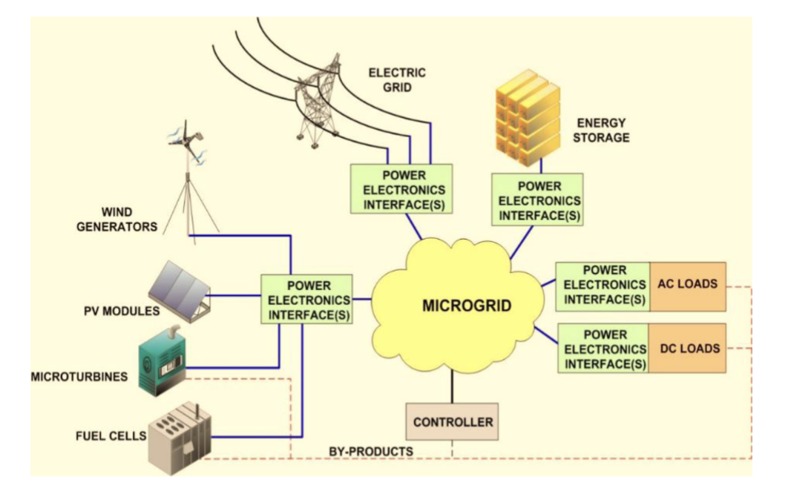

同时，在航空业也有使用。波音 787 的电力系统使用了多块锂离子电池供电。在 2013 年1月， JAL 的 787 发生锂电池起火，导致全球所有 787 的锂电池被召回，波音不得不重新设计电力系统，增加了电池的隔离和散热措施。

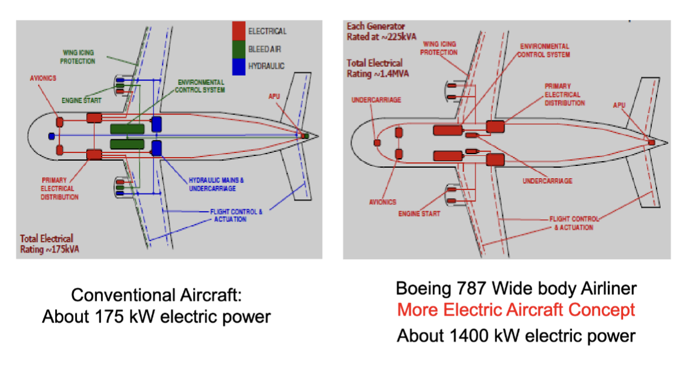

在驱逐舰上也有使用：英国皇家海军的 45 型驱逐舰使用了集成电力推进 (Integrated Electric Propulsion, IEP) 系统，所有的推进系统和电力负载都通过高压交流点供电，主推进电机提供了 20MW 的功率。

在全球市场上，电力电子产业直接占据 700 亿英镑，年增长率为 11%。

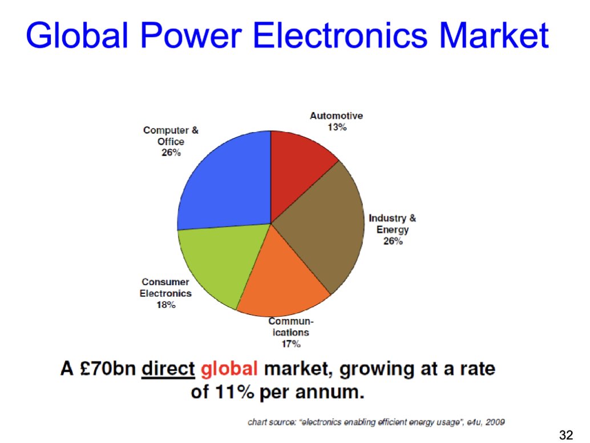

> 是的，还有苹果的事：
>
> 苹果在 Apple II 中使用了开关电源让重量明显减轻
>
> 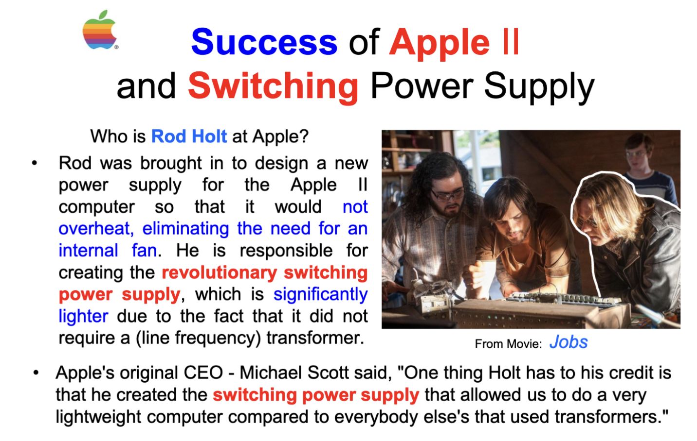

---

最后，电力电子有跨学科的特性。下图是 Newell 在 1970 年代提出的一个模型，展示了电力电子系统中不同学科之间的关系。

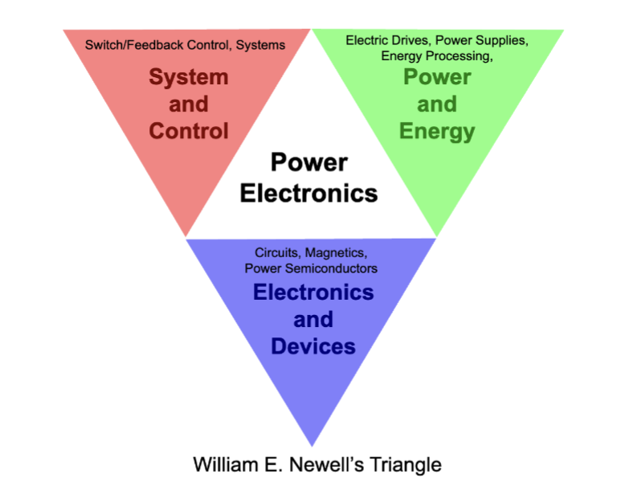

其中，三个顶点分别是

- 系统与控制 (Systems and Control)
  - 包括开关、控制、反馈等
- 电力与能源 (Power and Energy)
  - 包括电力驱动、电源、能量处理等
- 电子与器件 (Electronics and Devices)
  - 包括电路、磁学、功率半导体等

也就是整合了电力工程、电子学和控制理论三大领域的知识。
