# DC-AC 变换器 - I: 半桥逆变器

> **_DC-AC Converters (Inverters)_**
>
> Lecture @ 2026-5-18

## 逆变器

DC-AC 变换器被称为 **逆变器 (Inverter)**，它的作用是输入直流信号并输出交流信号。

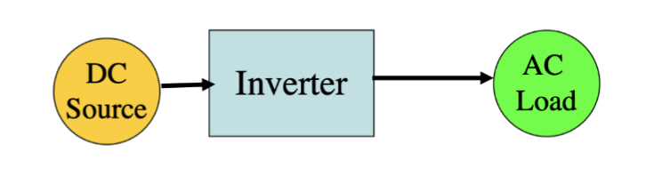

理想情况下，逆变器应该输出完美的正弦波，但是在实际场景下并不可能。最终输出的波是带有谐波的交流信号，但是这个对中低功率应用是可以接受的。

逆变器有两种主要类型：单相逆变器和三相逆变器，主要区别在于输出的交流信号的相数。

通常使用半导体器件构筑，基本构建模块是 **桥式电路 (Bridge Circuit)**

### 逆变器的类型

对于单相逆变器，常见的两种电路构型是 **半桥逆变器 (Half Bridge Inverter)** 和 **全桥逆变器 (Full Bridge Inverter)**。

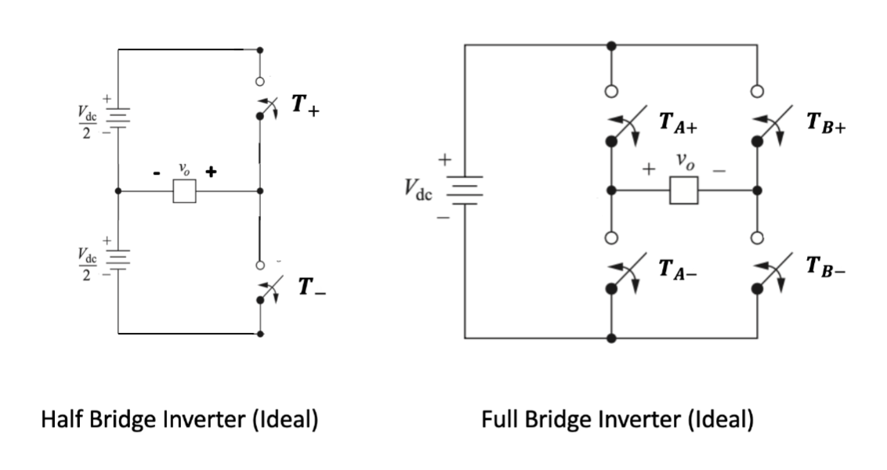

输出都是方波，使用脉宽调制来控制输出的交流信号。

---

三相逆变器则是 **3-桥臂 (3-Leg)** 结构，输出三相交流信号。

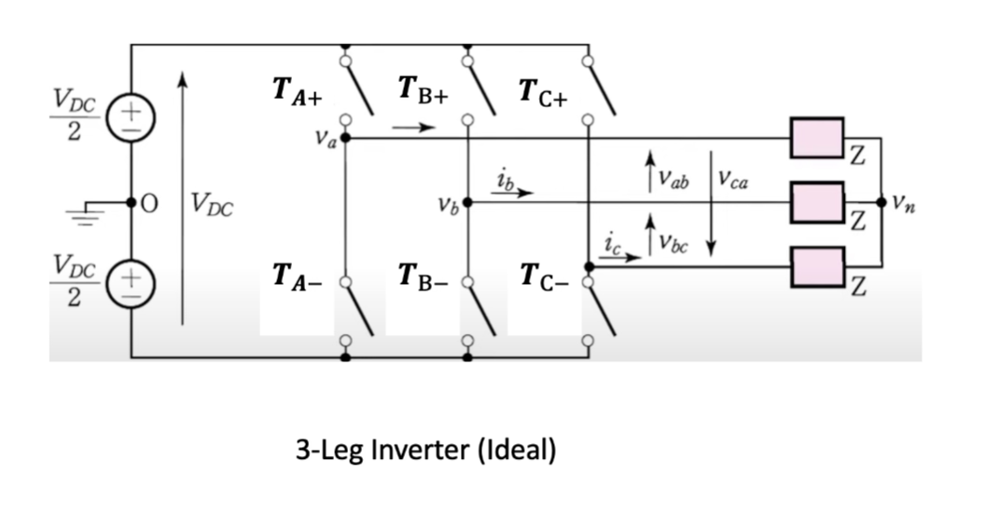

同样的，都是方波输出，使用脉宽调制来控制输出的交流信号。

## 半桥逆变器

### 原理

半桥逆变器由两个开关组成，分别是 $S_1$ 和 $S_2$，它们交替导通来产生交流输出。当 $S_1$ 导通时，输出电压为 $+V_{dc}/2$；当 $S_2$ 导通时，输出电压为 $-V_{dc}/2$。

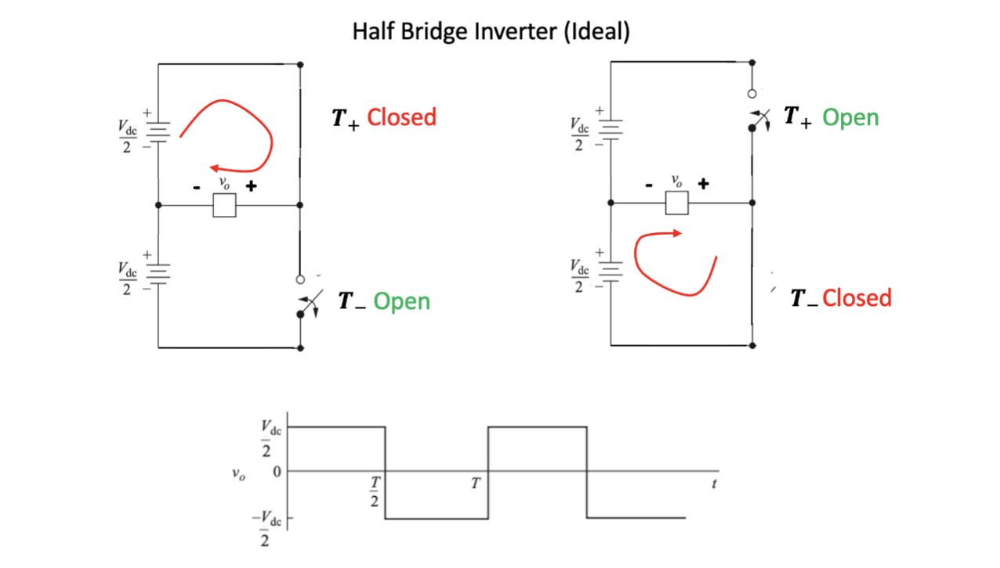

两个开关的导通时间并不像普通方波那样固定，而是通过 **脉宽调制 (PWM)** 来控制的。

脉宽调制主要使用两个信号：三角波信号 $v_{tri}$（频率 $f_s$，称为**开关频率 (Switching Frequency)**）和控制信号 $v_{control}$（频率 $f_1$，称为**期望基波频率 (Fundamental Frequency)**）。

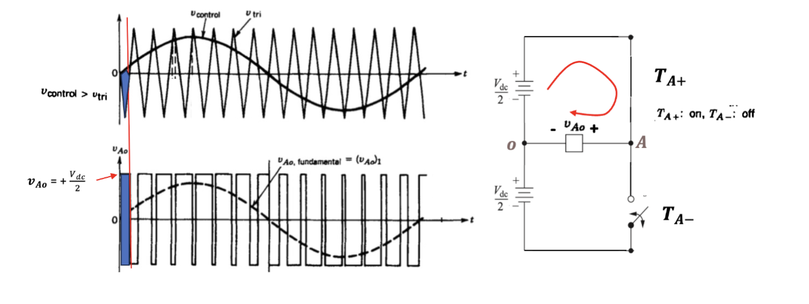

脉宽调制的原理是比较 $v_{tri}$ 和 $v_{control}$ 的大小关系来控制开关的导通。当 $v_{tri} > v_{control}$ 时，$S_2$ 导通；当 $v_{tri} < v_{control}$ 时，$S_1$ 导通。进而输出电压在正电压和负电压之间摆动。

### 谐波

我们期望逆变器输出纯正弦波，但实际上，无论是方波调制还是 PWM 调制，输出都不可能是一个纯正弦波，实际输出中会混入其他频率的正弦分量，其频率为基波频率的整数倍。这些成分被称为**谐波 (Harmonics)**，它们会引起系统的损耗和干扰。

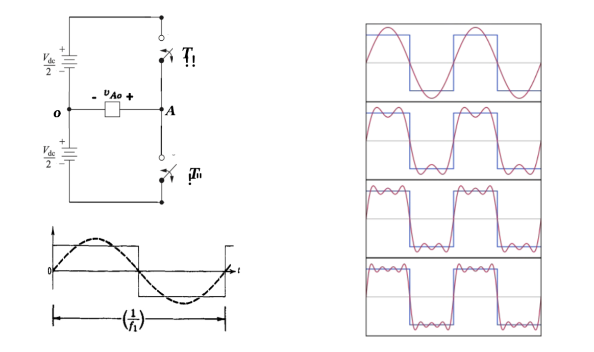

具体的谐波分量大小和频率可以使用周期信号的傅里叶级数展开来分析。

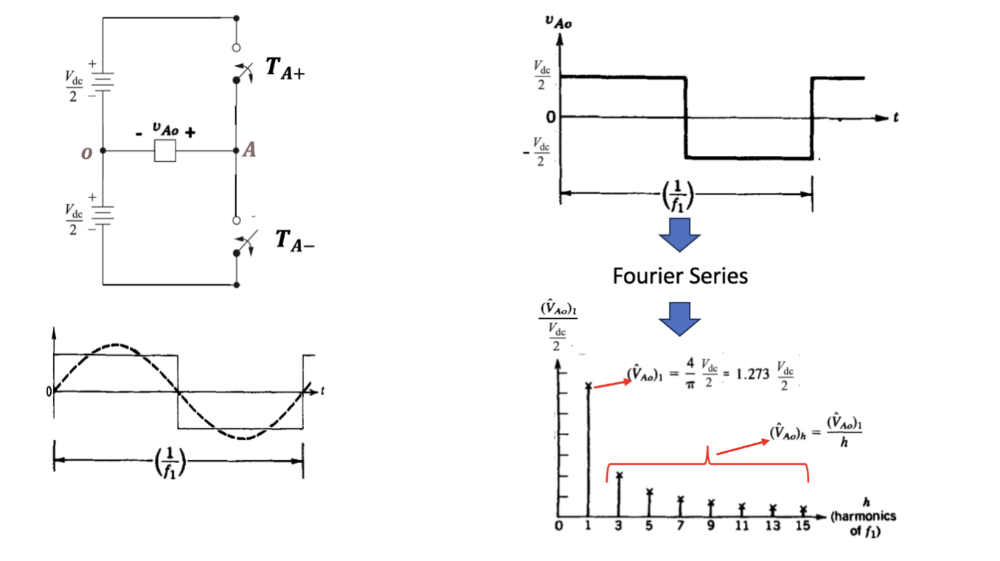

---

为了分析 PWM 开关中的谐波，我们需要引入两个新的概念：**幅度调制比例 (Amplitude Modulation Ratio)** 和 **频率调制比例 (Frequency Modulation Ratio)**。

- 幅度调制比例定义为

  $$
  m_a = \frac{\hat{V}_{control}}{\hat{V}_{tri}}
  $$

  其中， $\hat{V}_{control}$ 是控制信号的峰值，$\hat{V}_{tri}$ 是三角波信号的峰值。

- 频率调制比例定义为

  $$
  m_f = \frac{f_s}{f_1}
  $$

  其中，$f_s$ 是开关频率，$f_1$ 是期望基波频率。

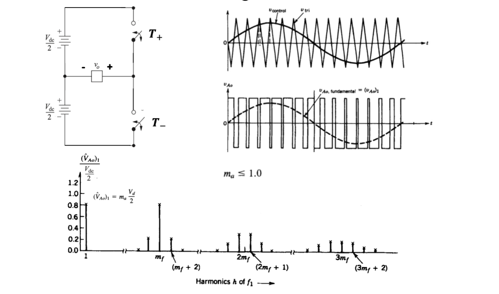

图为 PWM 调制输出电压的频谱分析。

- 在基波频率 $f_1$ 处有一个分量，幅值为 $m_a \cdot \frac{V_{dc}}{2}$。这是期望的输出信号。
- 谐波以边带的形式出现，集中在开关频率以及其倍数频率周围，也就是在 $n \cdot m_f$ 附近，其中 $n$ 是整数。谐波的幅值随着频率的增加而减小

理论上，电压谐波发生的频率可以表示为

$$
f_h = (j m_f \pm k) f_1
$$

其中，$j$ 和 $k$ 是整数。这个公式表明谐波频率是基波频率的整数倍加上或减去开关频率的整数倍。

类似的，谐波次数 $h$ 对应于 $j$ 倍频率调制比例 $m_f$ 的第 $k$ 个边带：

$$
h = j m_f \pm k
$$

从图中也可以看到，当 $j$ 为奇数时，谐波只在 $k$ 为偶数时存在；当 $j$ 为偶数时，谐波只在 $k$ 为奇数时存在。这是因为在 PWM 调制中，只有当 $j$ 和 $k$ 的奇偶性不同的时候，才会产生谐波分量。

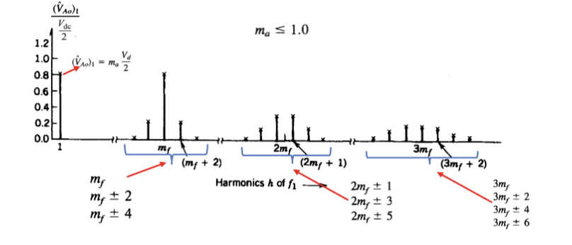

### 死区时间

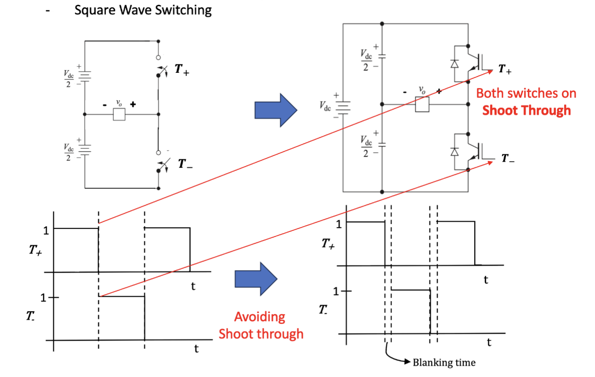

实际的半桥逆变器中，理想的开关使用实际的晶体管来实现。因为晶体管具有有限的开关时间，因此可能出现两个晶体管同时导通的情况 —— 这会直接导致 **直通 (Shoot Through)** ，也就是电源短路。

因此，为了避免直通和对应的事故，在开关过程中会有一段 **死区时间 (Blanking Time)**。在这段时间中两个开关都不导通，确保不会发生直通。

类似地，脉宽调制也存在同样的问题——如果只使用比较器和比较器的反相输出控制两个开关，那么在开关切换过程中也会出现直通的情况。因此，在实际的 PWM 控制中，也会有一个死区时间来避免这个问题。

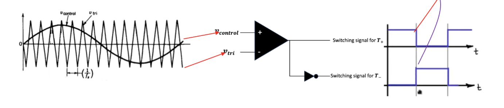

为了避免直通，仍然需要设置死区时间。

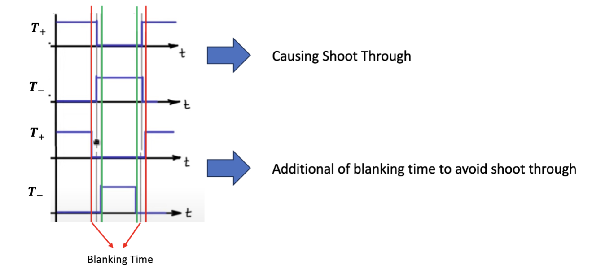

增加死区时间的一种方法是使用两个比较器，并且更改比较器的输入。两个比较器的三角波分别增加一个正向和一个负向的偏移量，这样就可以在比较器的输出中自然地形成死区时间。

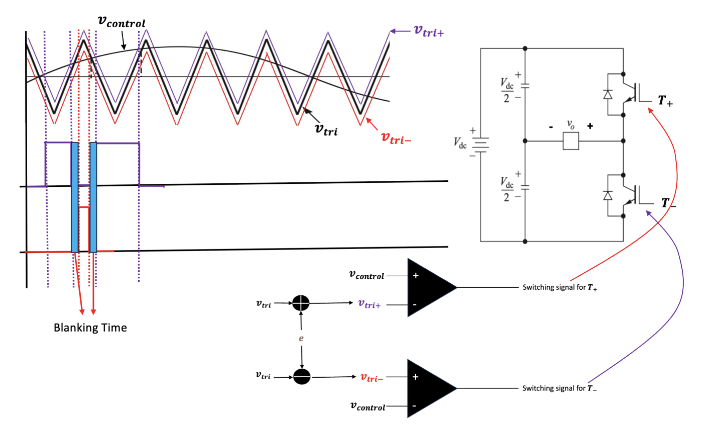
