# Lec.11 DC-AC 变换器 - II: 全桥逆变器

> **_DC-AC Converters (Inverters)_**
>
> Lecture @ 2026-5-19

## 全桥逆变器

### 原理

一个典型的全桥逆变器的电路图如下所示

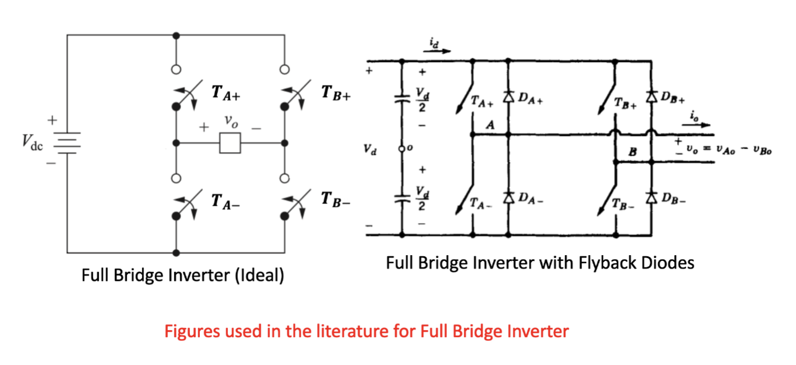

和半桥逆变器的结构类似，但是全桥逆变器有四个开关 $T_{A+}$、$T_{A-}$、$T_{B+}$ 和 $T_{B-}$，它们的导通方式如下：

- 当 $T_{A+}$ 和 $T_{B-}$ 导通时，输出电压为 $+V_{dc}$；
- 当 $T_{A-}$ 和 $T_{B+}$ 导通时，输出电压为 $-V_{dc}$；

另外两种是无效的导通状态

- 当 $T_{A+}$ 和 $T_{B+}$ 导通时，输出电压为 $0$，没有形成回路
- 当 $T_{A-}$ 和 $T_{B-}$ 导通时，输出电压为 $0$，没有形成回路

更实际的电路中还包含电容和续流二极管，用来平滑输出电压和提供续流路径。

### 方波输出和 PWM 输出

在实际运行中，逆变器工作在前两种工作状态中，交替输出 $+V_{dc}$ 和 $-V_{dc}$，从而实现交流方波的输出。

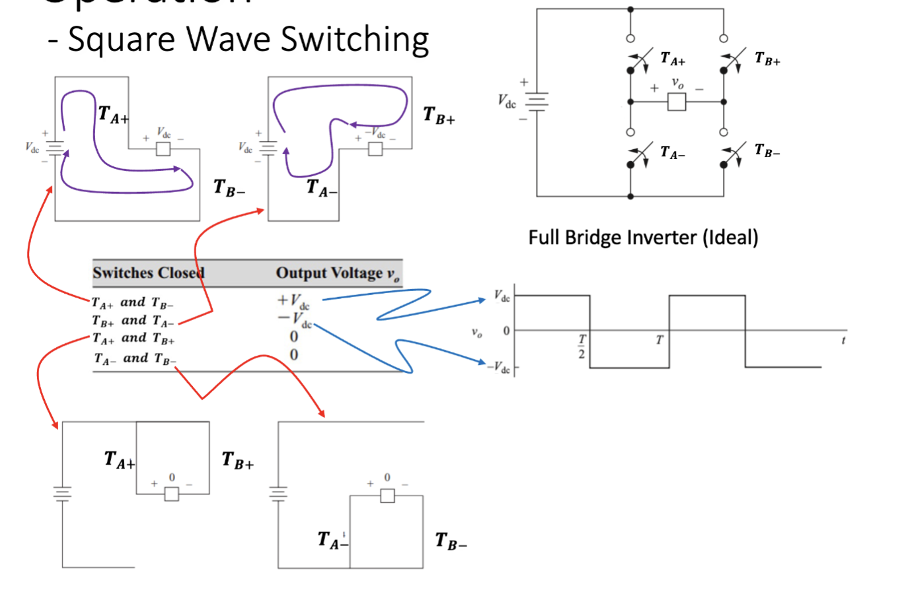

---

同样的，全桥逆变器也有 PWM 输出的模式，仍然是使用两个信号

- $v_{tri}$：三角波信号，频率为开关频率 $f_s$
- $v_{control}$：控制信号，频率为期望基波频率 $f_1$

然后对比两个信号的大小关系来控制开关的导通状态。

- 当 $v_{tri} < v_{control}$ 时，$T_{A+}$ 和 $T_{B-}$ 导通，输出电压为 $+V_{dc}$；
- 当 $v_{tri} > v_{control}$ 时，$T_{A-}$ 和 $T_{B+}$ 导通，输出电压为 $-V_{dc}$；

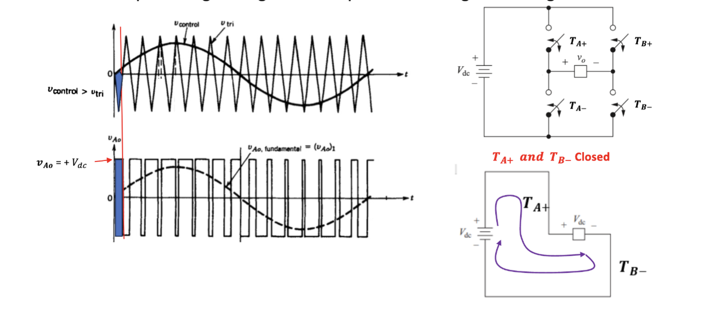

这种形式的 PWM 输出被称为双极性开关 (Bipolar Switching)，因为输出电压在 $+V_{dc}$ 和 $-V_{dc}$ 之间切换。

### PWM 单极性开关

PWM 单极性开关 (PWM Unipolar Switching) 是一种特殊的 PWM 控制方式，在这种方式下，仍然需要三角波信号和控制信号，但是控制信号有正负两个极性，其他参数保持不变。

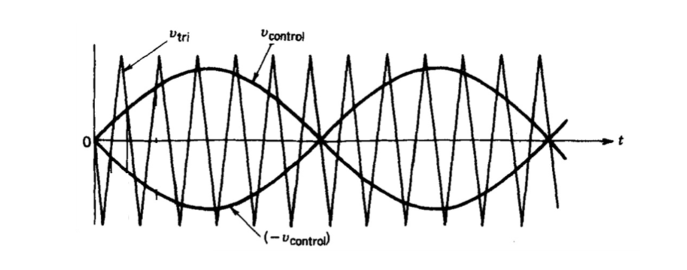

在这个情况下，三角波信号和 $v_{control}$ 以及 $-v_{control}$ 进行比较。

- 对于桥臂 A，当 $v_{tri} < v_{control}$ 时，$T_{A+}$ 导通；当 $v_{tri} > v_{control}$ 时，$T_{A-}$ 导通。
- 对于桥臂 B，当 $v_{tri} < -v_{control}$ 时，$T_{B+}$ 导通；当 $v_{tri} > -v_{control}$ 时，$T_{B-}$ 导通。

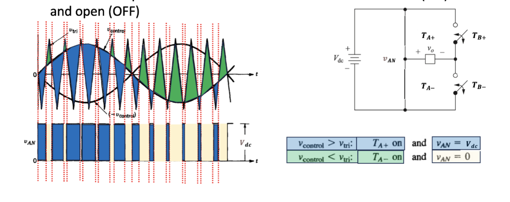

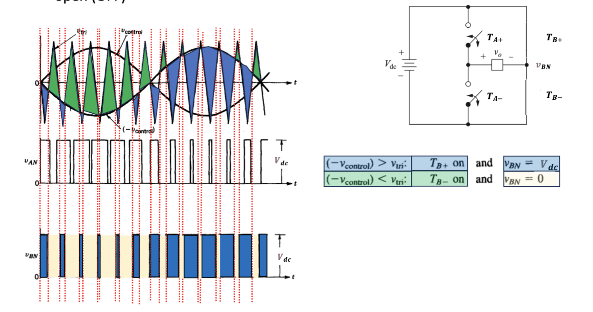

进而，最终输出的 PWM 波形如图所示

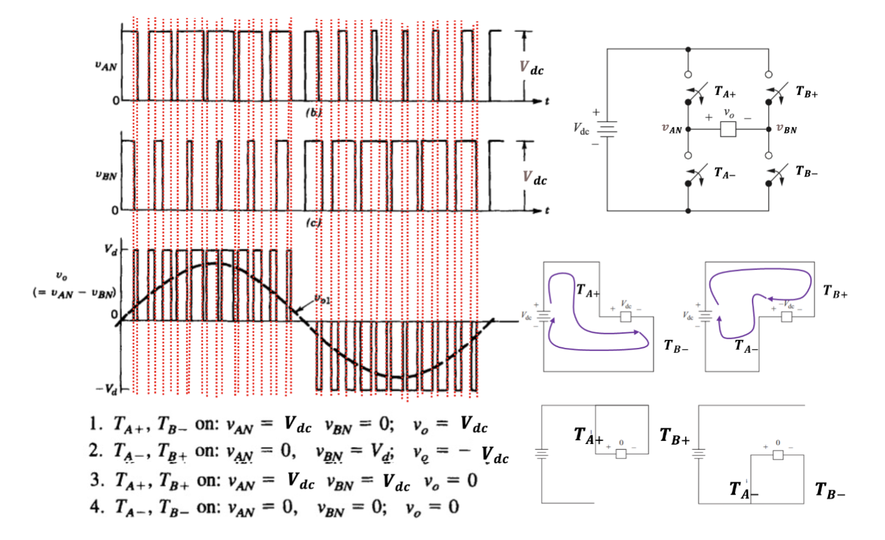

此时在每个半周期内，电压只会在 $V_{dc}$ 和 $0$ 之间切换，而不会直接切换到 $-V_{dc}$，因此称为单极性开关。

### 谐波

我们期望的输出波形是纯正弦波，但是无论是方波输出和 PWM 输出都不是正弦波。此时，需要分析输出中是否存在其他频率为所需正弦波整数倍的正弦波，也就是[谐波](./lec10.md#谐波)。

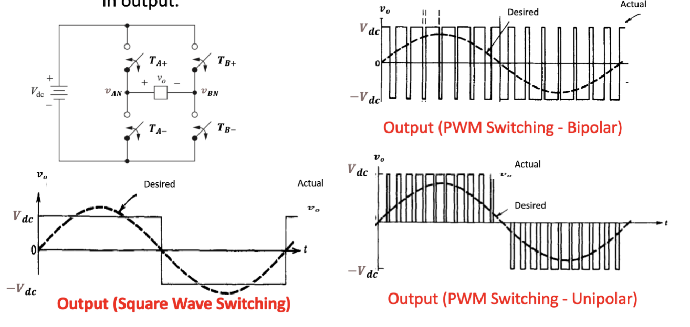

对于具体的谐波分析，仍然是需要傅里叶级数展开来分析输出波形中包含哪些频率成分。比如对于方波输出，谐波就可以简单的使用傅里叶级数展开成如图的样式

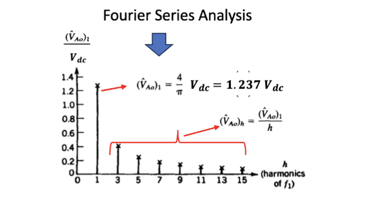

---

分析双极性 PWM 开关中的谐波，需要两个之前提到过的重要术语

- 幅值调制比 (Amplitude Modulation Ratio)：
  - $m_a = \frac{\hat{V}_{control}}{\hat{V}_{tri}}$，
  - 表示控制信号的峰值相对于三角波的峰值的比例。
- 频率调制比 (Frequency Modulation Ratio)：
  - $m_f = \frac{f_s}{f_1}$，
  - 表示开关频率相对于基波频率的比例。

对于双极性 PWM 开关，输出波形是这样的：

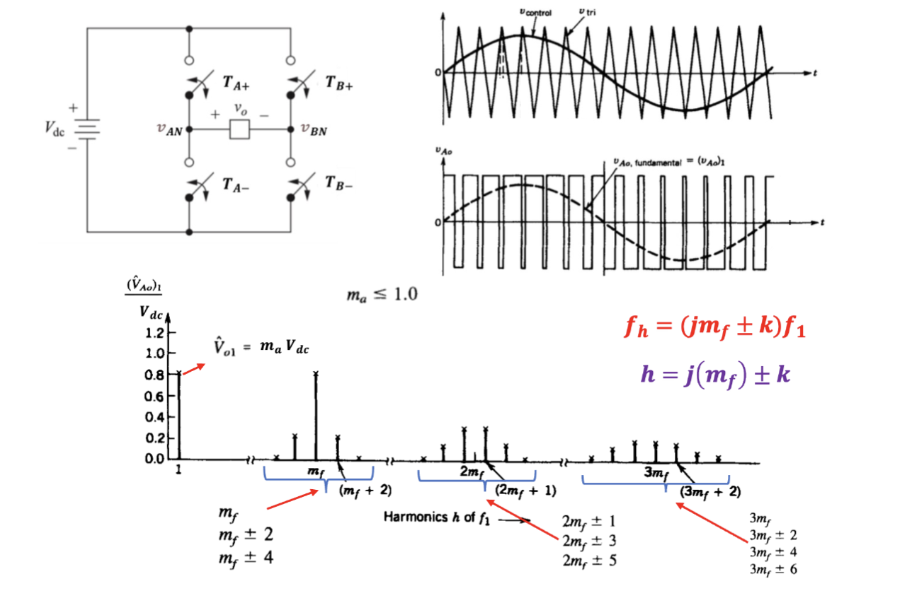

和[半桥逆变器](./lec10.md#谐波)的情况没有本质区别。

- 在目标频率 $f_1$ 处，输出的幅值为 $m_a V_{dc}$。
- 之后在 $f_h = (j m_f \pm k) f_1$ 处存在谐波，其中 $j$ 和 $k$ 是整数，且 $j \geq 1$，$k \geq 0$。
- 当 $j$ 是偶数时，$k$ 是奇数；当 $j$ 是奇数时，$k$ 是偶数。

在已知 $m_a$ 的情况下，每个谐波分量的比例实际上是已知的，可以通过查表法来得到每个谐波分量的幅值。

双极性 PWM 开关的谐波分析

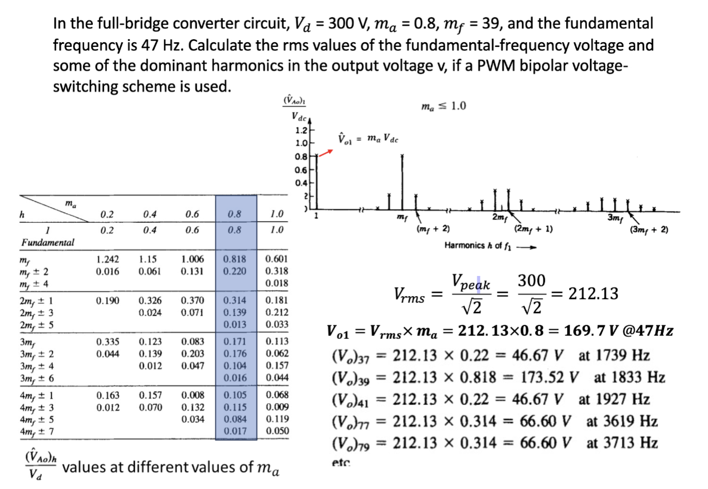

---

对于单极性 PWM 开关，情况有所不同

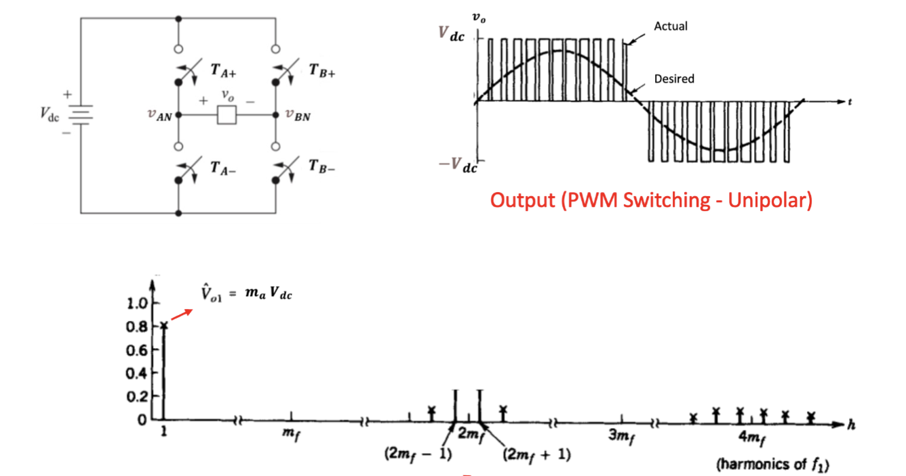

根据图像可以明显看出，双极性 PWM 开关的谐波分布比起单极性 PWM 开关更为分散，单极性 PWM 开关的谐波分布更为集中。

- 在目标频率 $f_1$ 处，输出的幅值为 $m_a V_{dc}$。
- 之后在 $f_h = (j m_f \pm k) f_1$ 处存在谐波，
  - 其中 $j$ 是正偶数，$k$ 是正奇数

仍然可以通过查表法获得在特定 $m_a$ 情况下每个谐波分量的幅值。

单极性 PWM 开关的谐波分析

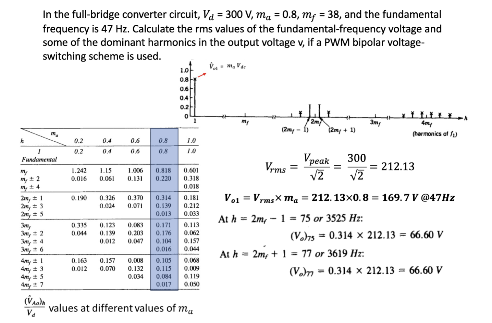

---

因此，三种方案下的谐波波形如图所示

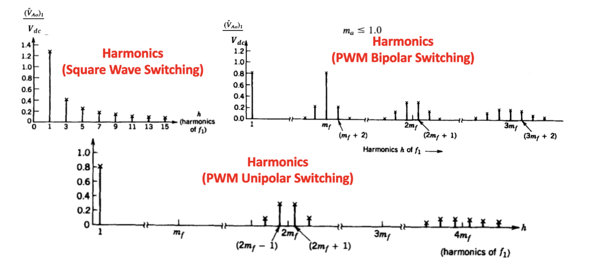

单极性方案等效地将输出谐波的频率翻倍了，因此在同样的开关频率下，单极性方案的谐波分布更为集中，且更容易被滤除掉。

这种"等效地"将开关频率翻倍的优势体现在输出电压波形的谐波频谱中：最低次谐波出现在两倍开关频率附近的边带上（而非一次开关频率附近）。

### 死区时间

对于实际的全桥逆变器，我们使用晶体管来替代理想开关。和在 [半桥逆变器](./lec10.md#死区时间) 中提到的一样，如果在切换过程中没有任何保护措施，那么可能会出现两个晶体管同时导通的情况，这会直接导致电源短路，也就是所谓的直通 (Shoot Through)。

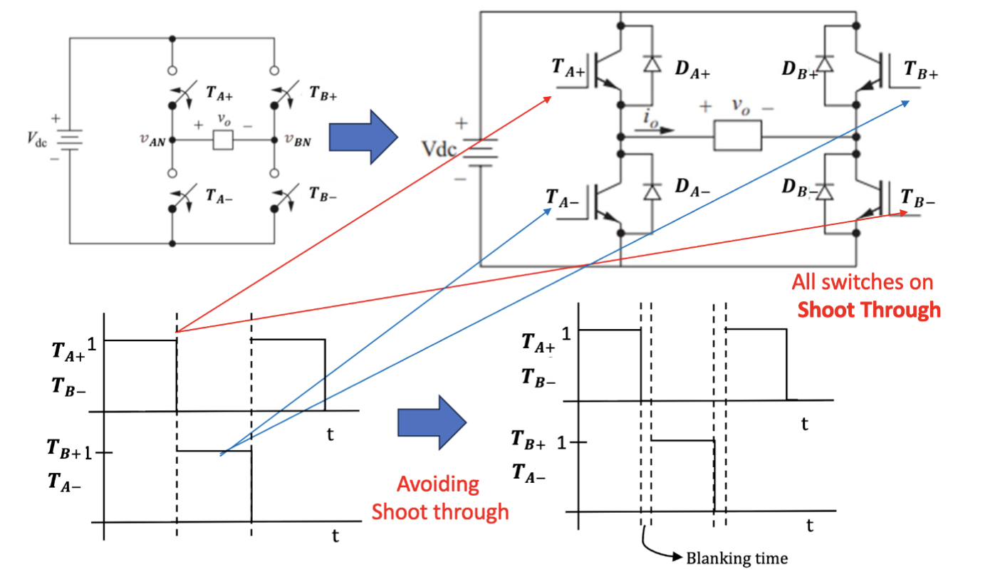

因此，在 $T_{A+}$ 和 $T_{A-}$ 之间，以及 $T_{B+}$ 和 $T_{B-}$ 之间，都需要设置一个死区时间 (Blanking Time)，在这个时间段内两个开关都不导通，确保不会发生直通。最终的开关时间波形就应该像图中这样

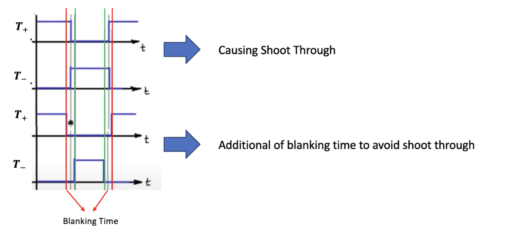

一开始理想的获取控制一组开关的互补输出的方式是使用一个比较器和反相器来控制两个开关的导通状态，但是这种方式在切换过程中会出现直通的情况。

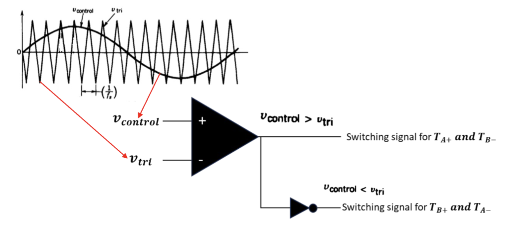

对于双极性开关方案，解决方案和半桥逆变器方案类似——使用两个比较器，同时在每个比较器的三角波输入分别加上正电压和负电压的偏置，进而自然的在两个比较器的输出之间形成一个死区时间。

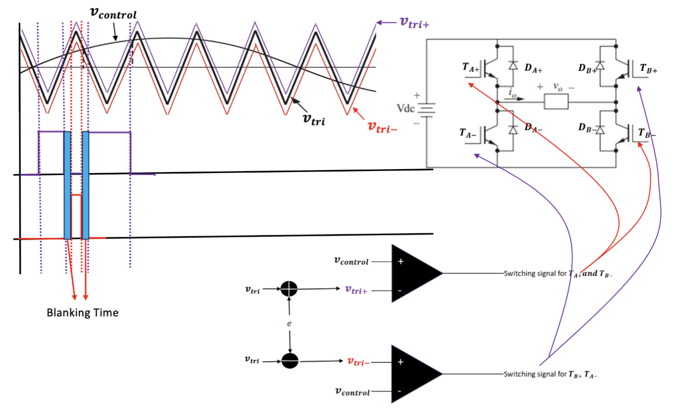

---

对于单极性开关方案，一开始的解决方案类似，是使用两个比较器来分别控制两个桥臂的开关状态，因此会出现类似的直通风险。

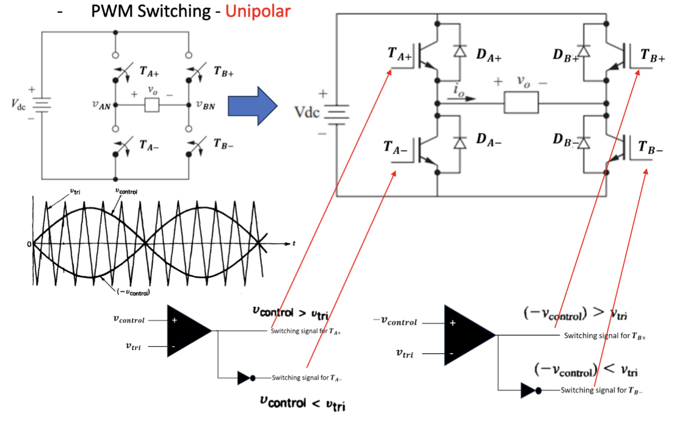

解决方案也是类似的——把三角波分别加上正电压和负电压的偏置，然后分别接入四个比较器的输入端，进而自然的在每个比较器的输出之间形成一个死区时间。

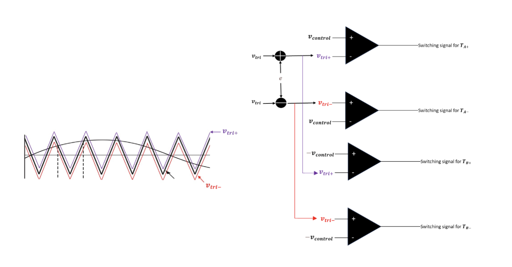

接线方案很明确

- $v_{tri-}$ 接入 $T_{A-}$ 和 $T_{B-}$ 的比较器正相输入
- $v_{tri+}$ 接入 $T_{A+}$ 和 $T_{B+}$ 的比较器反相输入

## 不同方案的比较

### 全桥 & 半桥

在相同的直流输入电压的情况下，半桥逆变器的最大输出电压是 $\frac{V_{dc}}{2}$，而全桥逆变器的最大输出电压是 $V_{dc}$，因此全桥逆变器的输出电压是半桥逆变器的两倍。

在低功率应用中，可以通过使用半桥逆变器节省一个桥臂的复杂度。

### 方波 & PWM

方波中的突变会产生大量谐波，谐波频率是基波频率的倍数，进而扭曲波形，可能会对负载造成损害。为了减轻这些谐波的影响，方波逆变器需要庞大昂贵的滤波器件

PWM 采用了一种更复杂的方式，生成了一个具有恒定频率的脉冲序列并通过改变占空比来有效合成正弦波输出电压。这种方案把谐波分散到了更高的频率上，因此更容易被滤除掉，更小、更高效的滤波器就能实现相同的输出质量水平。

### 单极性 & 双极性

单极性方案有效地倍增了开关频率，因此在同样的开关频率下，单极性方案的谐波分布在了更高的频率中，且更容易被滤除掉。

具体来说，双极性的最低次谐波大概在一倍开关频率附近，而单极性的最低次谐波大概在两倍开关频率附近，因此单极性方案的谐波分布更为集中，且更容易被滤除掉。
