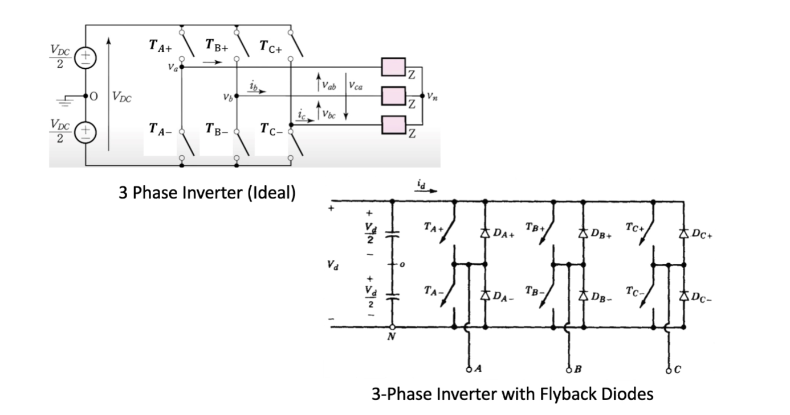
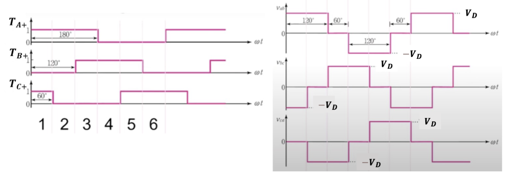
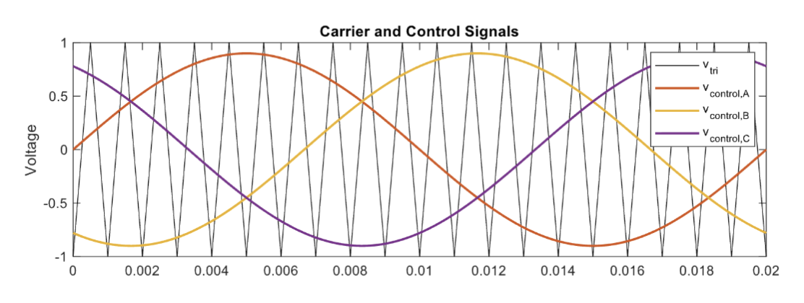
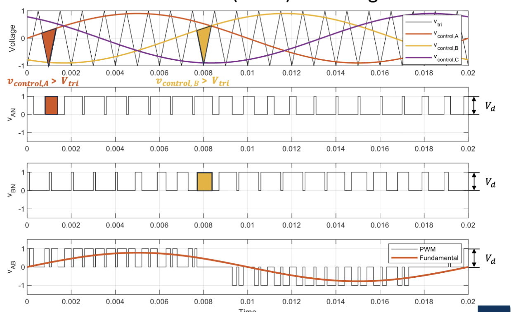
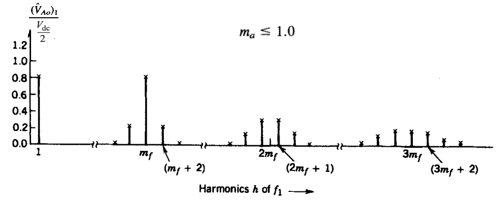
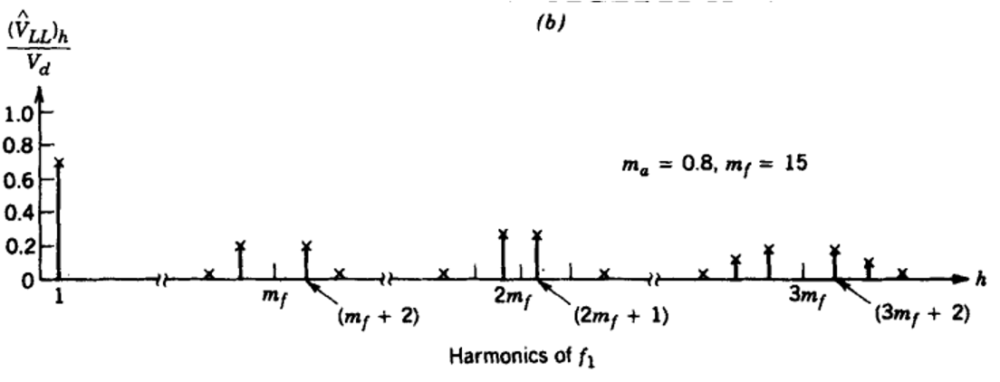
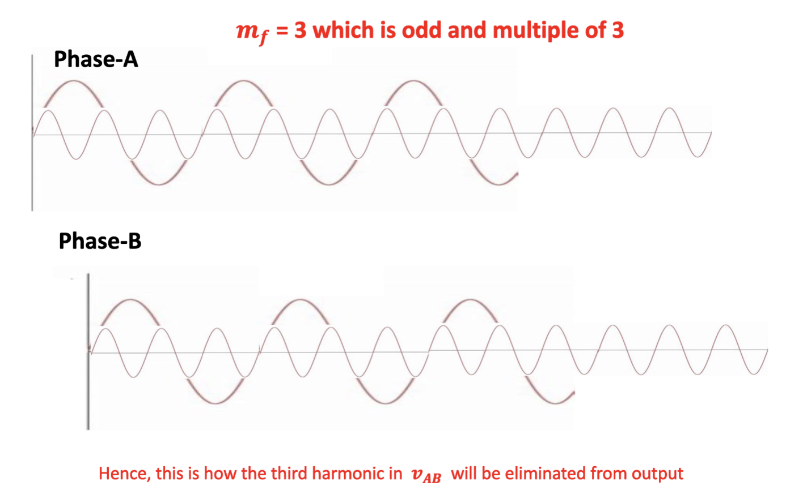
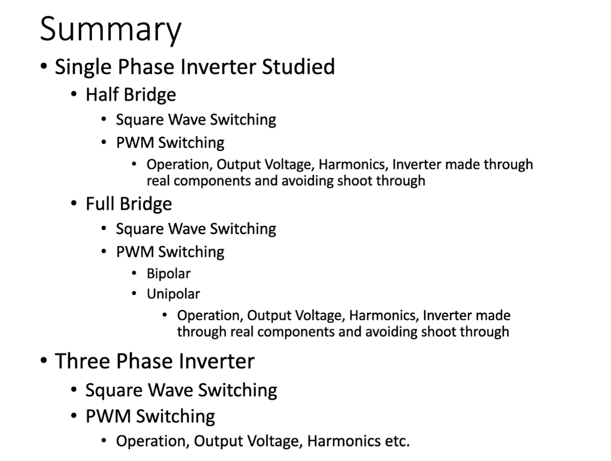

# Lec.12 DC-AC 变换器 - III: 三桥臂逆变器

> **_DC-AC Converters (Inverters)_**
>
> Lecture @ 2026-5-21

## 三桥臂逆变器

### 方波输出

三桥臂逆变器 (3-Leg Inverter) 的典型电路图如下所示

最常用的三相逆变器电路由三个桥臂组成，每相一个桥臂。每个逆变器的结构与基本的半桥逆变器的桥臂类似。每个桥臂的输出电压 $v_{AN}$ 只取决于直流电压 $V_{dc}$ 和开关状态

当工作在方波开关的情况时，每个桥臂中的开关以互补的方式工作，也就是对于任意桥臂 X，当 $T_{X+}$ 导通时，$T_{X-}$ 关断；当 $T_{X-}$ 导通时，$T_{X+}$ 关断。

因此，只考虑只有一到两个桥臂导通的情况，一共六种情况，分别是

|     | $T_{A+}$   | $T_{B+}$   | $T_{C+}$   | $v_{AB}$ | $v_{BC}$ | $v_{CA}$ |
| --- | ---------- | ---------- | ---------- | -------- | -------- | -------- |
| 1   | **_闭合_** | 断开       | **_闭合_** | $V_{dc}$    | $-V_{dc}$   | $0$      |
| 2   | **_闭合_** | 断开       | 断开       | $V_{dc}$    | $0$      | $-V_{dc}$   |
| 3   | **_闭合_** | **_闭合_** | 断开       | $0$      | $V_{dc}$    | $-V_{dc}$   |
| 4   | 断开       | **_闭合_** | 断开       | $-V_{dc}$   | $V_{dc}$    | $0$      |
| 5   | 断开       | **_闭合_** | **_闭合_** | $-V_{dc}$   | $0$      | $V_{dc}$    |
| 6   | 断开       | 断开       | **_闭合_** | $0$      | $-V_{dc}$   | $V_{dc}$    |

> 是的，这是数电里的 **格雷码 (Gray Code)**，特征是每次状态变化只有一个位发生改变。

最终，考虑开关的状态在这六种情况下周期性变化的情况，最终输出的电压波形则如图所示

这就是三相方波输出的情况。

### PWM 输出

三桥臂逆变器的 PWM 输出和单相不同，控制信号由三个，是三路相同幅度、相同频率，相位差为 $\frac{2\pi}{3}$ 的正弦波信号，记作 $v_{control,A}$、$v_{control,B}$ 和 $v_{control,C}$，频率为期望的基波频率 $f_1$。

类似的，有一个三角波信号 $v_{tri}$，频率为开关频率 $f_s$。

对于每个相的输出，和半桥逆变器的 PWM 输出情况类似，当 $v_{tri} < v_{control,X}$ 时，$T_{X+}$ 导通；当 $v_{tri} > v_{control,X}$ 时，$T_{X-}$ 导通。然后在 XY 通路上，最终产生的波形就是一个单极性的 PWM 输出。

对于任意两个相的输出电压，形式都和图中的单极性 PWM 输出类似，只有因为控制信号的相位差的关系，输出电压的相位差也是 $\frac{2\pi}{3}$。

### 谐波

类似的，我们定义频率调制比 $m_f = \frac{f_s}{f_1}$ 和幅值调制比 $m_a = \frac{V_{control}}{V_{tri}}$，其中 $V_{control}$ 是控制信号的峰值，$V_{tri}$ 是三角波信号的峰值。之后，可以得到这样的频谱

#### 相电压

其中，相电压 (Phase Voltage) $\frac{(\hat{V}_{Ao})_1}{\frac{V_{dc}}{2}}$ 指的是每相输出点与直流中点之间的电压，通常表示为 $v_{XN}$，比如 $v_{AN}$、$v_{BN}$ 和 $v_{CN}$。

相电压的频谱如图所示

- 在期望的基波频率 $f_1$ 处，存在一个幅值为 $m_a$ 的分量；
- 其余的谐波位于 $(j m_f \pm k) f_1$ 处，其中 $j$ 是正整数
- $j$ 是奇数时 $k$ 是偶数，$j$ 是偶数时 $k$ 是奇数。

#### 线电压

线电压 (Line Voltage) $\frac{(\hat{V}_{LL})_h}{V_{dc}}$ 指的是任意两相输出点之间的电压，比如 $v_{AB}$、$v_{BC}$ 和 $v_{CA}$。

线电压的频谱如图所示

在三相逆变器中仅需要关注线电压中的谐波成分。可以看到，

- 当 $m_f$ 为 3 的倍数并且是奇数时，谐波成分在线电压中被抵消了
- 就像图里的 $m_f = 15$ 和 $3 m_f = 45$ 的情况，在相电压频谱有峰的位置，在线电压频谱中没有峰了。

原因则是

其中，当 $m_f$ 为 3 的倍数时，开关频率 $f_s$ 处及 $m_f$ 倍数处的谐波分量在 A 相和 B 相中频率、相位、幅度完全相等，在计算电压差值时被抵消。

### 实际的逆变器

半桥逆变器中使用的控制硬件可以应用于三相逆变器的每相桥臂，以实现开关控制的作用。同样的，可以使用类似的电路来创造死区时间，避免方波和 PWM 开关中的直通问题。

## 总结

