# Lec.13 应用与系统

> **_Applications and Systems_**
>
> Lecture @ 2026-5-21

> - **所有的引用样式文本是旧课件中的内容，在新课件中被删除**
> - **~~（大概率）~~ 不需要记忆**
> - **这个规则只限定这一章**

## 家用应用

美国住宅和建筑消耗了全国大概 $35\%$ 的发电量，大概相当于一次能源总使用量的 $8.5\%$

### 空调和供暖

常见的使用场景如图，一个是空间供暖和空调

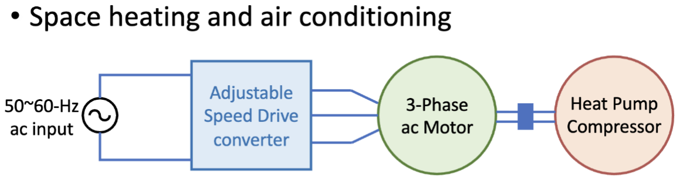

典型电路结构是从单相市电接入可调速驱动器 (Adjustable Speed Drive Converter)，之后接入三相电机和热泵压缩机

> 压缩机电机的准速和相应的压缩机输出会调整至与建筑供暖/制冷负荷相匹配，进而消除压缩机的启停循环以及导致的压缩机输出损失。
>
> 更具体的控制内容在 [动力学与控制](https://cateds.github.io/Dynamics-Control.md/) 里有详细介绍

### 电磁烹饪

类似的，还有电磁烹饪

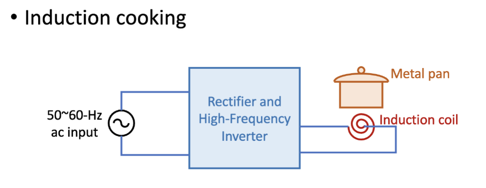

电磁炉的电路结构是从单相市电接入整流器与高频逆变器，输出 $25 \sim 40 \mathrm{kHz}$，接入感应线圈，进而加热金属锅

## 工业应用

### 感应加热

感应加热 (Induction Heating) 是一种利用电磁感应原理来加热金属材料的技术，广泛应用于工业制造过程中。其基本原理是通过高频交流电流在金属工件中产生涡流，进而产生热量来加热工件。

> 可以精确加热工件的指定区域，感应电流大小根据表面深度 $x$ 指数递减，具体的公式为
>
> $$
> I(x) = I_0 \exp(-\frac{x}{\delta})
> $$
>
> 其中 $I_0$ 是工件表面处的电流，$\delta$ 是电流衰减到 $1/e$ 的深度，称为表面深度 (Skin Depth)，其计算公式为
>
> $$
> \delta = k \sqrt{\frac{\rho}{f}}
> $$
>
> 其中 $f$ 是交流频率，$\rho$ 是工件的电阻率，$k$ 是一个常数。
>
> 频率的选择取决于具体应用，比如对于大尺寸工件的熔炼，就会使用较低频率；而数百千赫兹的高频则会用于锻压、焊接、硬化、退火等。

### 电弧焊

电弧焊 (Electric Welding) 是一种利用电弧产生高温来熔化和连接金属材料的焊接方法。电弧焊的基本原理是通过在焊接电极和工件之间产生电弧，电弧产生的高温足以熔化金属，从而实现焊接。其中一个电极是待焊接的金属工件

> 焊机的电压-电流特性取决于采用的焊接工艺类型。典型的额定电压和电流分别为 $50V$ 和 $200A$
>
> 在所有焊接应用中，输出必须与电网进行电气隔离，可以使用 $60 Hz$ 的电力变压器或高频隔离装置实现
>
> 典型的电路图如下
>
> 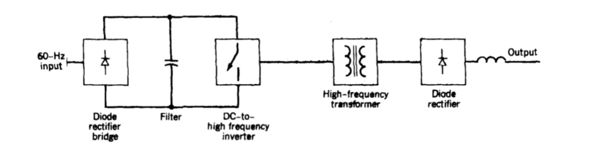

## 电力系统应用

### 高压直流输电

高压直流输电 (High-Voltage DC Transmission) 指的是发电厂以高压直流电的形式对外传输电能。

通常发电厂使用交流电压和电流的形式输出，通过三相交流输出线路传输至负载中心。但是，在有些情况下，直流输电更具有优势，比如从偏远发电厂向负载中心传输大量电力时，在经济上更具有吸引力。

架空线路的高压直流输电等价距离（价格相等的距离）大概是 $300\sim 400$ 英里，在海底线缆场景更短。之后，距离越长，直流输电的优势越明显。

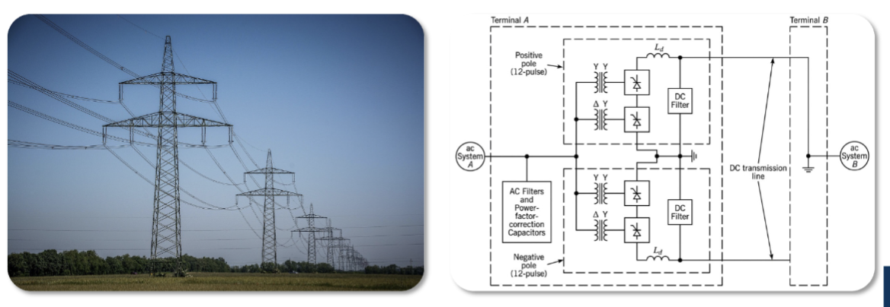

## 电机驱动应用

### 电机驱动介绍

电力电子中电机驱动的应用功率范围极广，从几瓦到数千千瓦，应用场景也十分多样，从机器人领域的高精度高性能位置控制驱动到用于控制泵流量到调速驱动都有涵盖。所有驱动系统中都需要一个功率电子变换器作为电源和电机之间的接口

典型的系统结构图为

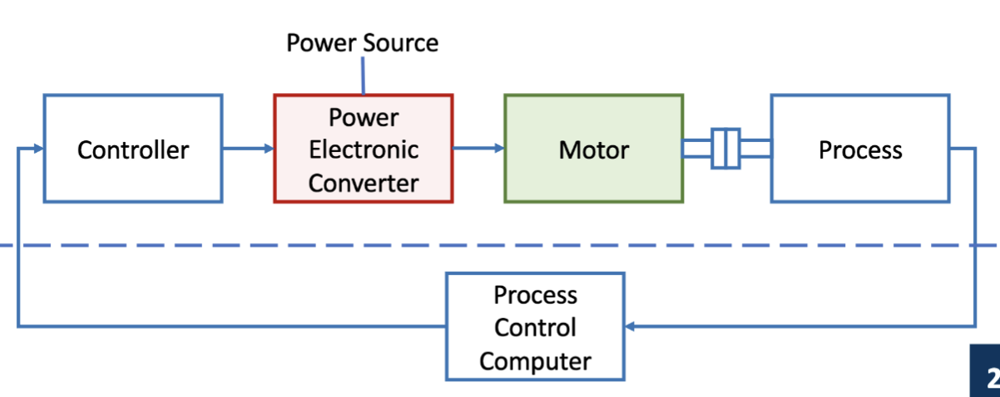

### 直流电机驱动

#### 直流电机原理

直流电机的原理如图

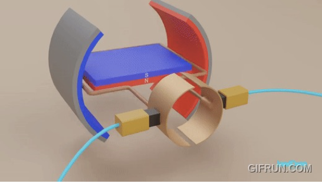

具体是两个永磁体的定子和一个转子组成，转子连接着电刷和换向器，电刷和换向器的作用是将电流从外部电路传递到转子线圈中。这样，当电机通电后，绕组中的电流会让电动机产生一个磁场，和定子永磁体的磁场相互作用，产生一个转矩，使转子旋转。每次转子旋转 $180^\circ$，换向器就会改变电流的方向，保持转矩的连续性。

---

等效的电路如图

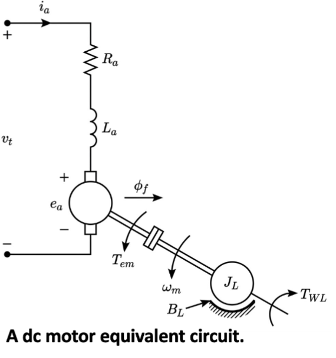

旋转产生的反电动势大小为

$$
e_a = k_e \phi_f \omega_m
$$

其中，$k_e$ 是电动势常数，与电机结构有关。 $\phi_f$ 是励磁磁通量，$\omega_m$ 是转子角速度。

电枢电压 (Armature Voltage) 电动机承载工作电流并产生转矩的绕组的两端电压，大小为

$$
v_t = e_a + R_a i_a + L_a \frac{di_a}{dt}
$$

其中 $R_a$ 是电枢电阻，$L_a$ 是电枢电感，$i_a$ 是电枢电流。

电磁转矩为

$$
T_{em} = k_f \phi_f i_a
$$

其中 $k_f$ 是转矩常数，与电机结构有关。

#### 四象限运行

直流电机一共有四个象限 (Quadrant) 的运行状态，具体分别由角速度 $\omega_m$ 正负以及电磁转矩 $T_{em}$ 正负划分，如下图所示

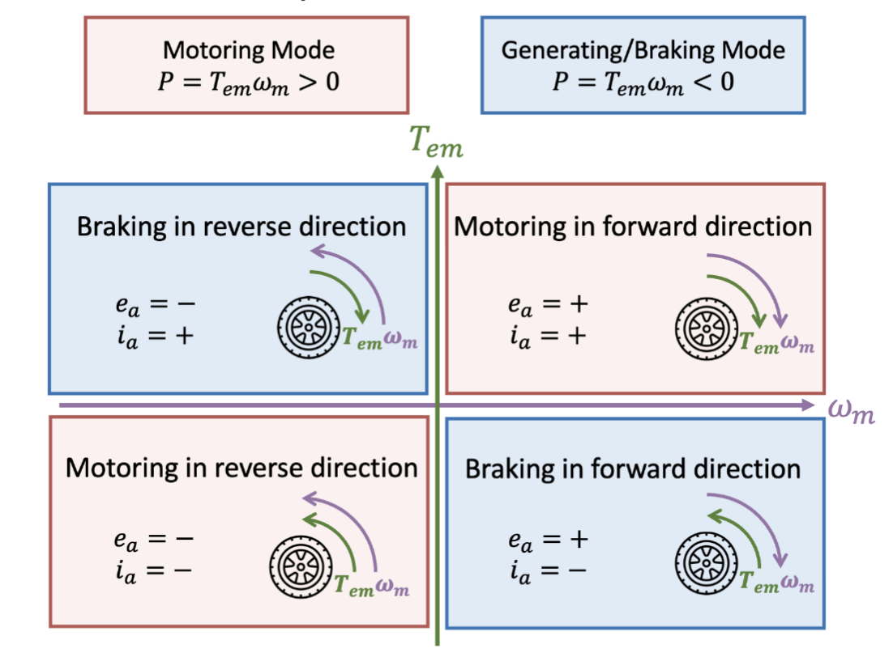

|              | $\omega_m < 0$                        | $\omega_m > 0$                        |
| ------------ | ------------------------------------- | ------------------------------------- |
| $T_{em} > 0$ | 反向制动 (Reverse Braking)，吸收功率  | 正向电动 (Forward Motoring)，输出功率 |
| $T_{em} < 0$ | 反向电动 (Reverse Motoring)，输出功率 | 正向制动 (Forward Braking)，吸收功率  |

也就是当 $\omega_m$ 和 $T_{em}$ 同号时，电机处于电动状态，输出功率；当 $\omega_m$ 和 $T_{em}$ 异号时，电机处于制动状态，吸收功率。

#### 直流电机伺服驱动

> [动力学与控制](https://cateds.github.io/Dynamics-Control.md/) 来找你了

伺服驱动 (Servo Drive) 是一种专门用于控制伺服系统的电机驱动器，通常用于需要高精度位置控制的应用中，比如机器人、数控机床等。它的结构如图所示，由两个闭环控制器组成

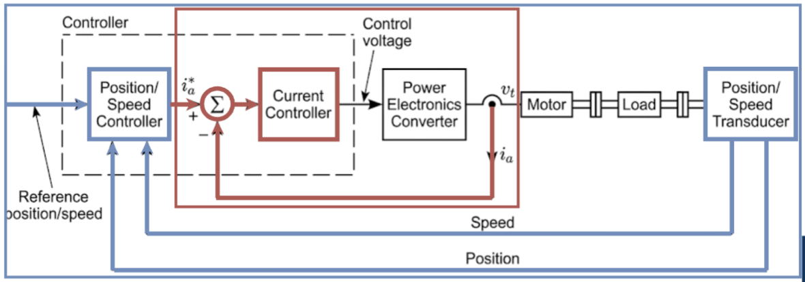

- **内环：电流环，红色**
  - 用来限制电流，**保护**电机不被过流摧毁
  - 同时因为转矩和电流由正比例关系，电流环也可以用来实现**转矩控制**
  - 可以实现**快速响应**，因为这是系统中最快的环路
- **外环：速度/位置环，蓝色**
  - 确保电机遵循参考速度/位置，实现**跟踪 (Tracking)**
  - 比较参考值和反馈值，**修正误差**
  - 产生电流参考值 $i_a^*$，**产生对电流环的指令**
  - **动态响应较慢**，比电流环慢

### 感应电机驱动

#### 感应电机原理

使用鼠笼式转子的 **感应电机 (Induction Motor)** 因为低成本和坚固制造成为了工业领域的主要设备。下图中左图是滑环式转子 (Slip Ring Rotor)，右图是鼠笼式转子 (Squirrel Cage Rotor)。

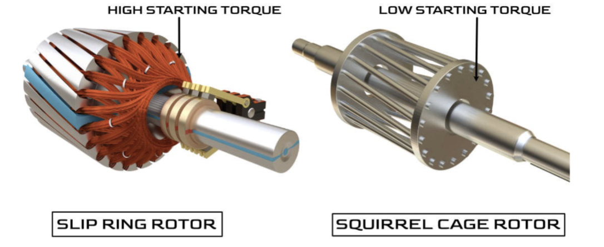

其连接至线路电压时感应电机几乎以恒定速率运转，但是我们可以通过电力电子变换器来调节电机转速。

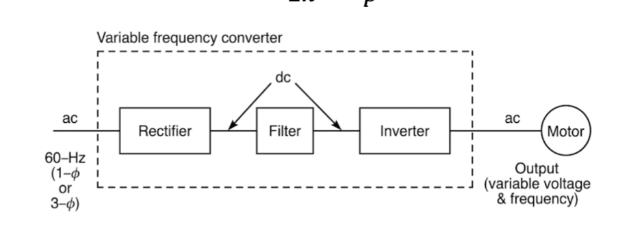

具体结构是一个整流器接滤波器接逆变器，也就是通过 dc 中转做频率的调节

#### 感应电机参数

感应电机的角速度用 $\omega_s$ 表示，在输入供电频率为 $f$ 的 p 极电机中，$\omega_s$ 的计算公式为

$$
  \omega_s = \frac{\frac{2\pi}{
    \frac{p}{2}
  }}{\frac{1}{f}}
  = \frac{2}{p} (2\pi f)
  = \frac{2\omega}{p}
$$

其中 $\omega$ 是电源的角频率。$p$ 极指的是电机中磁极的数量，$p$ 极电机中每个周期电机转子旋转 $\frac{2}{p}$ 圈。

如果要用 $rpm$ 为单位计算转速，则同步转速的计算方法为

$$
n = 60\times\frac{\omega_s}{2\pi} = \frac{120f}{p}
$$

---

感应电机的转矩由气隙磁通量 $\phi_{ag}$ 和转子电流相互作用产生。当转子以同步速度 $\omega_s$ 旋转时，磁通和转子之间没有相对作用，因此转矩为 $0$。

当转子以其他速度 $\omega_r$ 运行时，其会和磁通产生相对运动，相对角速度称为 **转差速度 (Slip Speed)**

$$
\omega_{sl} = \omega_s - \omega_r
$$

**归一化转差率 (Normalized Slip)** 被定义为转差速度和同步速度的比值

$$
S = \frac{\omega_{sl}}{\omega_s} = \frac{\omega_s - \omega_r}{\omega_s}
$$

#### 感应电机运行模式

当感应电机存在转差速度，且 $0 < \omega_r < \omega_s$ 或者说 $0 < S < 1$ 时，电机处于电动状态，输出功率。

此时在转子侧电磁转矩和转速的旋转方向相同，$T_{em} \omega_r > 0$，对外输出机械能。在定子侧，存在反电动势 $E$，和有功电流 $I_a$ 方向相反，因此 $E I_a < 0$，电机从电网吸收电能。

当 $\omega_r > \omega_s$ 或者说 $S < 0$ 时，电机处于发电状态，吸收机械能。

此时在转子侧电磁转矩和转速的旋转方向相反，$T_{em} \omega_r < 0$，吸收机械能。在定子侧，存在反电动势 $E$，和有功电流 $I_a$ 方向相同，因此 $E I_a > 0$，电机向电网输出电能。

| 电动模式 (Motoring)                    | 发电模式 (Generating)                    |
| -------------------------------------- | ---------------------------------------- |
| 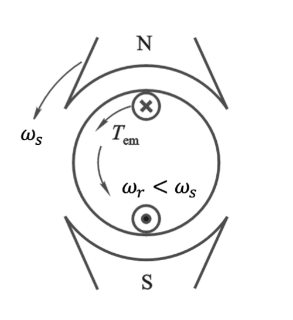 | 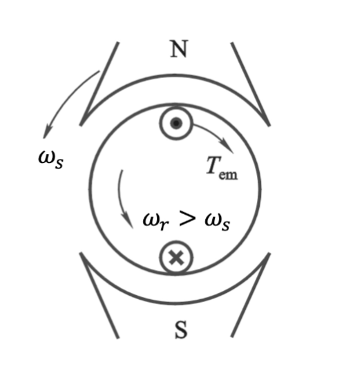 |

#### 感应电机伺服驱动

感应电机伺服驱动的控制通常基于**磁场定向的空间矢量计算 (Field-Oriented Space-Vector-Based Calculation)**，用来确定感应电机的定子电流在特定时机是何值，进而产生电磁转矩 $T_{em}$，使其等于速度调节器给定的转矩指令。

> 你先告诉我你期末不会真的要考什么 FOC 吧

控制框图如下：

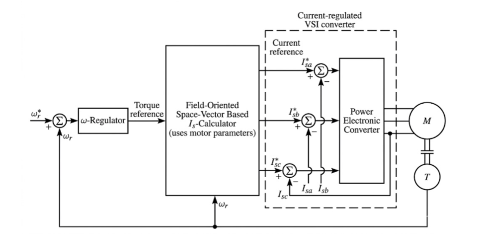

- 速度调节器输出扭矩参考值，
- 磁场定向空间矢量计算器根据电机参数计算出三相电流参考值，
- 电流调节器根据参考值产生 PWM 控制信号，
- 之后电压源逆变器驱动电机。

### 同步电机驱动

#### 同步电机类型

同步电机可以通过转子分为两种，一种是永磁转子 (Permanent Magnet Rotor) 的同步电机，另一种是励磁绕组转子 (Salient-pole Wound Rotor) 的同步电机。

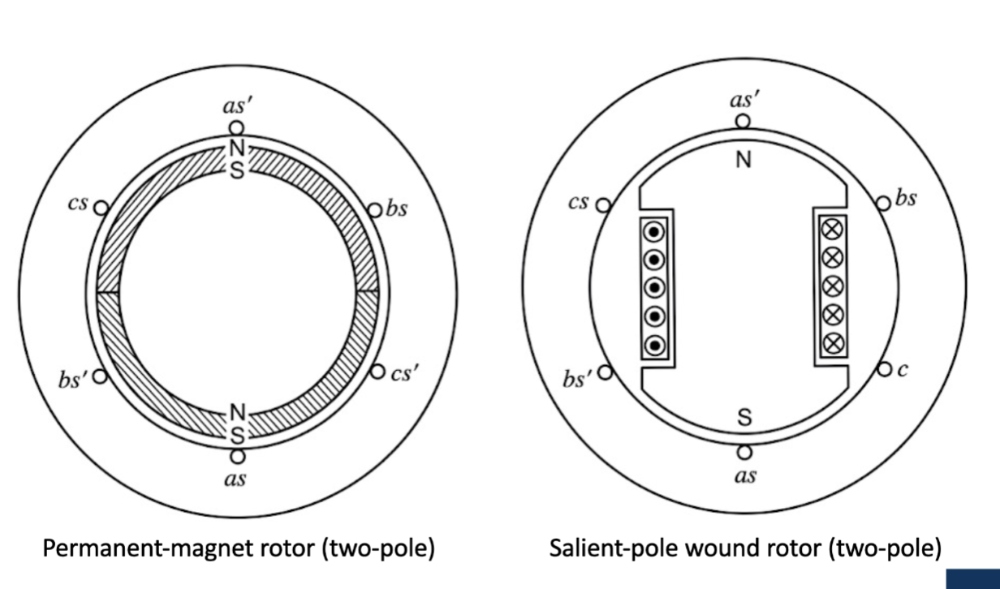

---

类似的，同步电机也可以通过反电动势波形分为两种。

一种是无刷直流电机 (Brushless DC Motor, BLDC)，其会产生梯形的反电动势，通常用于无人机和家用电器

另一种是永磁同步电机 (Permanent Magnet Synchronous Motor, PMSM)，其会产生正弦的反电动势，通常用于高端电动汽车和精密机器人

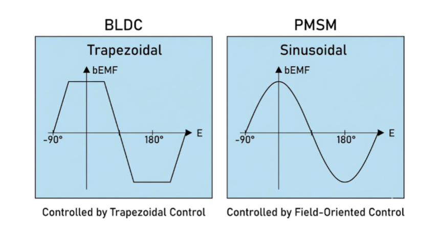

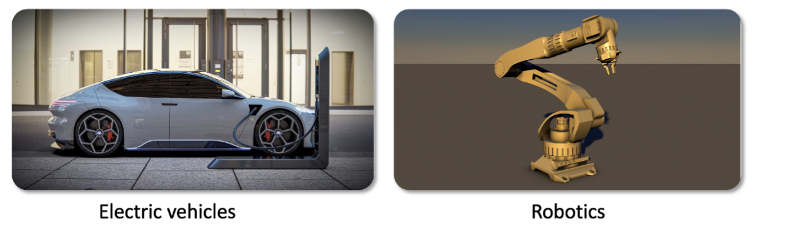

#### 同步电机伺服驱动

> 接下来最重要的是对着这张图祈祷别塞到试卷里

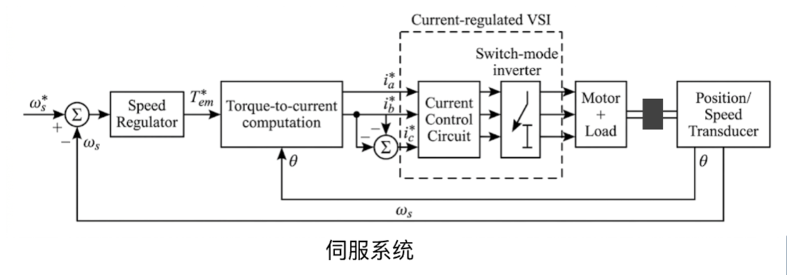

- 速度调节器获取参考转速 $\omega_s^*$ 和实际转速 $\omega_s$ 的误差，输出扭矩参考值 $T_{em}^*$。
- 扭矩-电流计算器根据 $T_{em}^*$ 和电机的转子位置 $\omega$ 计算出三相电流参考值 $i_a^*$, $i_b^*$ 和 $i_c^*$。
  - 这里的精确位置是必要的，因为磁场是永磁体产生的
- 电流比较电路根据电流参考值和实际电流 $i_a$、$i_b$ 和 $i_c$ 的误差产生 PWM 控制信号
- 开关模式逆变器使用电压源逆变器来驱动电机
- 传感器反馈获取转子位置 $\omega$ 和角速度 $\omega_s$ 的反馈信号

### 总结

| 功能     | 直流电机             | 感应电机               | 同步电机                     |
| -------- | -------------------- | ---------------------- | ---------------------------- |
| 成本     | 中等                 | **低，高性价比**       | 高，磁铁需要稀土元素         |
| 维护     | 高，有电刷磨损       | **最低**               | 低，无刷                     |
| 效率     | 中低                 | 中等                   | **非常高**                   |
| 典型应用 | 玩具、车窗、启动电机 | 泵、暖通空调、工业风扇 | 电动汽车、机器人、数控机床等 |

## 电动汽车

电动汽车中，除了典型的电机的使用，还有各种变换器的使用

- **AC-DC 变换器**：充电器为电池充电
- **DC-AC 变换器**：逆变器为电机提供交流电压
- **DC-DC 变换器**：为低压电器系统供电

---

最后以一个 _意义不明_ 的图片结束所有的电力电子的应用：

**_它无处不在_**

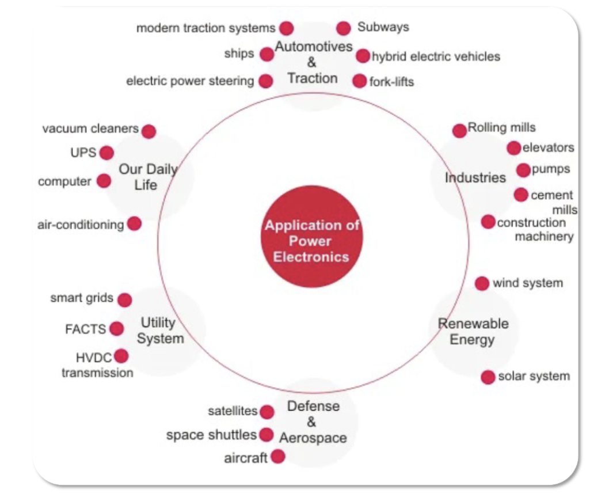
