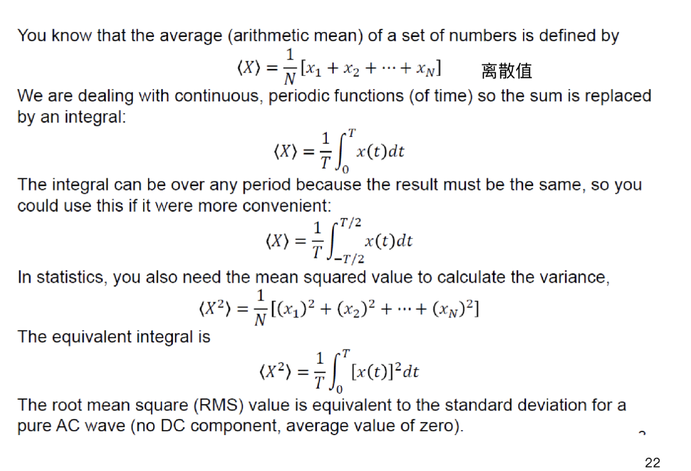
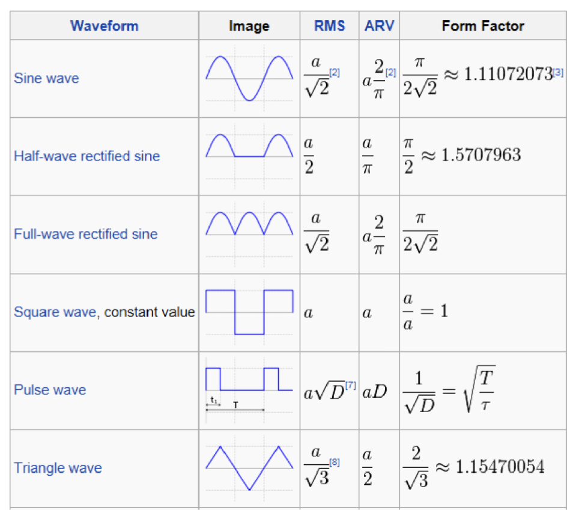

# Lec.2 电路知识复习

> **_Revision of Electric Circuit_**
>
> Lecture @ 2026-3-31

> [!TIP]
>
> 是的，这很明显是 [电路分析与设计](https://github.com/Cateds/CAD_Lecture_Notes) 的复习，内容都太基础了，就直接贴链接吧。

## 电路

- 电路的定义
  - 电流需要在一个闭合完整路径中流动，这被我们称为电路
  - 一个电路的必要组成部分包括电源、元件、导线
- 电压
  - 电势差
- 基本电路元件
  - 电阻器 (Resistor)
  - [电容器 (Capacitor)](https://github.com/Cateds/CAD_Lecture_Notes/blob/main/Lecture10.md)
  - [电感器 (Inductor)](https://github.com/Cateds/CAD_Lecture_Notes/blob/main/Lecture11.md)
  - [电压源 (Voltage Source)](https://github.com/Cateds/CAD_Lecture_Notes/blob/main/Lecture2.md)
  - [电流源 (Current Source)](https://github.com/Cateds/CAD_Lecture_Notes/blob/main/Lecture2.md)

电阻、电容、电感器都有不同的串联和并联组合等效。[实质上是阻抗的串并联组合](https://github.com/Cateds/CAD_Lecture_Notes/blob/main/Lecture15.md#impedance-and-admittance%E9%98%BB%E6%8A%97%E5%92%8C%E5%AF%BC%E7%BA%B3)。

## 基尔霍夫电路定律

基尔霍夫电路定律有两条：

- 基尔霍夫电流定律 (Kirchhoff's Current Law, KCL)
  - 在任何一个节点处，流入节点的电流总和等于流出节点的电流总和
- 基尔霍夫电压定律 (Kirchhoff's Voltage Law, KVL)
  - 在任何一个闭合回路中，沿着回路的电压总和等于零

## 功率和能量

电路的功率是一段电路下压降和电流的乘积：

$$
P = VI
$$

在动态场景下，换成微分形式：

$$
dE = v dq
$$

对于 [电容](https://github.com/Cateds/CAD_Lecture_Notes/blob/main/Lecture10.md) 和 [电感](https://github.com/Cateds/CAD_Lecture_Notes/blob/main/Lecture11.md) 来说，他们的充放电过程就是能量的存储和释放过程，因此存储了能量。这个原理实现了 [RC电路](https://github.com/Cateds/CAD_Lecture_Notes/blob/main/Lecture12.md) 和 [RL电路](https://github.com/Cateds/CAD_Lecture_Notes/blob/main/Lecture13.md)。

电感会在希望断路时导致电压尖峰，需要使用续流二极管解决这个问题。

对于 [交流电路](https://github.com/Cateds/CAD_Lecture_Notes/blob/main/Lecture15.md) 和变化的信号，一个重要参数是均方根值 (Root Mean Square, RMS)，它是一个周期内信号的平方的平均值的平方根。对于正弦交流电来说，RMS 值是峰值的 $\frac{1}{\sqrt{2}}$。

一般提到的交流电压 220V 是指 RMS 值，而不是峰值。对于正弦交流电来说，峰值是 RMS 值的 $\sqrt{2}$，大约是 311V。

RMS 与峰峰值的比例只与波形有关，和频率无关，和幅值无关。

> 这个是 RMS 值是等效功率的证明：
>
> 

如果一个信号同时有直流和交流成分，那么它的 RMS 值是两者的平方和的平方根：

$$
V_\mathrm{Total RMS} = \sqrt{V_\mathrm{DC}^2 + V_\mathrm{AC}^2}
$$

对于一个 $A\sin(\omega t)+B$ 的信号来说，RMS 值是 $\sqrt{\frac{A^2}{2}+B^2}$。

---

对应的，一个信号的平均值是一个周期内信号的绝对值的平均值：

$$
V_\mathrm{Average} = \frac{1}{T}\int_0^T |v(t)| dt
$$

**有绝对值**，所以交流信号的平均值不为零。

## 波形因数

波形因数是周期函数的均方根值和平均值的比例

$$
\mathrm{Form\ Factor} = \frac{V_\mathrm{RMS}}{V_\mathrm{Average}} = \frac{\sqrt{\frac{1}{T}\int_0^T v^2(t) dt}}{\frac{1}{T}\int_0^T |v(t)| dt}
$$

这个参数标识了信号与给定交流电等效功率的直流电的比值。

这是一个重要的概念，因为电路元件/变压器等的发热与均方根相关，仪器也通常假设波形是正弦波。

对于正弦波，这个参数的值为

$$
FF = \frac{\sqrt{\frac{1}{T}\int_0^T A^2\sin^2(\omega t) dt}}{\frac{1}{T}\int_0^T A\sin(\omega t) dt} = \frac{\sqrt{\frac{A^2}{2}}}{\frac{2A}{\pi}} = \frac{\pi}{2\sqrt{2}} \approx 1.11
$$

不同的波形的典型波形因数是

