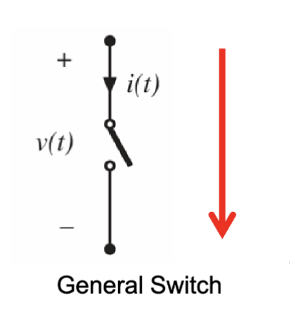
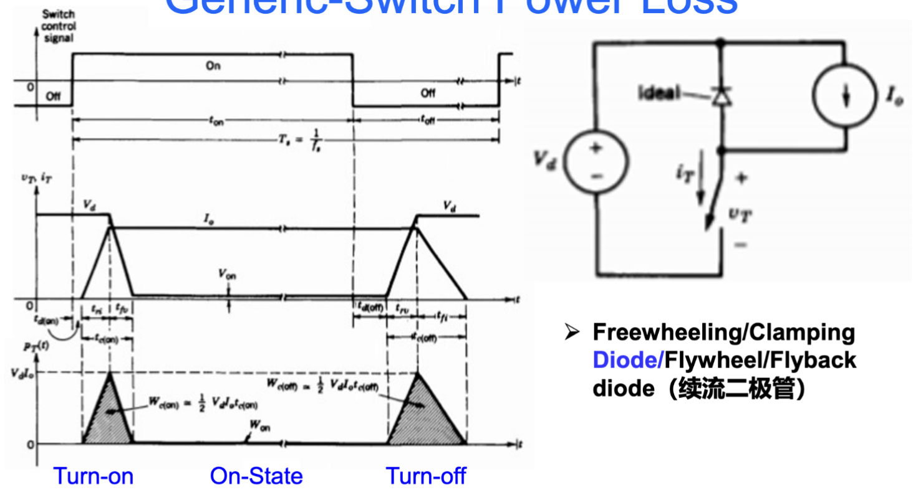
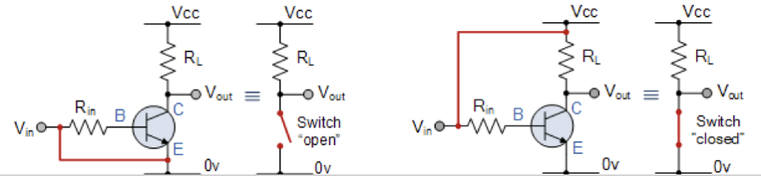
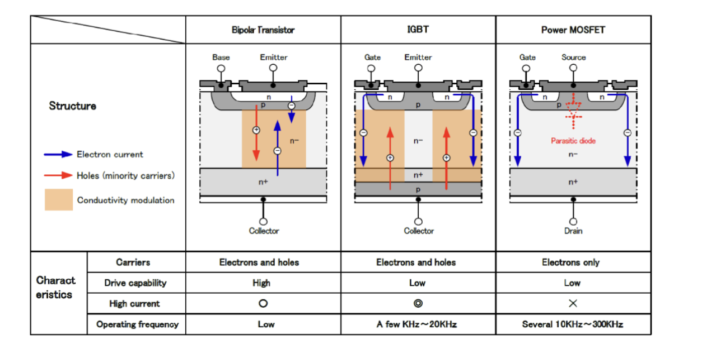
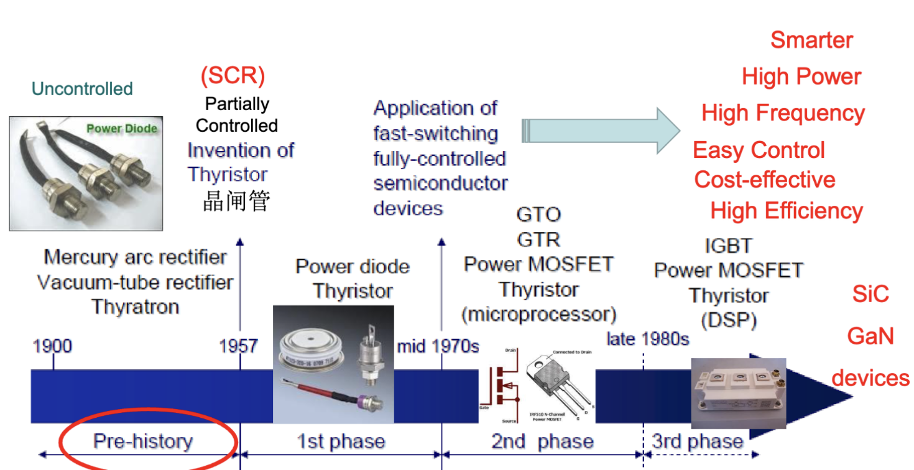
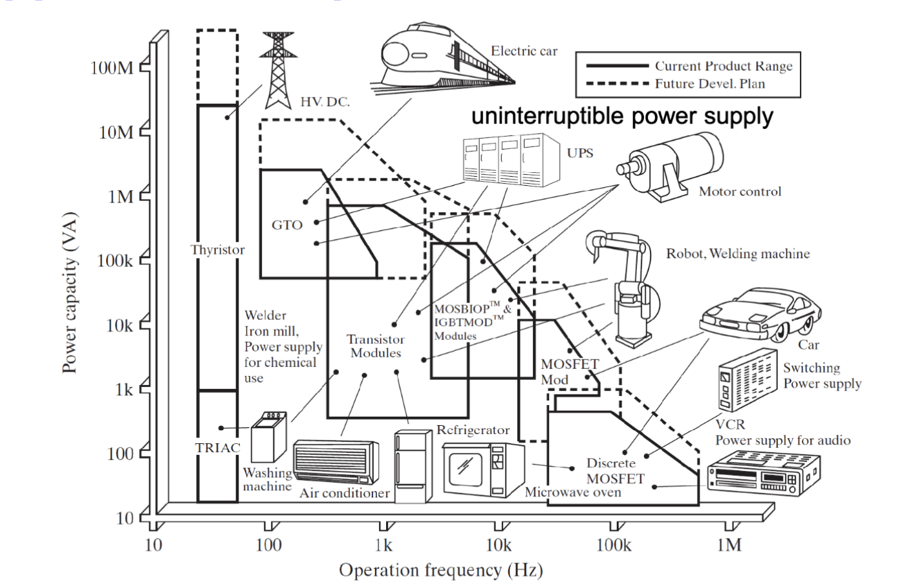
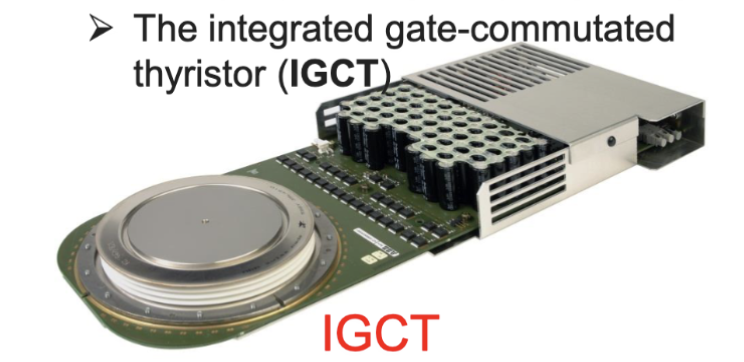

# Lec.3 用于开关电源转换的功率开关

> **_Power Switches For Switching Power Conversion_**
>
> Lecture @ 2026-3-31

## 功率开关损耗

理想的开关具有这样的特性：

- 单向电流流动
  - 当开关闭合时，电流可以流过，且是从输入端流向输出端的
- 电压降为0
  - 当开关闭合时，输入端和输出端之间的电压差为0
- 电压/电流额定值无穷大
  - 开关可以承受任意高的电压和电流，而不会损坏
- 瞬间的开关通断
  - 开关可以在瞬间从完全导通状态切换到完全断开状态，反之亦然

而在实际中，因为材料和工艺的限制，开关不可能完全满足上述理想特性，

- 功率损耗
  - 一部分由导通时开关上的电压压降引起
  - 另一部分由非理想的导通时间引起
  - 越小越好
- 额定功率限制
  - 一部分是输入电压/电流的限制
  - 另一部分是输入电压/电流的变化率的限制
  - 越大越好
- 驱动电路
  - 针对开关元件的特性设计的电路，用于控制开关的通断状态
  - 越简单高效越好
- 热管理
  - 开关在工作过程中会产生热量，需要有效的散热措施来保持开关的温度在安全范围内
  - 越可靠越好

---

一个通用的功率开关损耗应该是这样的：

其中，包括导通 (Turn-On)、关断 (Turn-Off)、以及维持开关状态 (On-State) 的损耗。

更具体来说，在导通阶段，开关从完全断开状态切换到完全导通状态，电压从输入电压降到0，电流从0升高到负载电流。在这个过程中，开关同时承受较高的电压和电流，因此会产生较大的功率损耗。

$$
\begin{aligned}
  P_s &= \frac{1}{2} V_d I_o f_s (t_\mathrm{on} + t_\mathrm{off}) \\
  P_\mathrm{on} &= V_\mathrm{on} I_o \frac{t_\mathrm{on}}{T_s} = V_\mathrm{on} I_o f_s t_\mathrm{on} \\
  P_\mathrm{total} &= P_s + P_\mathrm{on}
\end{aligned}
$$

这里的 $P_s$ 是开关损耗，$P_\mathrm{on}$ 是导通损耗，$P_\mathrm{total}$ 是总损耗。$V_d$ 是输入电压，$I_o$ 是负载电流，$f_s$ 是开关频率，$t_\mathrm{on}$ 和 $t_\mathrm{off}$ 分别是开关的导通时间和关断时间，$T_s$ 是开关周期。

根据这个式子，开关电容更小，电压变化更快，则导通和关断时间更短，开关损耗更小。开关效率越高，则压降越小，导通损耗越小。

## 功率开关分类

为了实现预期的优秀性质，特定元件的选择是必要的。常见的一个功率开关的选择是使用半导体晶体管开关，更具体来说是三极管。

三极管作为放大器时工作在放大区，作为开关时工作在饱和区。在饱和区中，三极管有着较低的导通电压和较高的电流承载能力，因此适合用作功率开关。

在经过特定的制造工艺后，三极管可以被设计接近于理想开关的特性，快速、高效、易于驱动。

---

我们通常可以通过这么几种方式来分类开关，首先是可控性，也就是开关的导通状态是否可以被外部信号控制：

- **可控性**
  - 几乎不可控
    - 功率二极管
      - 只能单向导通，无法控制导通状态
  - 半可控
    - 晶闸管 (Thyristor)
      - 可以通过触发信号控制导通，但无法控制关断
  - 完全可控
    - 双极晶体管 (GTR)
    - 金属氧化物半导体场效应晶体管 (MOSFET)
    - 绝缘栅双极晶体管 (IGBT)
    - 可关断晶闸管 (GTO)

之后是驱动方式，也就是开关的导通状态是通过电压还是电流来控制：

- **驱动方式**
  - 电压驱动
    - 金属氧化物半导体场效应晶体管 (MOSFET)
    - 绝缘栅双极晶体管 (IGBT)
    - MOS 控制的晶闸管 (MCT)
  - 电流驱动
    - 双极晶体管 (GTR)
    - 可关断晶闸管 (GTO)
    - 晶闸管 (Thyristor)

> 通常，电压驱动的开关有着更高的输入阻抗，对应的有更低的输入功率，输入电路简单，工作频率高
>
> 而电流驱动的开关因为有电导调制效应，导通电压更低，导通损耗低，工作频率低，所需的驱动功率较大，输入电路复杂

然后是材料自身的性质，例如载流子类型：

- **载流子**
  - 单极型 (多数载流子)
    - MOSFET
    - 肖特基二极管 (Schottky Diode)
  - 双极型 (少数载流子)
    - GTR
    - 晶闸管
    - GTO
  - 混合型
    - IGBT
    - MCT

除了通过器件本身的性质来分类的方法，还有按照参数等级来分类的方法，例如：

- **等级**
  - 电压等级
  - 电流等级
  - 开关频率
- **材料**
  - 硅 (Si, Silicon)
  - 碳化硅 (SiC, Silicon Carbide)
  - 氮化镓 (GaN, Gallium Nitride)
- **封装**
  - 高压集成电路 (HVIC, High Voltage Integrated Circuit)
  - 智能功率集成电路 (IPIC, Intelligent Power Integrated Circuit)
  - 智能功率模块 (IPM, Intelligent Power Module)

---

更具体的例子是，这是几种基本的晶体管的性质的比较

他们有着不同的性质，比如大电流承载能力，驱动能力，载流子区别以及工作频率等，这些性质决定了他们在不同的应用场景中的适用性。

## 功率开关的发展

功率开关器件的突破和演进标志着电力电子技术的发展历程。其从几乎不受控的二极管、晶闸管到完全受控的 GTO， GTR， MOSFET， IGBT，再到现在的 SiC 和 GaN 等宽禁带半导体器件，每一次技术的进步都极大地推动了电力电子系统的性能提升和应用范围的扩展。

功率电子器件广泛的使用在了不同的领域中，涵盖不同的功率频率和功率等级。二者呈现出一个权衡的关系，随着功率等级的增加，频率通常会降低，反之亦然。

未来发展的方向则是更高效、高功率、更快、更智能的功率开关。

比如 集成⻔极换流晶闸管 (ICGT, Integrated Gate-Commutated Thyristor)，它结合了晶闸管的高电流承载能力和 MOSFET 的快速开关特性，适用于高功率、高频率的应用场景。

以及 GaN 和 SiC 等宽禁带半导体器件，它们具有更高的击穿电压、更快的开关速度和更低的导通损耗，适用于高频率、高效率的应用场景。

## 典型的功率开关

有几种常用的电子器件可以用来切换相当可观的功率传输，并且是之后课程的重点。他们分别是：

- 电力二极管 (Power Diode)
- 晶闸管 (Thyristor)
- 可关断晶闸管 (Gate Turn-Off Thyristor, GTO)
- 双向晶闸管 (Triode for alternating current, TRIAC) & 固态继电器 (Solid State Relay, SSR)
- MOSFET
- 大功率晶体管 (Giant Transistor, GTR)
- 绝缘栅极双极型晶体管 (Insulated Gate Bipolar Transistor, IGBT)

而在具体的场景中，选择哪一个，则是需要考虑更具体的使用场景，如

- 需要多少控制能力 => **可控性**
- 导通时电压会下降多少 => **导通电阻**
- 关闭时可以阻断多少电压 => **额定电压**
- 能够承受多少电流 => **额定电流**
- 开关需要多少时间 => **开关频率**
