# Lec.4 功率二极管和二极管整流器

> **_Power Diode and Diode Rectifier_**
>
> Lecture @ 2026-4-7
>
> 你的意思是你在上课时讲完了这个堪比模电压缩饼干的内容吗，我中无量空处了？

## 功率二极管

### 二极管

功率二极管 (Power Diode) 是一个典型的不可控开关，也就是说不能通过施加的电流/电压控制其导通状态。它的导通状态一直保持在正向电流流过时导通，反向电压施加时截止的状态。

二极管是目前为止第一个考虑的非线性元件，也就是施加在它上的电压翻倍时，通过它的电流不一定翻倍。二极管的电流-电压关系可以通过 Shockley 方程来描述：

$$
I = I_s \left( e^{\frac{V}{nV_T}} - 1 \right)
$$

在实际工作中，二极管的行为类似于电压敏感开关，当阳极电位较高时电流导通，反之阻断电流。这种选择性通过的过程称为 **整流 (Rectification)**，是交流电转变为直流电的基础。

整流二极管具有 0.6 V ~ 1.2 V 左右的正向压降，一般被认为不根据通过的电流而变化。二极管阻断时，反向电流非常小，大概是几 nA （对于小型二极管）或者几 $\mu A$ （对于功率二极管）。在不发生击穿的情况下可施加的最大反向电压 (Peak Inverse Voltage, PIV, 也称为反向电压峰值) 根据不同的器件而不同。

如果施加了超过 PIV 的反向电压，且电流未被限制，则反向击穿导致二极管发生灾难性甚至永久性故障。

### 二极管损耗

一般来讲二极管是一个高效的元件，但是仍然具有损耗，我们认为它的损耗主要由两部分组成

$$
P_\mathrm{Total} = P_\mathrm{Conduction} + P_\mathrm{Switching}
$$

也就是导通损耗和开关损耗。

#### 导通损耗

二极管的连续额定值指的是二极管在不发生过热的情况下所能通过的最大的连续电流，散发的热量恰好是二极管两端电压压降和通过电流的乘积，也就是

$$
P_\mathrm{Conduction} = V_\mathrm{F} I_\mathrm{F}
$$

因为二极管结存在热惯性，可以承受合理的短期负载而不会过热，但是根据瞬态额定值来设计二极管的负载能力是非常不可靠的。

#### 开关损耗

二极管从关断切换到导通状态时非常迅速，但是考虑到电荷在 PN 结中的移动过程，关断过程相对较慢，而功率二极管尤其容易受 **反向恢复效应 (Reverse Recovery Effect)** 的影响。

反向恢复效应指的是关断时可能会有过冲现象，可以认为模型是理想二极管串联了一个电阻和一个电感，在关断时电流不能立即降为0，而是会有一个反向恢复时间，在这个时间内，二极管会继续导通，导致额外的功率损耗。

这个过程主要会导致下图中的 C 和 D 期间产生不必要的电流流动，尤其是 D 的情况，因为同时有相对较大的电流和电压，会产生较大的功率损耗。

C 区的时间和 D 区 (恢复到0之前) 的时间分别是 $t_C$ 和 $t_D$，则对于一个二极管的恢复因子 (Recovery Factor) 可以定义为

$$
S = \frac{t_D}{t_C}
$$

也就是上升的时间和下降的时间的比值。如果 $S=1$，它是一个软恢复二极管，反之如果 $S < 1$，它是一个突变恢复二极管 (Snappy Recovery Diode) 或者快速恢复二极管 (Fast Recovery Diode)。

估算二极管损耗的公式是

$$
P_{rr} = Q_{rr} V_R F_{SW}
$$

其中，$P_{rr}$ 是反向恢复损耗，$Q_{rr}$ 是反向恢复电荷，$V_R$ 是反向电压，$F_{SW}$ 是开关频率。在高频率开关下，反向恢复损耗可能会成为系统的主要损耗来源，因此在设计电路时需要特别注意二极管的选择和使用，以减少反向恢复效应带来的影响。

例题

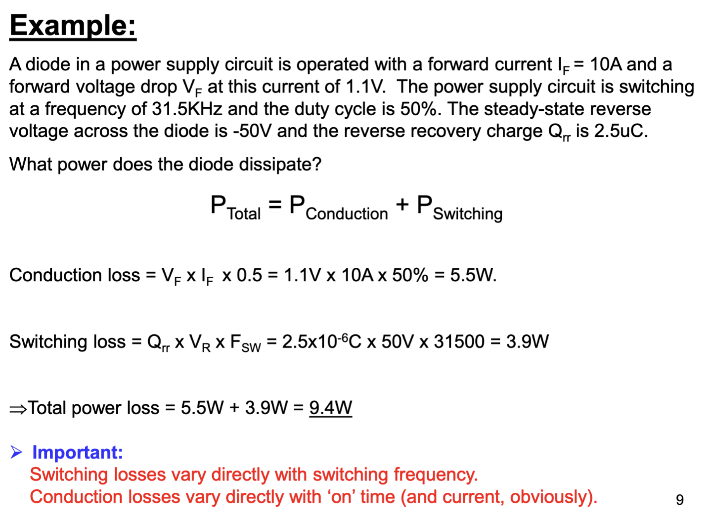

#### 反向恢复效应

跟之前提到的一样，反向恢复效应指的是 PN 二极管正向导通结束后反向电流会短暂流动，直到 PN 结区域内的电荷耗尽之前无法恢复阻断能力。

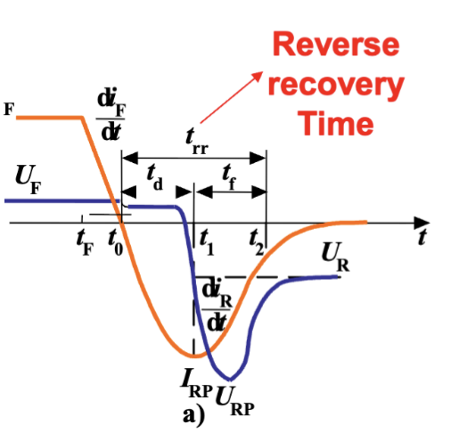

典型的反向恢复过程如图所示，其中的 $t_{rr}$ 是反向恢复时间。其他的参数分别是

- $t_0$：正向电流归零时间
- $t_1$：反向电流达到最大值的时间
- $t_2$：电流变化率接近零的时间（反向电流衰减完成）
- $t_d = t_1 - t_0$：延迟时间 (Delay Time)
- $t_f = t_2 - t_1$：电流下降时间 (Current Fall Time)
- $t_{rr} = t_d + t_f$：反向恢复时间 (Reverse Recovery Time)
- $S_r = t_f / t_d$：恢复因子 (Recovery Factor)
- $I_{RP}$：最大反向恢复电流 (Maximum Reverse Recovery Current)
- $U_{RP}$：最大反向恢复电压 (Maximum Reverse Recovery Voltage)

---

下图是正向恢复过程 (Forward Recovery)，当正向电流快速施加时，二极管两端的电压会先出现一个过冲峰值 $U_{FP}$，然后才下降到稳态正向压降 $u_F$，整个过程持续时间为正向恢复时间 $t_{fr}$。

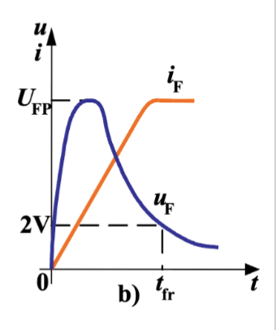

此时管上压降较大，电流也较大。正向电流的上升会因为器件自身的电感而产生较大压降，因此电流上升率越高，$U_{FP}$ 越大

---

反向恢复电流可能会导致感性电路中的过电压。

在大多数电路中，这种反向电流不会影响变换器的输入输出特性，因此在关断瞬态期间，二极管也可被视为理想器件。

#### 基于恢复时间的二极管分类

因为反向恢复效应是因为二极管 PN 结内部的可动电荷没有耗尽导致的，所以是二极管的固有特性，无法通过外部电路来改变。某些特别的二极管有着不同的性质，比如

- 肖特基二极管 (Schottky Diode)
  - 常用于低输出电压变换器
  - 有着低正向压降 (0.15V ~ 0.45V) 和非常快的开关速度 (10ns ~ 40ns)，因此没有明显的反向恢复效应
- 快恢复二极管 (Fast Recovery Diode)
  - 用于高达数百 kHz 的变换器
  - 反向恢复时间小于 $5\mu s$，额定值为几百 $V/A$
- 工频二极管 (Line Frequency Diode)
  - 低开关频率，适用于通用二极管和整流器二极管
  - 较长的反向恢复时间，额定值为数千 $V/A$

快恢复二极管是一种典型的克服功率开关中反向恢复问题的解决方案，其特性是 $T_{rr} < 50ns$，而超快恢复二极管 (Super Fast Recovery Diode, SFRD) 的恢复时间更短，通常在 $20ns < T_{rr} < 30ns$，因此适用于更高频率的应用。

常见的二极管基本都是工频二极管，因为其工作在交流电网的工作频率，也就是 50Hz 或者 60Hz 的频率下。

小型快恢复二极管的典型参数表为

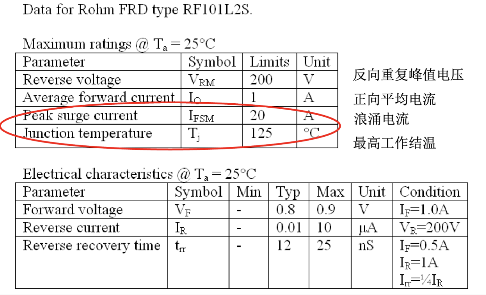

## 二极管整流器

二极管有几个常见的使用场景，比如整流

### 半波整流器

整流指的是把交流电转换成直流电的过程，实现这个目标的最常用的办法是使用多个二极管组成一个整流器 (Rectifier)，其中，一种办法是半波整流器 (Half-Wave Rectifier)。

半波整流器实质上是在电路上串联了一个二极管，交流电流通过二极管时，只有正半周期的电流能够通过，负半周期的电流被二极管阻断，因此输出的电压是一个脉动的直流电压。

对于半波整流后的输出电压，公式是

$$
V_L = \begin{cases}
  \hat{V}_{AC} \sin(\omega t) - V_F, & \text{if } \omega t \in [0, \pi] \\
  0, & \text{otherwise}
\end{cases}
$$

使用在 [电路复习](./lec2.md#功率和能量) 中默认装载的电路知识，可以计算出这种半波整流器的平均输出电压为

$$
V_{DC} = \frac{1}{2\pi}\left[
  \int_0^\pi \hat{V}_{AC} \sin(\omega t) d(\omega t)
\right] = \frac{\hat{V}_{AC}}{\pi}
$$

考虑到原本输入的交流电压有效值是 $V_{AC\ RMS} = \frac{\hat{V}_{AC}}{\sqrt{2}}$，我们可以得到 $V_{DC} \approx 0.45 V_{AC\ RMS}$，也就是说半波整流器的输出电压大约是输入交流电压有效值的 45%。这说明这种整流器没有充分利用变压器，因为它只利用了交流电压的正半周期，负半周期的电压被浪费了。

类似的，因为半波整流器需要在反向截断时把几乎所有的电压都施加在二极管上，所以二极管的反向电压峰值必须至少等于输入交流电压的峰值 $\hat{V}_{AC}$，因此二极管的额定值必须满足 $PIV \ge \hat{V}_{AC}$。

### 全波整流器

#### 全波整流的均值和有效值

我们期望的输入（待整流电压）是一个理想的正弦波。那么经过全波整流器后，期望的输出信号是一个绝对值的正弦波，也就是

$$
v(t) = V_{pk} \left| \sin\omega t\right|
$$

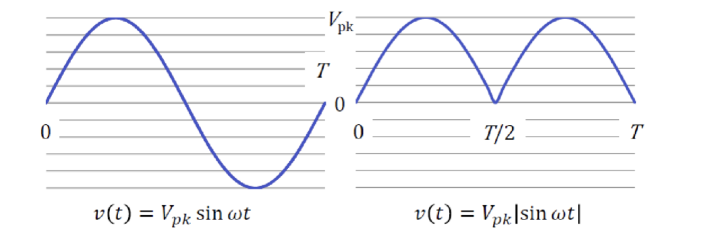

因此，考虑到原本的一个周期变成了现在的两个周期，信号的频率实际上翻倍了。

---

对于这个信号的平均值，可以对前半周期进行积分

$$
\begin{aligned}
  V_{ave} &= \frac{2}{T}\int_0^{\frac{T}{2}}V_{pk}\sin\omega t dt \\
  &= \frac{2V_{pk}}{T}\left[-\frac{\cos\omega t}{\omega}\right]_0^{\frac{T}{2}} \\
  &= \frac{2 V_{pk}}{\pi} \\
  &\approx 0.637 V_{pk}
\end{aligned}
$$

对于有效值，因为绝对值不会对平方的结果产生影响，因此不会发生变化，有

$$
V_{rms} = \frac{V_{pk}}{\sqrt{2}} \approx 0.707 V_{pk}
$$

在物理上也可以理解为理想的整流器不会影响输出功率。以及，这种类似对称性的计算方法往往很有用。

#### 中间抽头整流器

中间抽头整流器 (Full-Wave Center-Tapped Rectifier) 是一种改进的整流器设计，它使用了两个二极管和一个中心抽头的变压器来实现全波整流。

这个电路类似于两个拼在一起的半波整流器，在交替波形的交替半个周期中输出。负载电压可以写作

$$
V_L = \begin{cases}
  \hat{V}_{AC} \sin(\omega t) - V_F, & \text{if } \omega t \in [0, \pi] \\
  -\hat{V}_{AC} \sin(\omega t) - V_F, & \text{if } \omega t \in [\pi, 2\pi]
\end{cases}
$$

类似的，计算平均值

$$
\begin{aligned}
  V_{DC} &= \frac{1}{2\pi}\left[
  \int_0^\pi \hat{V}_{AC} \sin(\omega t) d(\omega t) +
  \int_\pi^{2\pi} -\hat{V}_{AC} \sin(\omega t) d(\omega t)
\right] \\
&= \frac{2\hat{V}_{AC}}{\pi} \\
& \approx 0.637 V_{AC\ MAX}
\end{aligned}
$$

此时的电流值也就成了

$$
I_{DC} = \frac{V_{DC}}{R_L} = \frac{2\hat{V}_{AC}}{\pi R_L}
$$

因此，这次的输入电压利用率来到了 $V_{DC} \approx 0.9 V_{AC\ RMS}$，相比于半波整流器有了显著的提升。问题只在于

1. 任何时刻只使用了一半的变压器绕组，因此变压器的利用率只有 50%
2. 每个二极管两端施加的最大反向电压实质上变成了 $2 \hat{V}_{AC}$，因此二极管的额定值必须满足 $PIV \ge 2\hat{V}_{AC}$，这对于高电压输入来说是一个很大的挑战
3. （半个）正弦波的频率加倍了

---

对于这个典型的中间抽头整流器

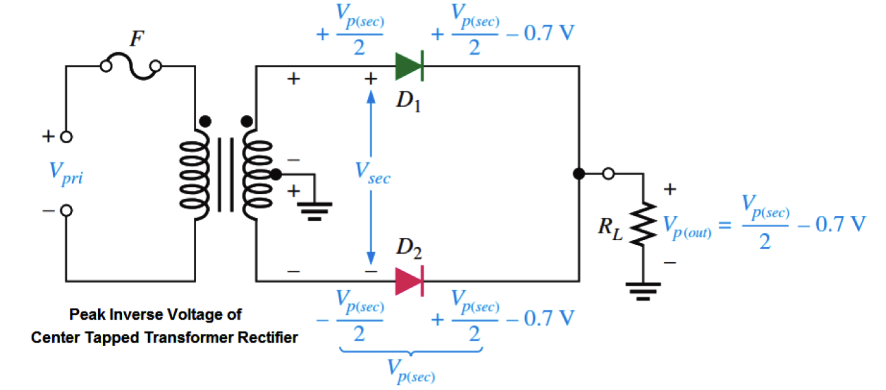

计算每个二极管上的峰值反向电压 (Peak Inverse Voltage, PIV)，则大小为

$$
\begin{aligned}
  PIV &= (\frac{V_{p(sec)}}{2} - 0.7V) - (- \frac{V_{p(sec)}}{2}) \\
  &= V_{p(sec)} - 0.7V
\end{aligned}
$$

此处的 $V_{p(sec)}$ 是次级绕组上的峰值输出电压。根据中间抽头变压器的特性，我们可以得到输出电压峰值和次级绕组电压峰值的关系

$$
V_{p(out)} = \frac{V_{p(sec)}}{2} - 0.7V
$$

带入可得

$$
PIV = 2V_{p(out)} + 0.7V
$$

#### 全桥整流器

额外使用一对二极管来进一步改进之前的电路，可以得到**单相桥式电路 (Single-Phase Bridge Rectifier)**，也就是**全桥整流器 (Full-Bridge Rectifier)**。这种电路结构不需要中心抽头，可以充分利用变压器的次级绕组。

这往往是成本效益最高的电路。

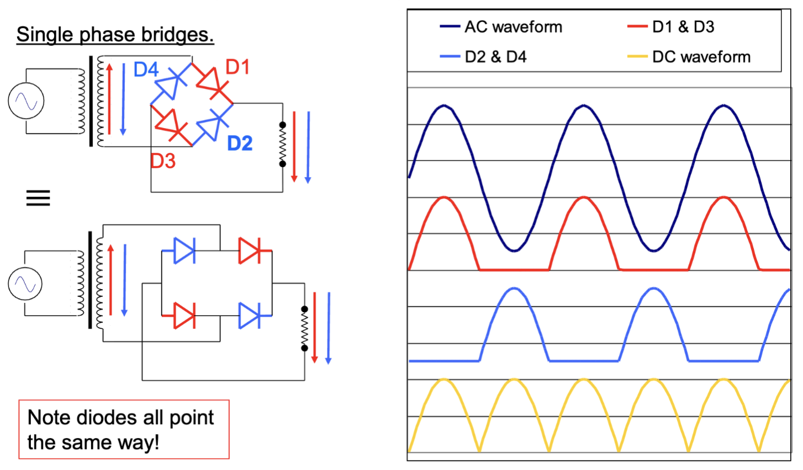

原理很明确

- 上半周期时 $D_1$ 和 $D_2$ 导通，$D_3$ 和 $D_4$ 截止，电流从输入端流向输出端
- 下半周期时 $D_3$ 和 $D_4$ 导通，$D_1$ 和 $D_2$ 截止，电流同样从输入端流向输出端

---

桥式电路与全波整流电路之间的关系是相同的（因为理想情况下输出是一致的）。因此，有 $V_{DC} \approx 0.9 V_{AC\ RMS}$。

因此反向峰值电压此时同时由两个二极管分担，每个二极管只用承担大约 $V_{p(sec)}$ 的反向电压。

对于需要高电流和低电压的应用，中心抽头电路更受青睐，因此次级电路中只有一个二极管压降，但是与相同次级功率的桥式电路相比，往往需要增加大约 30% 的额定功率

---

给出的变压器的次级电压是在满载电流的工况上的，因此在其他的条件下次级电压可能会更高。这被称为变压器的 **电压调整率 (Regulation)**。

### 平滑输出

整流器的输出不能直接通入其他电路，大多数电子电路需要恒定的直流电源。因此，为了降低纹波电压，需要在整流电路的输出端并联一个平滑电容器。

容值的选择应注意 $R_{load}C_{smoothing} \gg \frac{1}{\text{frequency}}$，也就是应当保证电容器的充放电时间常数远大于输入交流电压的周期。

#### 半波整流器

典型的电路如下

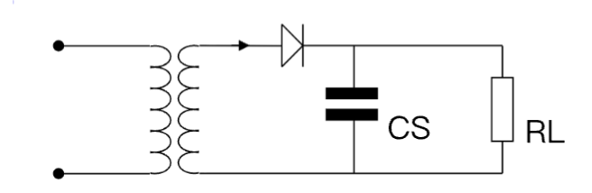

在这个电路中二极管仅仅在阳极电压高于电容电压才会导通。因此，较大的电容带来较低的纹波电压。

但是，更大的电容会导致充电电流脉冲变短，流过二极管的峰值电流更大，波形因数也会更高（通常为 $1.8 \sim 2.2$）。因此，变压器需要更大的线径和更高的伏安额定值来避免过热。

二极管的导通角用 $\alpha$ 表示，定义为二极管导通的时间占一个周期的角度。

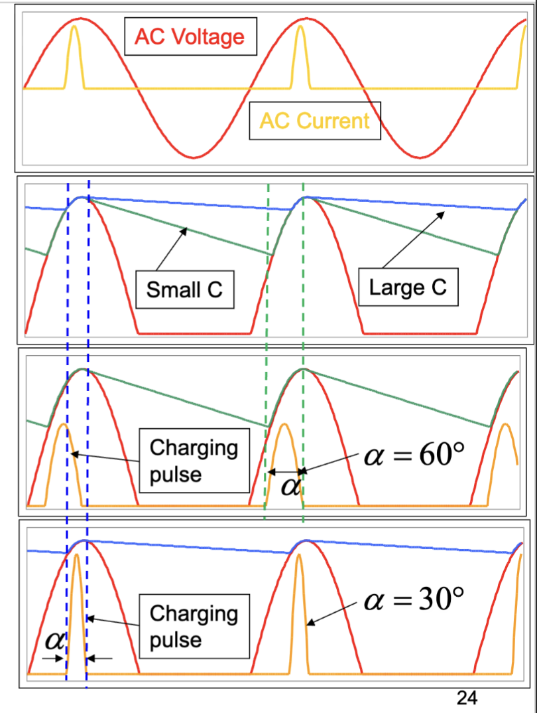

这种构型有较高的谐波电流。

---

需要注意的是，因为电容在负半周期保持了输出电压，因此二极管的峰值反向电压相比不带电容的情况下需要增加。

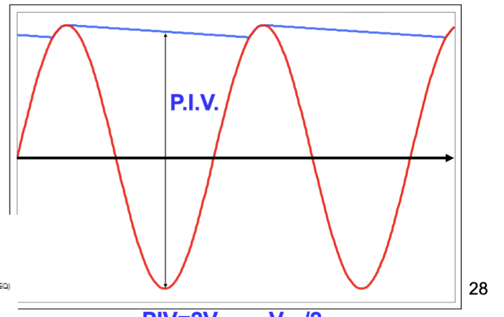

也就是有

$$
PIV = 2V_{p(sec)} - \frac{V_{pp}}{2}
$$

这里的 $V_{pp}$ 是输出纹波电压的峰峰值，$V_{p(sec)}$ 是变压器次级电压的峰值。作为参考，不带电容时，输出的直流电压为

$$
\begin{aligned}
  V_{dc} &= \frac{V_{p(sec)}}{\pi}  \\
  &\approx 0.318 V_{p(sec)} \\
  &\approx 0.45 V_{RMS}
\end{aligned}
$$

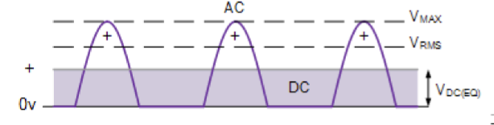

#### 全波整流器

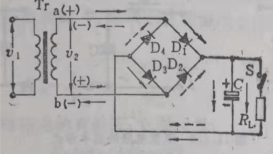

全波整流是类似的。当接入了更大的电容，则会有更好的纹波表现，同时二极管的导通角越窄，波形因数越高，变压器的伏安额定值越高。

|                                                   |                                                     |
| ------------------------------------------------- | --------------------------------------------------- |
| 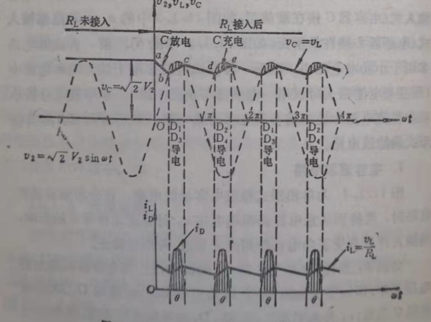 | 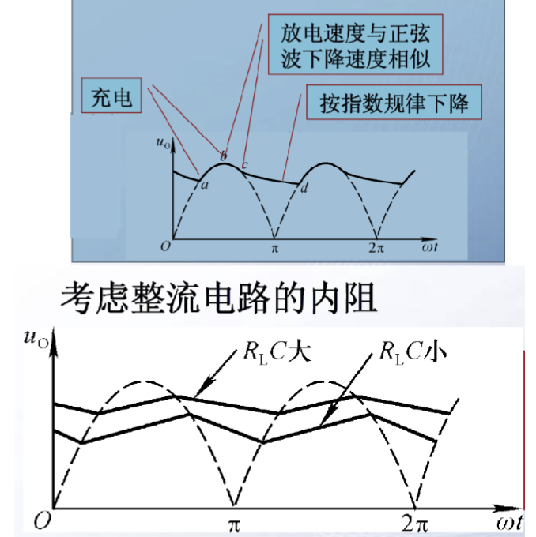 |

#### 纹波计算

我们可以把电容器上的电压指数衰减近似看作是线性下降（前提条件仍然是$RC\gg T$），此时输出电压波形也就变成了线性锯齿波形。因为充电周期远小于放电周期 ($t\ll\tau$)，可以认为放电周期时间就是锯齿波周期。

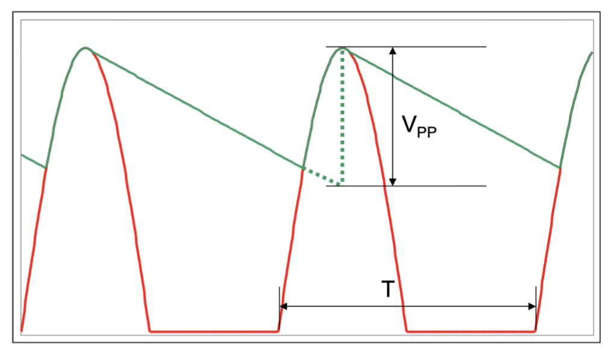

放电周期所有电流都来自电容器，因此

$$
\begin{aligned}
  I_L &= C \frac{d V_L}{dt} \\
  \Delta V_L &= \frac{I_L}{C} \Delta t
\end{aligned}
$$

进而得到了一个周期内的纹波电压 $\Delta V_L$ 的近似计算公式

示例计算

这是半波下的计算，但是假设是相同的。

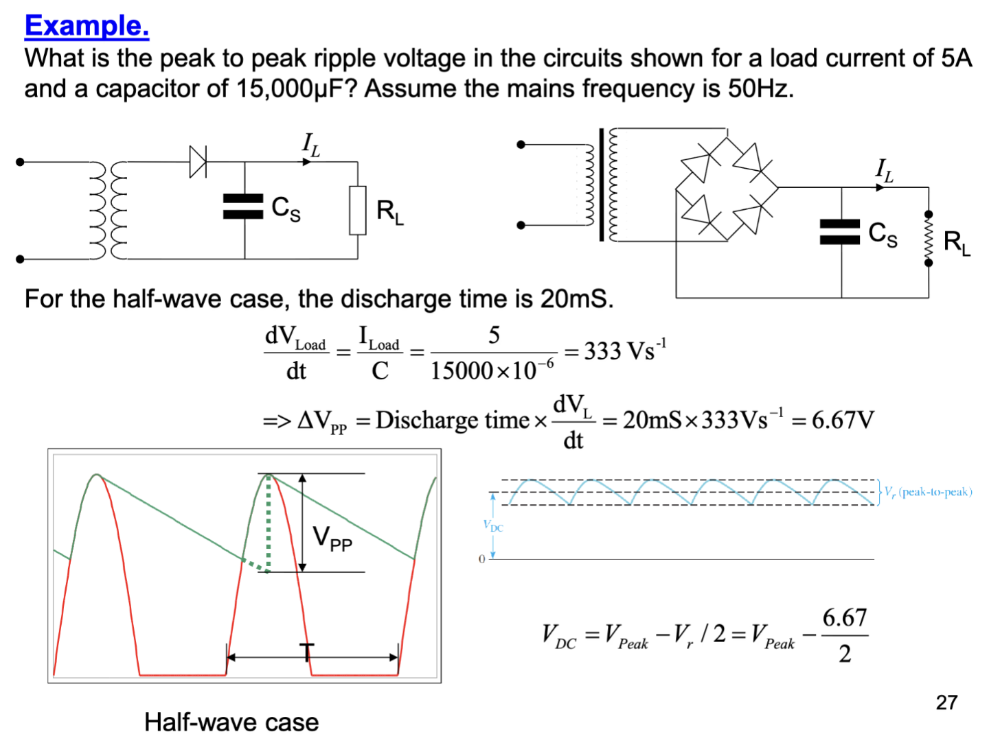

---

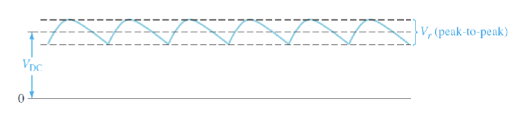

另一个角度是能量角度。电容储存的能量为 $E = \frac{CV^2}{2}$，放电的能量为 $\Delta E = V A t$。因此，放电结束后的电压可以认为是

$$
V' = \sqrt{\frac{2 (E-\Delta E)}{C}}
$$

仍然是上面那个示例

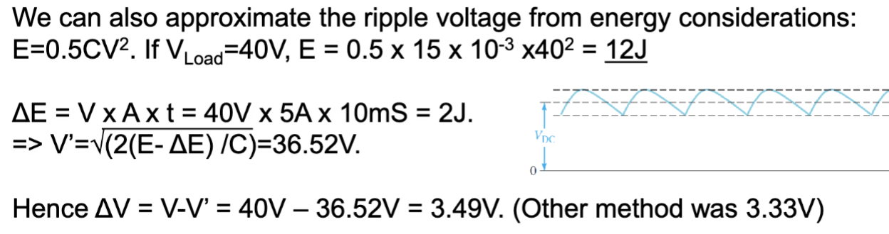

需要注意的是，这个方法得出来的结果和另一种线性近似的方法算出来的结果是 **不一样的**。

---

全波情况下，因为我们假设电压是线性下降的，因此频率翻倍可以带来纹波电压的减半。

全波情况下的计算

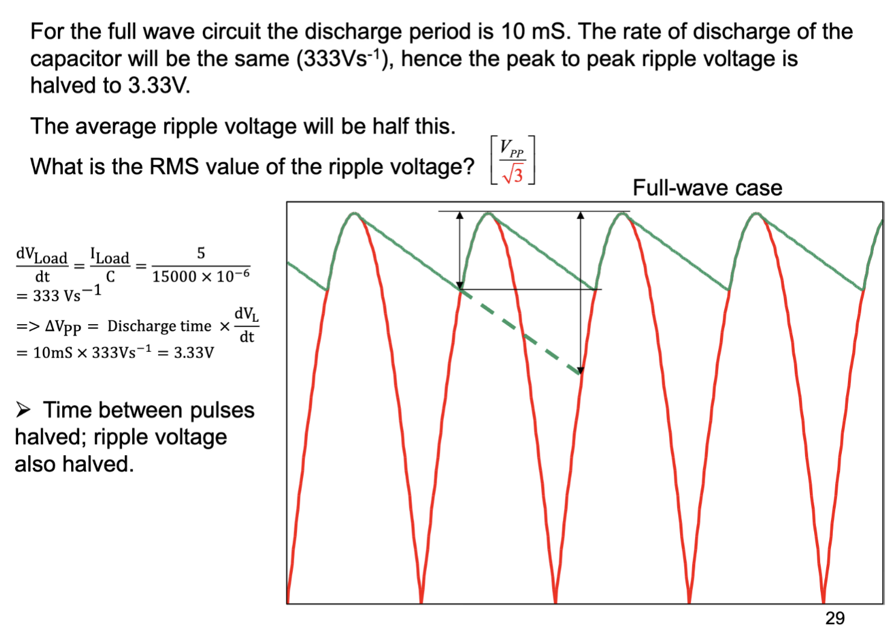

#### 波形因数计算

较大的平滑电容值会降低纹波电压，但是这会对从变压器抽取的电流波形的波形因数产生不利影响。电容值越大，会产生更短时间下的更大的电流脉冲，其与二极管导通角 $\alpha$ 直接相关

这里假设导通角是 $60\degree$，则相关参数为

> $60\degree$ 相当于 $3\omega t$，因为全波情况下一个周期是 $\pi$，$60\degree$ 占比 $\frac{1}{3}$，有系数 $3$

$$
\begin{aligned}
 I_{ave(\alpha=60)} &= \frac{1}{\pi} \left[
  \int_0^\frac{\pi}{3} \hat{I} \sin 3\omega t d\omega t +
  \int_\frac{\pi}{3}^\pi 0 d\omega t
 \right] \\
 &= \frac{2 \hat{I}}{3 \pi}
\end{aligned}
$$

$$
\begin{aligned}
  I_{RMS(\alpha=60)}^2 &= \frac{1}{\pi} \left[
    \int_0^\frac{\pi}{3} \hat{I}^2 \sin^2 3\omega t d\omega t +
    \int_\frac{\pi}{3}^\pi 0 d\omega t
  \right] \\
  &= \frac{\hat{I}^2}{6} \\
  I_{RMS(\alpha=60)} &= \frac{\hat{I}}{\sqrt{6}}
\end{aligned}
$$

因此，波形因数有

$$
FF = \frac{I_{RMS(\alpha=60)}}{I_{ave(\alpha=60)}} = \frac{\frac{\hat{I}}{\sqrt{6}}}{\frac{2 \hat{I}}{3 \pi}} = \frac{3 \pi}{2 \sqrt{6}} \approx 1.933
$$

类似的，在 $\alpha = 30\degree$ 的情况下，有 $FF \approx 2.72$

---

我们之前认为电容器中的充电脉冲近似为足够短的时间，不影响电压波形，但是实际上这个脉冲的影响是足够显著的，需要考虑。当二极管导通时，它不仅为负载充电，还为电容器充电。电容器的放电周期因此被缩短了。

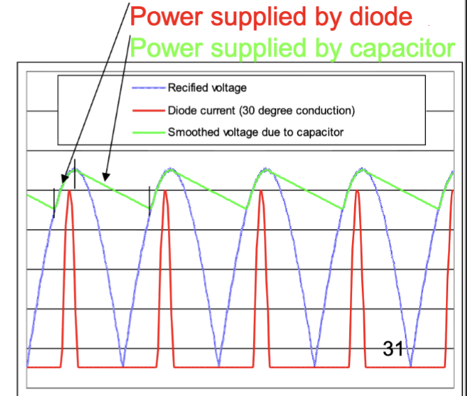

比如，当输入为 12V@50Hz，$R_{load}$ 为 $8.5\Omega$，电容为 $C_{smoothing} = 10000\mu F$，导通角为 $\alpha = 30\degree$，全波整流器，计算纹波电压，则有

- 输入 50Hz，因此输出加倍为 100 Hz
- 导通角为 $30\degree$，是 $\frac{1}{6}$ 个输出周期，因此电容的放电时间为 $\Delta t = \frac{5}{6} \times \frac{1}{100} s$，也就是 $8.33ms$
- 峰值负载电压为 $12 \times \sqrt{2} \approx 17V$，因此负载电流为 $I_L = \frac{17V}{8.5\Omega} = 2A$
- 使用公式 $I_L = C \frac{dV_L}{dt}$，不那么标准的带入 $\Delta t$，则有 $\Delta V_L = \frac{I_L \Delta t}{C} = 1.66 V$

因此纹波电压为 $1.66 V$。

> 这里的假设是负载电流在放电期间不发生变化，近似为线性放电斜坡。也就是仍然是理想情况。

此时，输出的直流电压可以表示为

$$
V_{DC} = V_{Peak} - \frac{V_r}{2}
$$

因为 $V_{Peak}$ 是供电决定的，所以当电容越大，纹波电压越小，最终输出的电压越高，导通角降低，二极管电流增大。

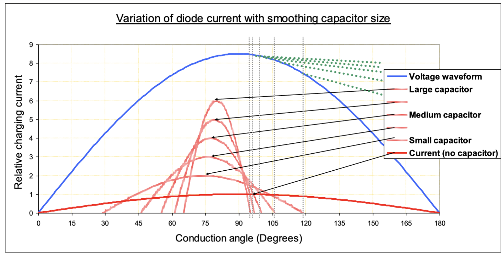

假设输出功率是恒定的情况下，则在固定供电频率下，每次脉冲的面积（也就是能量）应该是恒定的。随着充电脉冲持续时间的减小，其幅度一定要对应增加来维持总能量的相等。

较大的电流会导致额外的发热，计算是 $I^2t$，被称为**允通能量 (Let-through Energy)**，其与电流的平方成正比，与时间成正比，因此 $10A$ 持续 $10ms$ 和 $100A$ 持续 $1ms$ 的发热损耗的比例是 $1:10$

## 线性电源

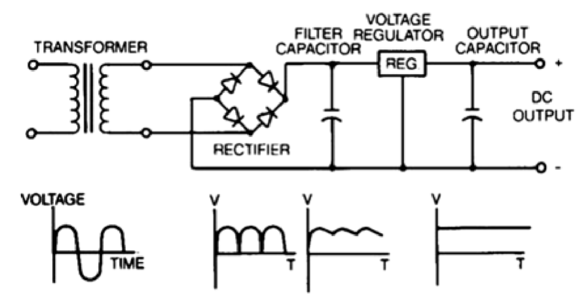

在整流器之后通常仍然需要一部分电路，用于将整流器输出的脉动直流电压进一步稳定为恒定的直流电压。这个电路是线性稳压器 (Linear Regulator)，它通过调整内部的电阻来维持输出电压的稳定。

稳压器是通过分压进行调节的，因此输出电压要比整流后带纹波的输入电压的最低值还要低。同时，它的效率非常差，通常只有 $30\% ~ 60\%$，并且有着较大尺寸。

线性电源的结构很简单，产生非常小的电磁干扰 (Electromagnetic Interference, EMI)，在小功率时成本较低。

---

线性电源一共有六个基本阶段，从图里也可以看出

- 隔离 (Isolation)
- 变压 (Transformation)
- 整流 (Rectification)
- 平滑/滤波 (Smoothing)
- 稳压 (Regulation)
- 保护 (Protection)

### 隔离和变压

变压器中需要关注的点主要是电气隔离以及电压从初级绕组到次级绕组的转换。在设计中需要注意的一共有两点

首先是变压器的 **调整率 (Regulation)** ，其定义式为

$$
\text{Regulation} = \frac{
  V_\text{No\ load} - V_\text{Full\ load}
}{
  V_\text{No\ load}
}
$$

变压器上的电压降是 $I_2 Z_2$，这里的 $Z_2$ 是次级绕组的阻抗，$I_2$ 是次级电流。因为 $I_2$ 与负载成正比，因此在满载时电压降最大，空载时电压降最小。

一般我们认为次级绕组的非理想因素是一个电阻和一个电感串联，电感的阻抗可以表示为 $X_2 = 2\pi f L$。

由此可以导出第二点：变压器的次级电压额定值是在最大负载下得出的，也就是最低电压的情况。

交流有效值实际也会有一个容差范围，在 $230V$ 有 $-6\% \sim +10\%$ 的范围。（这是欧盟的 $230V$ 标准）

因此，考虑一个接入市电的调整率为 $8\%$ 的额定 $12V$ 变压器，输出的最大和最小电压应该为

$$
\begin{aligned}
  V_{Min} &= 12 \times (1-0.06) = 11.3 V \\
  V_{Max} &= 12 \times (1 + 0.1) / (1 - 0.08) = 14.3 V
\end{aligned}
$$

> PPT 上使用的是 $12 \times (1+0.1) \times (1.08)$，但是按照定义式应该是除法，不确定是笔误还是近似计算

---

变压器的伏安额定值指的是满载时的次级电压和次级电流的乘积。当变压器输出接了较大的电容滤波的时候，电流的波形因数较高，有着较高的电流峰值，因此变压器的额定伏安值会比按照直流负载直接计算的结果大很多。此时变压器的次级额定值需要降额使用，以缓解大电流在变压器中产生的热效应。

降额 (derate) 的公式为

$$
I_{AC} = I_{DC} \times FF
$$

而功率的公式为

$$
\begin{aligned}
  V A_\text{Load} &= V_{AC} I_{AC} = V_{AC}\cdot FF\cdot  I_{DC} \\
  V A_\text{Transformer} &= \frac{V A_\text{Load}}{\eta}
\end{aligned}
$$

| 电路图                               | 波形图                                |
| ------------------------------------ | ------------------------------------- |
| 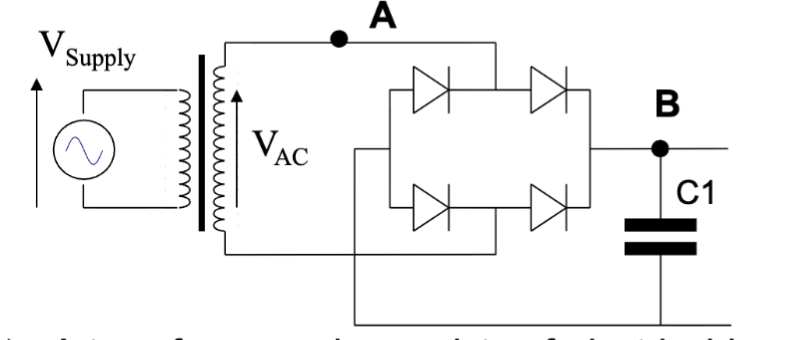 | 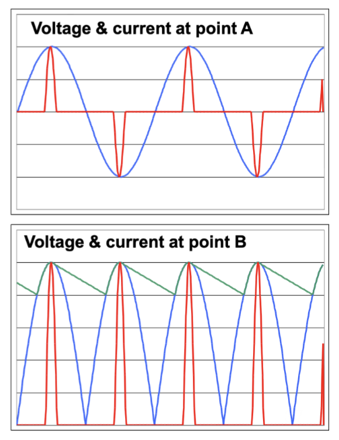 |

变压器只包含电气损耗，也就是铁损 (涡流损耗和磁滞损耗) 和铜损 (线圈电阻引起的损耗)，因此效率较高，通常在 $95\% \sim 98.5\%$

### 整流和滤波

这部分在前面的整流器章节已经提到，因此只用注意几个重点

1. **假设二极管在导通时有 $1V$ 的压降**

   如果电源没有负载，则二极管不留过任何电流，电容上的整流电压和变压器次级绕组的 $\sqrt{2}$ 倍相等，也就是到达峰值。

   必须假设电源在某些情况下会在无负载下运行，因此二极管必须要承受夹在它上的反向峰值电压。

   在无负载下，二极管上没有压降。

2. **全波桥式整流器比中间抽头更能有效利用变压器绕组**

   桥式整流器中每个二极管的反向电压是中间抽头的一半，因为对于桥式电路有两个二极管分担电压，也就是

   $$
   \text{Total\ PIV} = \hat{V}_{CAP} -\hat{V}_{AC(Min)}
   $$

   最大正向电压就是电容器上的峰值电压，最大反向电压则是交流输入的负峰值。

3. **全波整流电路都会把整流器的直流侧电源频率翻倍，继而简化了平滑问题**

   原因是频率加倍相当于电压下降时间 $\Delta t$ 减半，因此纹波电压也减半。估算方法为

   $$
   \begin{aligned}
      I = C\frac{dV}{dt} &\Rightarrow \Delta V = \frac{I \Delta t}{C} \\
      E = \frac{CV^2}{2} &\ \text{And}\ Q = CV
   \end{aligned}
   $$

   如果知道二极管导通角 $\alpha$，则在计算下降时间时可以减去对应的周期来获得更佳的估算值。

4. **对于给定的负载电流，更大的平滑电容将产生更小的纹波电压，但是需要更大的变压器**

   这是因为电流波形的纹波因数太大，变压器需要降额使用。并且电源线路的电流谐波会更严重。因此，负载电流决定了恒定电容下的纹波电压。

5. **纹波频率是电源频率的两倍，与电容大小无关**

### 稳压

稳压 (Regulation) 是一个衡量输出电压如何随着负载电流而变化的性能指标。理想电源应该具有稳定的输出电压，与负载电阻无关。在实际中这个很难实现。

**齐纳二极管 (Zener Diode)** 是一种产生固定电压的方法，但是这种方法的稳压性能较差 —— 随着负载电流变化，齐纳二极管的偏置电流会变化，输出电压会在器件的伏安曲线上移动。

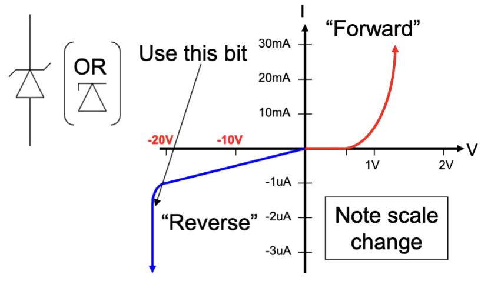

缺陷可以总结为

1. 稳压性能差
2. 功耗有限，适用于信号但是不适用于大负载
3. 输出电压总低于输入电压

---

线性稳压器 (Linear Regulator) 是一种经济的调节电源调节性能的方法，其使用三引脚的电子器件连接到输入电压，输出电压和地之间。

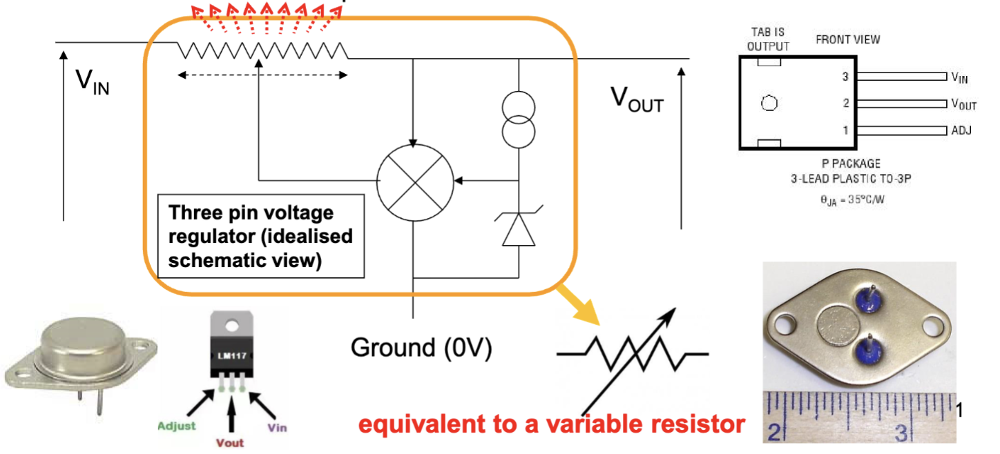

此时，只要输入电压比输出电压高出几伏，那么输出电压就能精确的调整到指定值。其达到的稳压率可以轻松达到 $0.1\%$ 。

其工作原理是等效一个可变电阻，通过内部反馈电路调节阻值大小，进而保持输出电压恒定。其分摊的电压差会以热量形式释放功耗为压降与电流的乘积，也就是

$$
P = I \times \Delta V
$$

通常这类器件内部还有自保护功能，包括热过载，短路保护等。

### 保护

晶闸管 (SCR) 可以在过压保护电路中用作开关元件，如下图所示。其比较分压网络结果和二极管参考电压的结果作为晶闸管的控制信号。晶闸管导通后电路相当于短路，然后保险丝熔断。

这个电路也叫撬棍 (Crowbar) 电路。

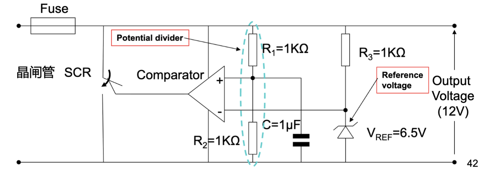

线性稳压器还提供了其他几种保护措施。比如，线性稳压器会以热量的形式耗散输入和输出之间的功率，因此在较大电压差的情况下器件可能会过热，如果短路则问题会进一步加剧。

保护的解决方法是随着负载电流上升，输出电压保持平稳；当超出最大输出电流时，降低输出电压。

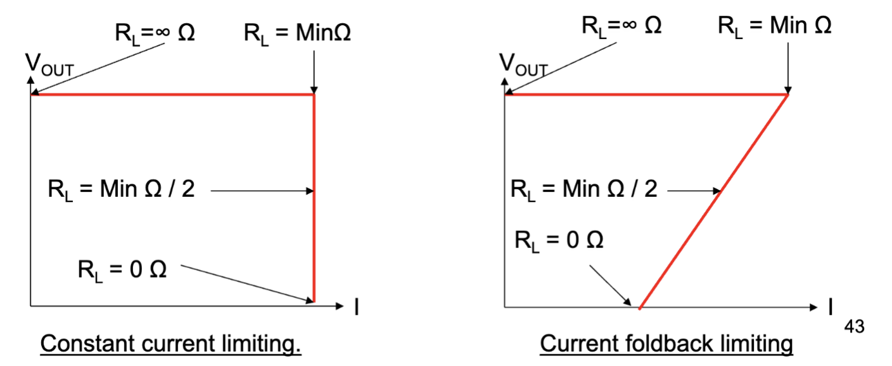

左图的形式被称为恒流限制 (Constant Current Limiting)，调节器保持输出电流恒定的同时降低输出电压。这种方法的问题是降低输出电压会导致压差增大，进而导致功率损耗增大。

另一种方式是右图，为电流折返限流 (Current Foldback Limiting)，此时输出电流和输出电压同时降低，限制了稳压器耗散的功率大小。

除此之外，稳压器还集成了全面的热保护电路。因为紧凑的封装，模块可以直接测量自身的温度，如果超出最大温度将直接关闭以保护自身。当散热到安全值后重新激活输出，大概如下图所示

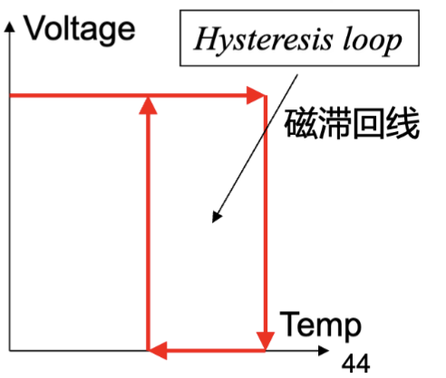

主要还是在与线性稳压器的低效率斗争，降低热功率和增加散热应该是考虑方向。

---

因此，经历了全部流程后，每一步的电压应该是像这个图这样的

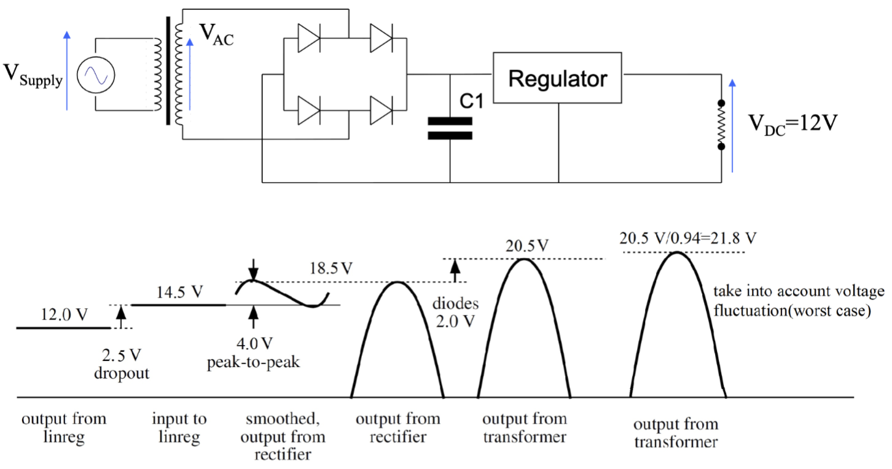

课后习题

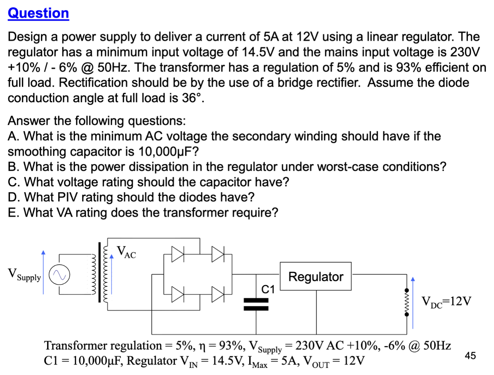

---

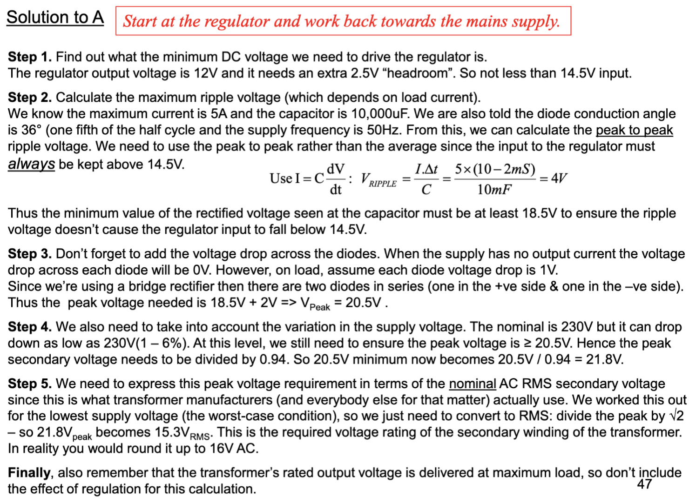

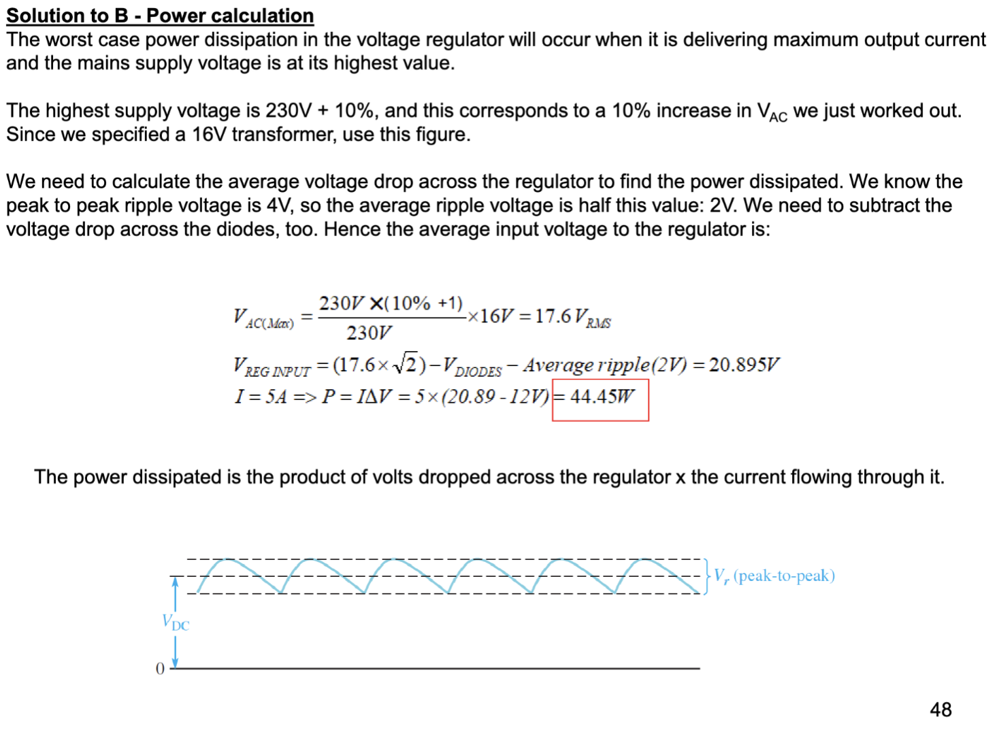

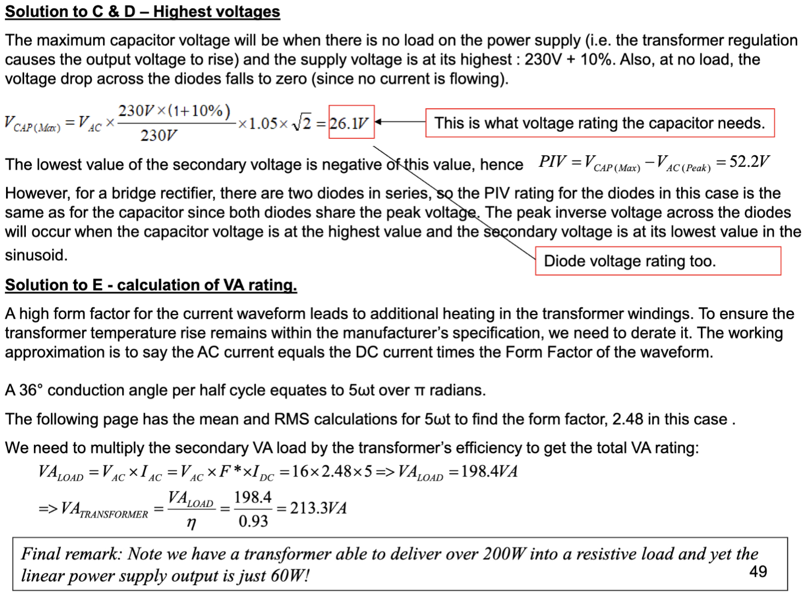

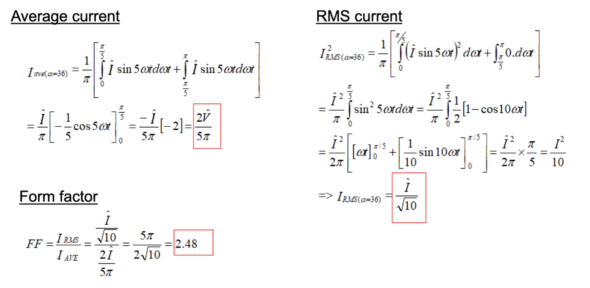

课后作业 (?)

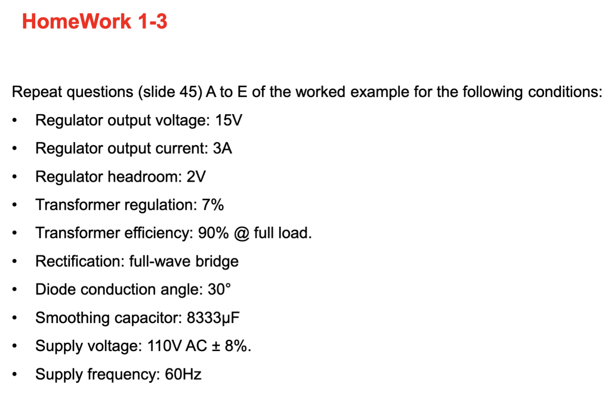

