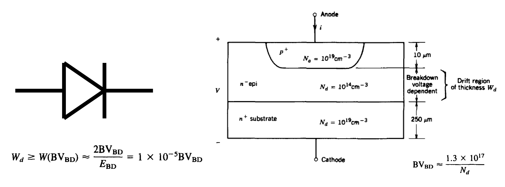
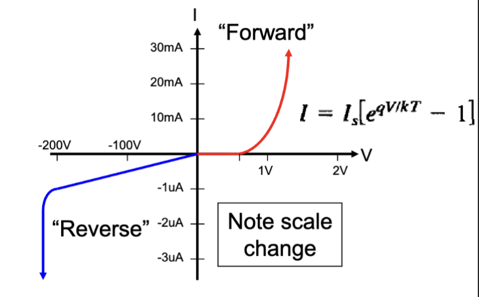
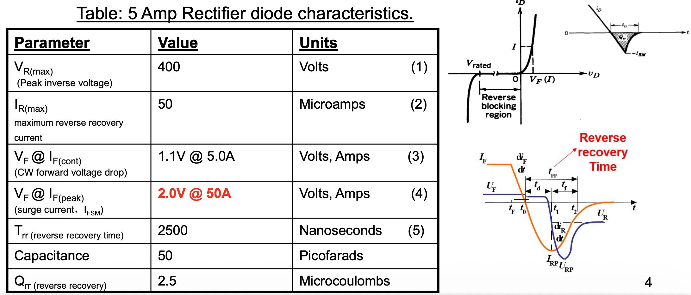
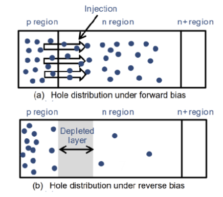
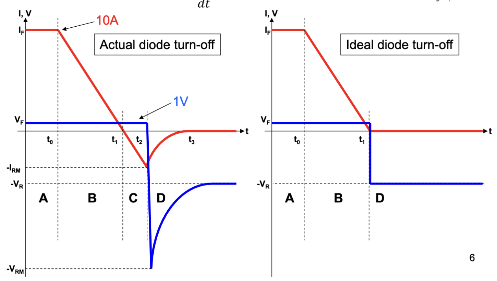
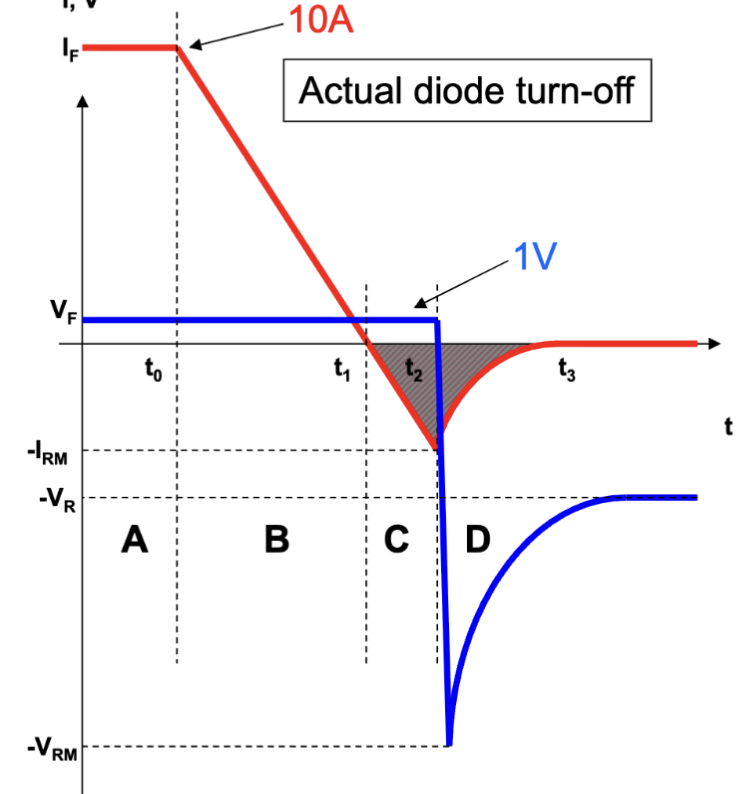
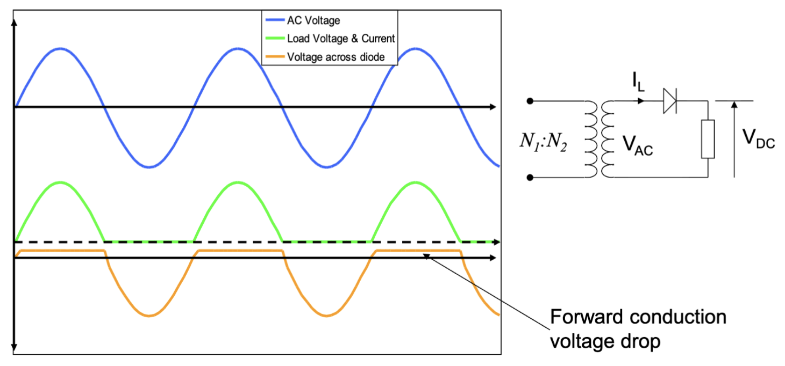
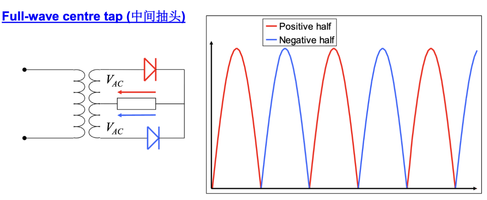

# Lec.4 功率二极管和二极管整流器

> **_Power Diode and Diode Rectifier_**
>
> Lecture @ 2026-4-7

## 功率二极管

### 二极管

功率二极管 (Power Diode) 是一个典型的不可控开关，也就是说不能通过施加的电流/电压控制其导通状态。它的导通状态一直保持在正向电流流过时导通，反向电压施加时截止的状态。

二极管是目前为止第一个考虑的非线性元件，也就是施加在它上的电压翻倍时，通过他的电流不一定翻倍。二极管的电流-电压关系可以通过 Shockley 方程来描述：

$$
I = I_s \left( e^{\frac{V}{nV_T}} - 1 \right)
$$

在实际工作中，二极管的行为类似于电压敏感开关，当阳极电位较高时电流导通，反之阻断电流。这种选择性通过的过程称为 **整流 (Rectification)**，是交流电转变为直流电的基础。

整流二极管具有 0.6 V ~ 1.2 V 左右的正向压降，一般被认为不根据通过的电流而变化。二极管阻断时，反向电流非常小，大概是几 nA （对于小型二极管）或者几 $\mu A$ （对于功率二极管）。在不发生击穿的情况下可施加的最大反向电压 (Peak Inverse Voltage, PIV, 也称为反向电压峰值) 根据不同的器件而不同。

如果施加了超过 PIV 的反向电压，且电流未被限制，则反向击穿导致二极管发生灾难性甚至永久性故障。

### 二极管损耗

一般来讲二极管是一个高效的元件，但是仍然具有损耗，我们认为它的损耗主要由两部分组成

$$
P_\mathrm{Total} = P_\mathrm{Conduction} + P_\mathrm{Switching}
$$

也就是导通损耗和开关损耗。

#### 导通损耗

二极管的连续额定值指的是二极管在不发生过热的情况下所能通过的最大的连续电流，散发的热量恰好是二极管两端电压压降和通过电流的乘积，也就是

$$
P_\mathrm{Conduction} = V_\mathrm{F} I_\mathrm{F}
$$

因为二极管结存在热惯性，可以承受合理的短期负载而不会过热，但是根据瞬态额定值来设计二极管的负载能力是非常不可靠的。

#### 开关损耗

二极管从关断切换到导通状态时非常迅速，但是考虑到电荷在 PN 结中的移动过程，关断过程相对较慢，而功率二极管尤其容易受 **反向恢复效应 (Reverse Recovery Effect)** 的影响。

反向恢复效应指的是关断时可能会有过冲现象，可以认为模型是理想二极管串联了一个电阻和一个电感，在关断时电流不能立即降为0，而是会有一个反向恢复时间，在这个时间内，二极管会继续导通，导致额外的功率损耗。

这个过程主要会导致下图中的 C 和 D 期间产生不必要的电流流动，尤其是 D 的情况，因为同事有相对较大的电流和电压，会产生较大的功率损耗。

C 区的时间和 D 区 (恢复到0之前) 的时间分别是 $t_C$ 和 $t_D$，则对于一个二极管的恢复因子 (Recovery Factor) 可以定义为

$$
S = \frac{t_D}{t_C}
$$

也就是上升的时间和下降的时间的比值。如果 $S=1$，它是一个软恢复二极管，反之如果 $S < 1$，它是一个突变恢复二极管 (Snappy Recovery Diode) 或者快速恢复二极管 (Fast Recovery Diode)。

估算二极管损耗的公式是

$$
P_{rr} = Q_{rr} V_R F_{SW}
$$

其中，$P_{rr}$ 是反向恢复损耗，$Q_{rr}$ 是反向恢复电荷，$V_R$ 是反向电压，$F_{SW}$ 是开关频率。在高频率开关下，反向恢复损耗可能会成为系统的主要损耗来源，因此在设计电路时需要特别注意二极管的选择和使用，以减少反向恢复效应带来的影响。

---

因为反向恢复效应是因为二极管 PN 结内部的可动电荷没有耗尽导致的，所以是二极管的固有特性，无法通过外部电路来改变。某些特别的二极管有着不同的性质，比如

- 肖特基二极管 (Schottky Diode)
  - 常用语低输出电压转换器
  - 有着低正向压降 (0.15V ~ 0.45V) 和非常快的开关速度 (10ns ~ 40ns)，因此没有明显的反向恢复效应
- 快恢复二极管 (Fast Recovery Diode)
  - 用于高达数百 kHz 的转换器
  - 反向恢复时间小于 $5\mu s$，额定值为几百 $V/A$
- 工频二极管 (Line Frequency Diode)
  - 低开关频率，适用于通用二极管和整流器二极管
  - 较长的反向恢复时间，额定值为数千 $V/A$

> [!NOTE]
>
> WORK IN PROGRESS @ 2026-4-2

## 二极管整流器

二极管有几个常见的使用场景，比如整流

### 半波整流器

整流指的是把交流电转换成直流电的过程，实现这个目标的最常用的办法是使用多个二极管组成一个整流器 (Rectifier)，其中，一种办法是半波整流器 (Half-Wave Rectifier)。

半波整流器实质上是在电路上串联了一个二极管，交流电流通过二极管时，只有正半周期的电流能够通过，负半周期的电流被二极管阻断，因此输出的电压是一个脉动的直流电压。

对于半波整流后的输出电压，公式是

$$
V_L = \begin{cases}
  \hat{V}_{AC} \sin(\omega t) - V_F, & \text{if } \omega t \in [0, \pi] \\
  0, & \text{otherwise}
\end{cases}
$$

使用在 [电路复习](./lec2.md#功率和能量) 中默认装载的电路知识，可以计算出这种半波整流器的平均输出电压为

$$
V_{DC} = \frac{1}{2\pi}\left[
  \int_0^\pi \hat{V}_{AC} \sin(\omega t) d(\omega t)
\right] = \frac{\hat{V}_{AC}}{\pi}
$$

考虑到原本输入的交流电压有效值是 $V_{AC\ RMS} = \frac{\hat{V}_{AC}}{\sqrt{2}}$，我们可以得到 $V_{DC} \approx 0.45 V_{AC\ RMS}$，也就是说半波整流器的输出电压大约是输入交流电压有效值的 45%。这说明这种整流器没有充分利用变压器，因为它只利用了交流电压的正半周期，负半周期的电压被浪费了。

类似的，因为半波整流器需要在反向截断时把几乎所有的电压都施加在二极管上，所以二极管的反向电压峰值必须至少等于输入交流电压的峰值 $\hat{V}_{AC}$，因此二极管的额定值必须满足 $PIV \ge \hat{V}_{AC}$。

### 中间抽头整流器

中间抽头整流器 (Full-Wave Center-Tapped Rectifier) 是一种改进的整流器设计，它使用了两个二极管和一个中心抽头的变压器来实现全波整流。

这个电路类似于两个拼在一起的半波整流器，在交替波形的交替半个周期中输出。负载电压可以写作

$$
V_L = \begin{cases}
  \hat{V}_{AC} \sin(\omega t) - V_F, & \text{if } \omega t \in [0, \pi] \\
  -\hat{V}_{AC} \sin(\omega t) - V_F, & \text{if } \omega t \in [\pi, 2\pi]
\end{cases}
$$

类似的，计算平均值

$$
\begin{aligned}
  V_{DC} &= \frac{1}{2\pi}\left[
  \int_0^\pi \hat{V}_{AC} \sin(\omega t) d(\omega t) +
  \int_\pi^{2\pi} -\hat{V}_{AC} \sin(\omega t) d(\omega t)
\right] \\
&= \frac{2\hat{V}_{AC}}{\pi} \\
& \approx 0.637 V_{AC\ MAX}
\end{aligned}
$$

因此，这次的输入电压利用率来到了 $V_{DC} \approx 0.9 V_{AC\ RMS}$，相比于半波整流器有了显著的提升。问题只在于

1. 任何时刻只使用了一半的变压器绕组，因此变压器的利用率只有 50%
2. 每个二极管两端施加的最大反向电压实质上变成了 $2 \hat{V}_{AC}$，因此二极管的额定值必须满足 $PIV \ge 2\hat{V}_{AC}$，这对于高电压输入来说是一个很大的挑战
3. （半个）正弦波的频率加倍了

> [!NOTE]
>
> WORK IN PROGRESS @ 2026-4-2
