# Lec.5 可控开关

> **_Controllable Switch_**
>
> Lecture @ 2026-4-7

## 可控开关分类

回顾一下[第三章的内容](./lec3.md#典型的功率开关)，有一些元件可以用于切换可观的功率，大概包括

- [晶闸管 (Thyristor)](#晶闸管-scr)
  - 硅控整流器 (Silicon Controlled Rectifier, SCR)
  - 半可控
- 可关断晶闸管 (Gate Turn-Off Thyristor, GTOs)
  - 完全可控
- [双向晶闸管 (Triode for Alternating Current, TRIAC)](#双向晶闸管-triac)
  - 半可控
- [金属氧化物半导体场效应晶体管 (Metal-Oxide-Semiconductor Field-Effect Transistor, MOSFET)](#金属氧化物半导体场效应晶体管-mosfet)
  - 完全可控
- [大功率晶体管 (Giant Transistor, GTR)](#大功率晶体管-gtr)
  - 完全可控
- [绝缘栅极双极型晶体管 (Insulated Gate Bipolar Transistor, IGBT)](#绝缘栅极双极型晶体管-igbt)
  - 完全可控

然后，需要考虑的指标有

- 需要多少控制能力 => **可控性**
- 导通时电压会下降多少 => **导通电阻**
- 关闭时可以阻断多少电压 => **额定电压**
- 能够承受多少电流 => **额定电流**
- 开关需要多少时间 => **开关频率**

---

| 器件类型                    | 标志                                | 控制类型 | 功率等级 | 切换速度 | 换流方式 | 供电方式    |
| --------------------------- | ----------------------------------- | -------- | -------- | -------- | -------- | ----------- |
| 晶闸管 (SCR)                |     | 半可控   | 非常高   | 慢       | 自然换流 | 交流        |
| 双向晶闸管 (TRIAC / SSR)    | 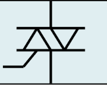  | 半可控   | 中等     | 慢       | 自然换流 | 交流        |
| 可关断晶闸管 (GTO)          |     | 完全可控 | 高       | 慢       | 自换流   | 交流 & 直流 |
| 场效应管 (MOSFET)           | 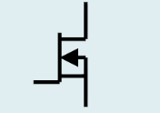 | 完全可控 | 中等     | 快       | 自换流   | 直流        |
| 绝缘栅极双极型晶体管 (IGBT) | 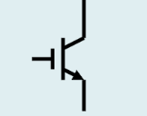   | 完全可控 | 高       | 中等     | 自换流   | 直流        |

## 晶闸管 (SCR)

> 也叫可控硅

| 器件图                              | 内部结构                           | 接入电路                            |
| ----------------------------------- | ---------------------------------- | ----------------------------------- |
| 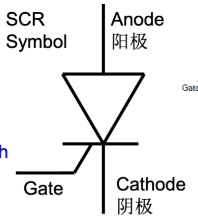 | 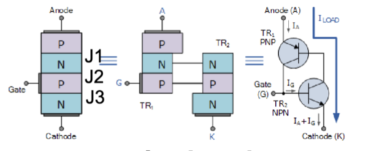 | 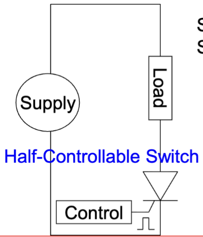 |

对于晶闸管，在阳极电压高于阴极电压的情况下，栅极上的脉冲将打开器件并让其保持导通状态，直到流经它的电流归零。因此它只能控制打开，不能控制关闭，属于半可控。

- 脉冲的大小大约是几伏电压和几毫安电流
- 可以通过数千安培电流，阻断数千伏电压
- 开启时正向压降较低，约为 $1V$
- 开启缓慢，需要几十到几百个微秒

通过电流的公式为

$$
I_A = \frac{
  \alpha_2 I_G + I_{CO1} + I_{CO2}
}{
  1 - (\alpha_1 + \alpha_2)
}
$$

这里的 $\alpha$ 是晶体管的共基极电流增益，$I_{CO}$ 是晶体管的共基极漏电流。

在阻断情况下栅极电流为 $0$，增益的和 $\alpha_1 + \alpha_2$ 很小，因此流过晶闸管的漏电流只是略大于两个晶体管的漏电流之和。

当注入触发电流后，晶体管的发射极电流增大，$\alpha_1 + \alpha_2$ 的和趋近于 1，通过晶闸管的电流 $I_A$ 大幅提升，接近无穷大，进而实现饱和导通。因为负载的限制实际上会维持在一个很大的值附近。

---

| 步骤                                                                           | 图片                              |
| ------------------------------------------------------------------------------ | --------------------------------- |
| 当没有门极电流，晶闸管关断，没有电流流过                                       | 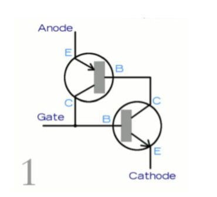 |
| 当电力流入门极后，其流入下方晶体管的基极，让下方晶体管导通                     | 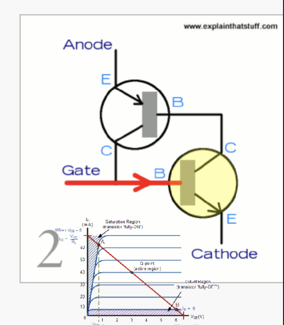 |
| 下方晶体管导通后电流流过他，从而激活上方晶体管的基极，让上方晶体管导通         | 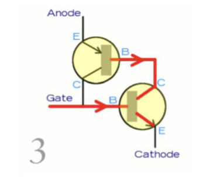 |
| 两个晶体管都完全导通后，电流可以一路穿过两个晶体管，晶闸管呈现为导通状态       | 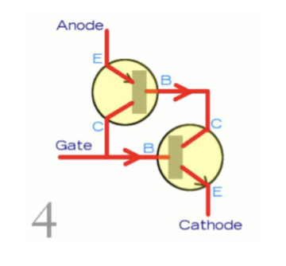 |
| 此时两个晶体管互相维持导通，不存在门极电流仍然保持导通状态，呈现锁定 (latches) | 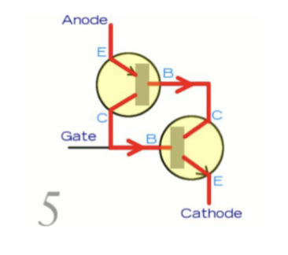 |

### 导通与阻断

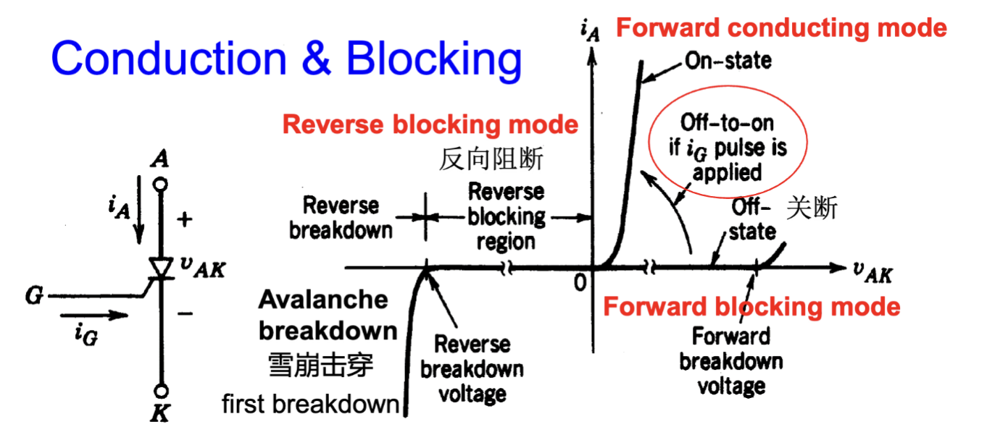

晶体管可以阻断电流，并通过一个外部电流脉冲来导通，之后被锁定在导通状态，直到电流降为零才会阻断。因此它是半可控的器件。

晶闸管有三种典型的工作模式

- 反向阻断模式 (Reverse Blocking)
  - 施加的电压方向和导通方向相反，器件阻断电流
- 正向阻断模式 (Forward Blocking)
  - 施加的电压方向和导通方向相同，但没有触发电流，器件阻断电流
- 正向导通模式 (Forward Conducting)
  - 施加的电压方向和导通方向相同，并且有触发电流，器件导通

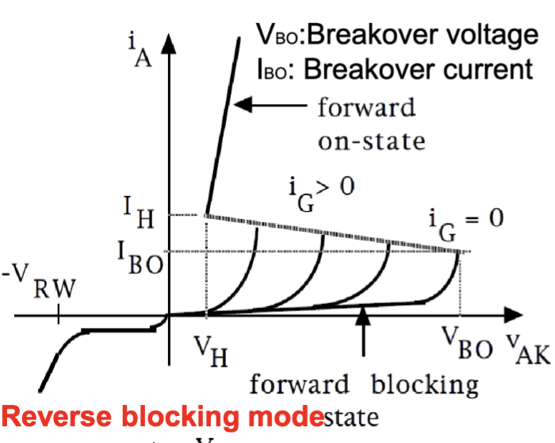

导通电流可以达到数千安培，导通压降约为 $1V$，阻断电压可以达到 $5\sim 8 kV$，最大结温度能到 $125\degree$。

更高的门极电流可以让晶闸管更快地导通，减少开关损耗。这让晶闸管在高压大电流应用中有较高的效率。

### 开启与关闭

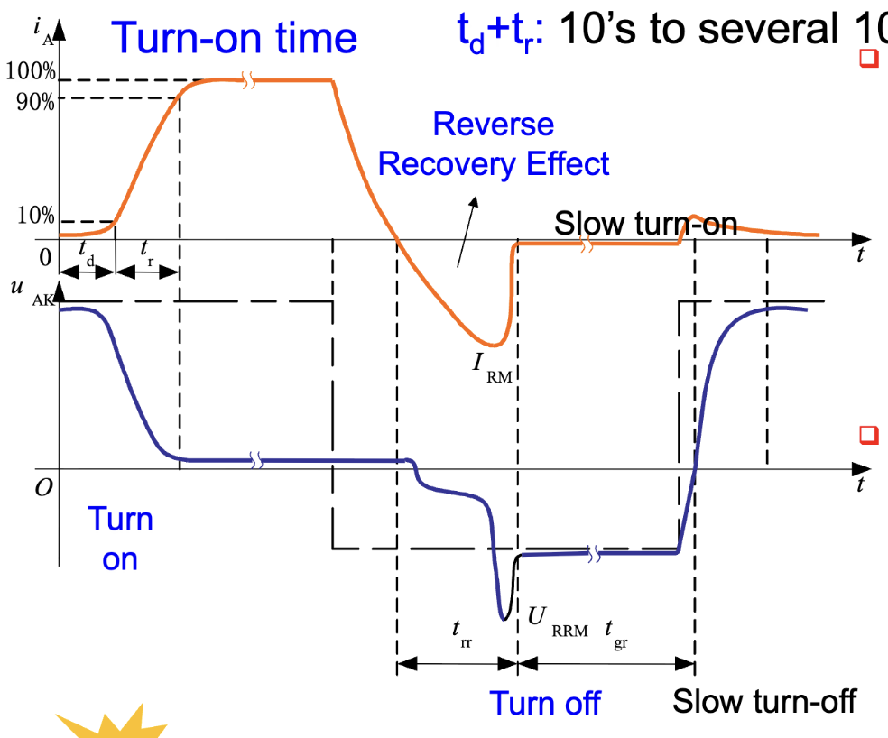

晶闸管导通需要一段时间，这段时间可以分为两个阶段：

$$
t_{d} + t_{r}
$$

其中 $t_d$ 是延迟时间，$t_r$ 是恢复时间。总的来说，正向阻断恢复时间通常在几到几百微秒之间。

如果在正向阻断恢复时间内再次施加正向电压，晶闸管会重新导通，而不是在栅极电流控制下导通。

---

这张图上展示了晶闸管的打开和关断的情况。可以发现，晶闸管的关断和二极管一样，存在反向恢复效应，关断时会有一个较大的反向电流。在反向恢复过程完成后，由于载流子复合过程相对较慢，晶闸管需要一定时间才能恢复其阻断正向电压的能力，这被称为正向阻断恢复时间 (Forward Blocking Recovery Time, $t_{gr}$)。

关断时间可以写作

$$
t_\text{turn\ off}  = t_{rr} + t_{gr}
$$

其中 $t_{gr}$ 是正向阻断恢复时间，$t_{rr}$ 是反向恢复时间。总的关断时间通常在几百微妙。

### 过压钳位电路

晶闸管的一个典型的应用场景是过压钳制电路，当输出电压超过定义值后直接熔断保险丝。

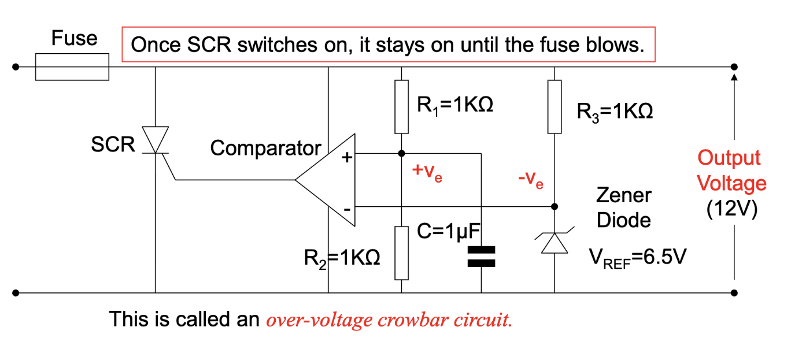

当输出电压过高，采样电压比参考电压高，比较器输出高电压，晶闸管导通，保险丝熔断，进而电路断路。

在采样电阻网络上还接了一个电容器，为了稳定电压，防止误触发。通常选择的阻值大小是 $T = RC = 1s$

$R_1$ 和 $R_2$ 组成了分压网络，$R_3$ 是偏置齐纳二极管到导通区域的电阻，以获取稳定的参考电压。

| 比较器电压                              | 过压过程                                 |
| --------------------------------------- | ---------------------------------------- |
| 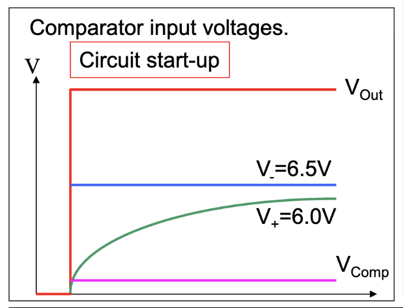 | 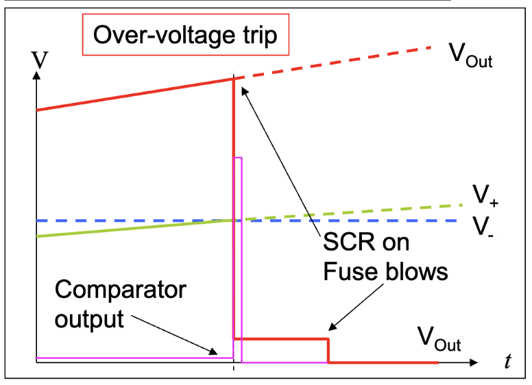 |

### 晶闸管作为开关

#### 半波整流

晶闸管的触发导通然后直到电流为 0 才关断的特性也可以用在交流电路中。

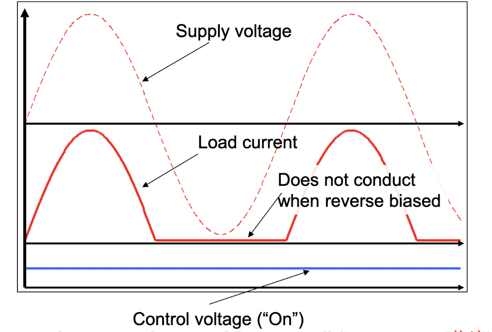

当我们持续在门极上施加导通信号时，晶闸管的表现等效于一个二极管，表现出半波整流器的特性，并且可以在每个正半周期后关断。它不适用于 DC-DC 变换，因为直流电压无法为晶闸管的关断提供所需的负电压。

#### 相位控制

如果我们控制晶闸管的触发信号，相对每个周期的开始晚一些施加触发脉冲，则最终的输出波形表现为部分周期被截断的半波整流信号。这是一种调节输出到负载的功率的方法。

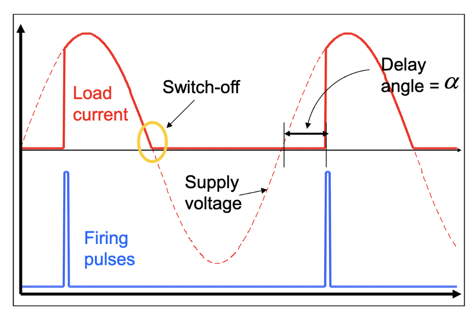

此时，电流在晶闸管开始流动之前的周期占比叫延迟角 (delay angle) $\alpha$

---

计算一下带了延迟角的平均电压

$$
\begin{aligned}
  V_{AVE} &= \frac{1}{2\pi}\left[
    \int_\alpha^\pi \hat{V} \sin\omega t d \omega t
  \right] \\
  &= \frac{\hat{V}}{2\pi}\left[
    1 + \cos\alpha
  \right]
\end{aligned}
$$

以及有效值

$$
\begin{aligned}
  V_{RMS}^2 &= \frac{1}{2 \pi} \left[
    \int_\alpha^\pi (\hat{V} \sin \omega t)^2 d \omega t
  \right] \\
  &= \frac{\hat{V}^2}{4 \pi} \left[
    \omega t  - \frac{1}{2} \sin (2\omega t)
  \right]_\alpha ^ \pi \\
  &= \frac{\hat{V}^2}{4 \pi} \left[
    \pi - \alpha + \frac{1}{2} \sin (2\alpha)
  \right]
\end{aligned}
$$

#### 全波控制

类似的，如果我们使用两个反向并联的晶闸管，则可以分别对上半和下半两个周期进行控制，得到全波控制的效果。

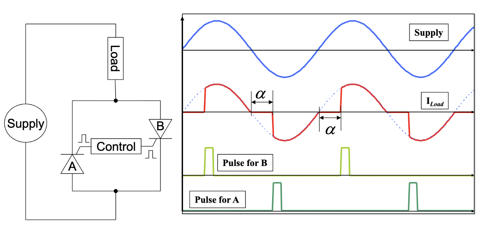

每个晶闸管使用单独的控制信号控制。我们仍然可以改变触发角 $\alpha$ 来控制输出波形的比例，进而改变负载中的功率。

此时相当于两个半波控制的叠加，可以直接把之前的结果乘二

$$
V_{AVE} = \frac{\hat{V}}{\pi}\left[
  1 + \cos\alpha
\right],\ 0\le \alpha \le \pi
$$

以及

$$
V_{RMS}^2 = \frac{\hat{V}^2}{2\pi} \left[
  \pi - \alpha + \frac{1}{2} \sin (2\alpha)
\right],\ 0\le \alpha \le \pi
$$

---

例题

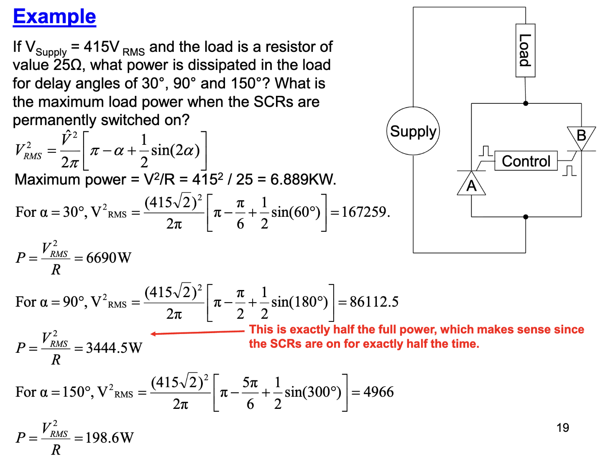

#### 晶闸管桥

类似的，我们可以使用晶闸管来替代桥式整流器中的二极管，得到一个可控的桥式整流器。

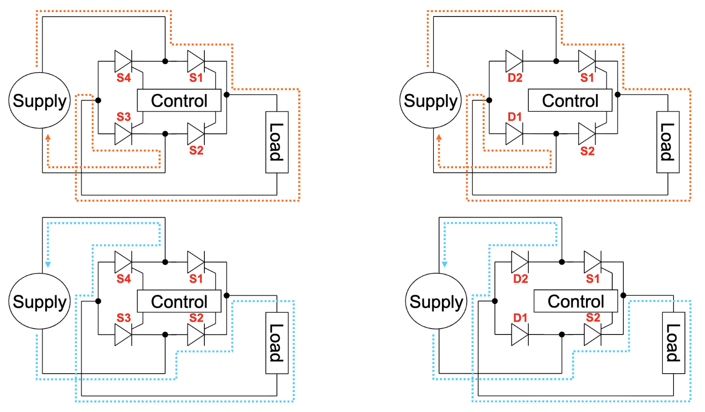

进而，我们可以对桥式电路的两个半周期分别使用两个晶闸管进行控制通断以及相位控制。考虑到延迟角为 $\alpha$，平均电压的积分结果和全波控制一致，为

$$
V_{AVE} = \frac{\hat{V}}{\pi}\left[
  1 + \cos\alpha
\right],\ 0\le \alpha \le \pi
$$

进而，我们可以在桥式电路中使用相位控制输出的平均电压

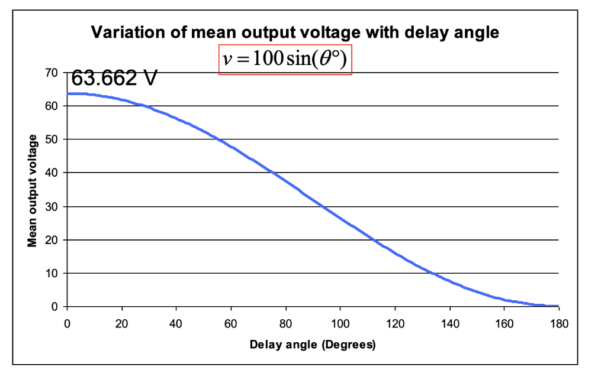

## 双向晶闸管 (TRIAC)

> 也叫双向可控硅

双向可控硅本质上是一对背靠背连接并共享一个公共的栅极的晶闸管。和晶闸管类似，它的开启方式是一个栅极的脉冲，开启后保持锁定状态，直到流经电流为 0。对于正弦交流信号，指的是半周期的结束。

| 电路                                 | 符号                                |
| ------------------------------------ | ----------------------------------- |
| 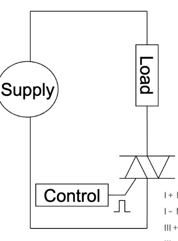 | 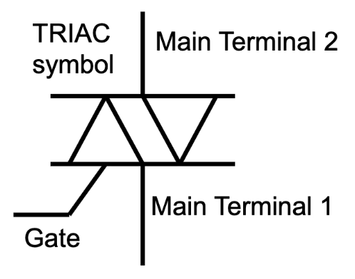 |

| 内部结构                           | 伏安特性                                                         |
| ---------------------------------- | ---------------------------------------------------------------- |
| 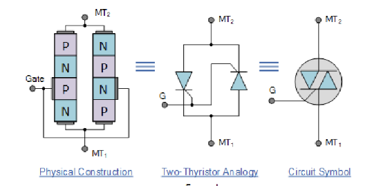 | 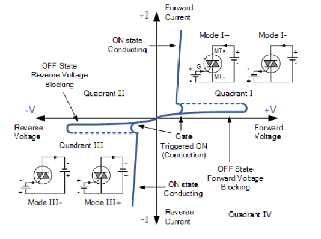  |

双向可控硅是一个双向器件。这意味着它不限制电流流过的方向。它的功率额定值没有晶闸管高，但是使用简单，通常应用于调光开关，加热器控制等应用场景。

### 导通与阻断

双向可控硅可以通过正向或者负向的门极脉冲导通，不受主信号极性的影响。导通的时间为微妙级别，触发模式包括四种

|              | MT2 电流为正 | MT2 电流为负 |
| ------------ | ------------ | ------------ |
| 门极电流为正 | Mode I+      | Mode III+    |
| 门极电流为负 | Mode I-      | Mode III-    |

MT2 电流指的是通过可控硅的电流，门极电流指的是施加在门极上的电流。Mode I 和 III 指的是工作在哪个象限，正负号指的是门极电流的极性。

---

当使用可控硅驱动感性负载时，每个半周期电流降到零时电压可能会很高，并且换相电压的变化率可能足够快，与双向晶闸管自身的寄生电容相互作用，导致其再次导通无法正常关断，进而永久锁定。

| 波形图                                | RC 缓冲电路                     |
| ------------------------------------- | ------------------------------- |
| 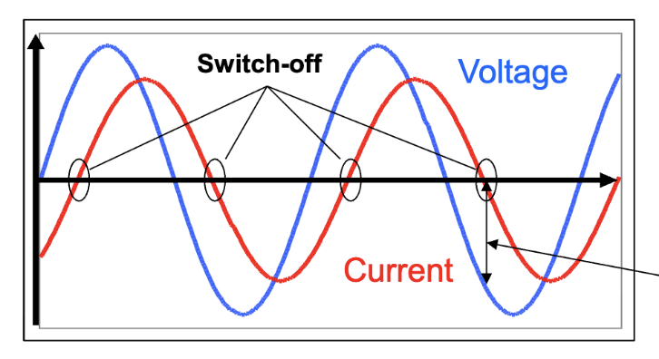 | 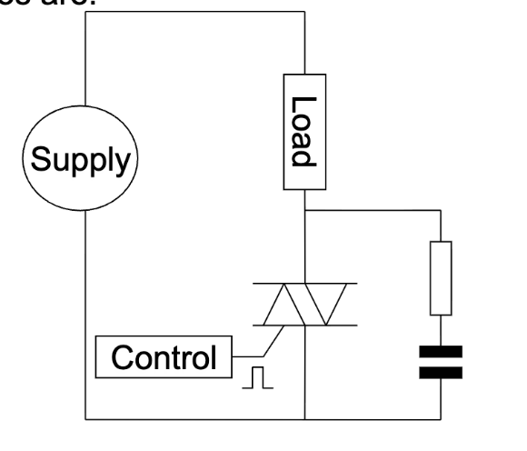 |

为了解决这个问题，在器件两端使用 RC 缓冲电路来限制电压变化率。

### 生成相位控制触发脉冲

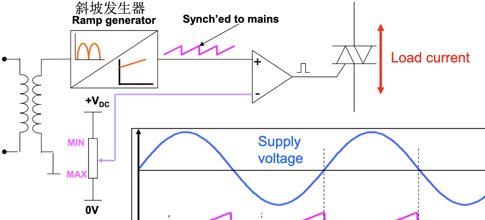

为了生成和输入电压的频率和相位匹配的控制信号来进行相位控制，一个可行的电路如上图所示。其机制是先将输出电压输入谐波发生器，生成频率翻倍，相位和半周期相同的斜波 (Ramp) 信号。之后将谐波信号与预先设定好的参考电压进行比较，当相等时产生一个脉冲信号激活可控硅使其导通。进而，通过调节参考电压，可以获得稳定的延迟角 $\alpha$，实现相位控制。

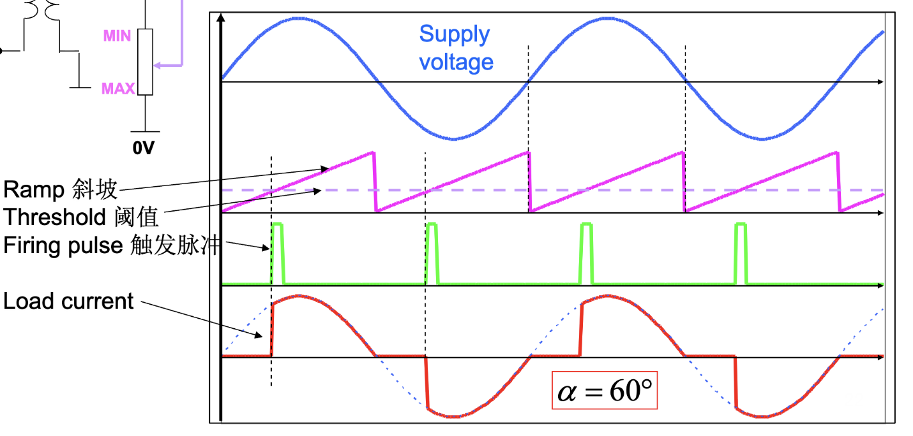

## 门级可关断晶闸管 (GTO)

门极可关断晶闸管 (GTO) 是完全可控的晶闸管。

| 符号                                | 波形                                  |
| ----------------------------------- | ------------------------------------- |
| 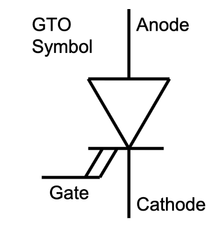 | 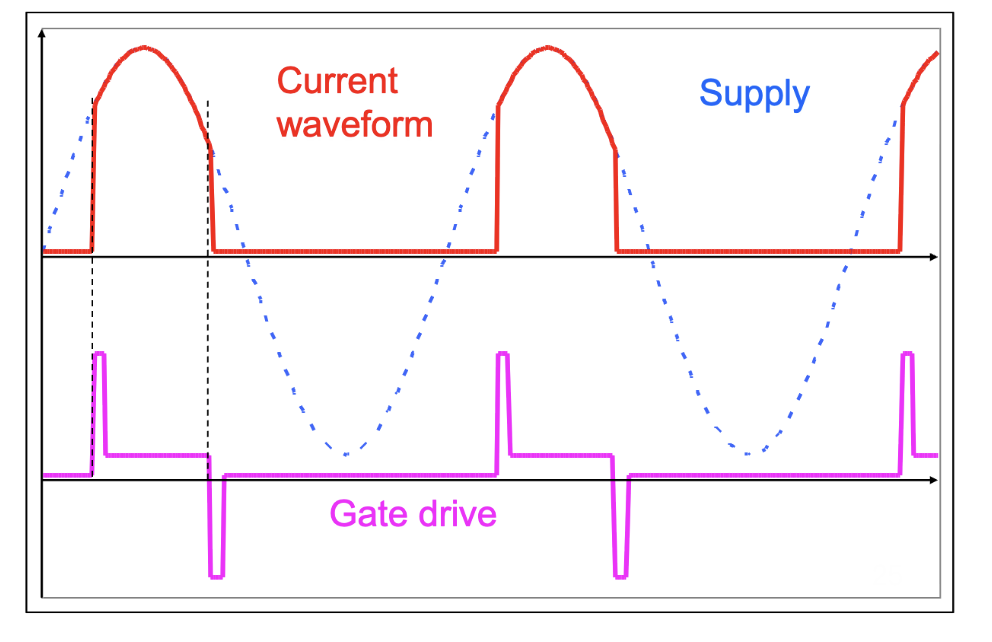 |

### 导通与关断

要开启 GTO，需要向门极输入一个正向脉冲，类似于 SCR。要关断 GTO，则需要向门极施加一个负向脉冲。

GTO 的开启不如 SCR 可靠，门极灵敏度大概比 SCR 低是被，因此通常会保持一个较低的正电流输入门极，以确保其在预期时间内保持开启状态。

其关闭需要流过相当大的电流，因此需要复杂的驱动电路。关断时间相当长，通常在数百微秒，因此限制了开关频率在 $1kHz$ 以下。

在关断过程中，必须保持电压较低以防止过热和器件故障。导通正向压降大约为 $3V$，是 SCR 的三倍，进而有了更大的散热负担。

尽管使用 GTO 存在诸多困难，但它们在大功率逆变器和直流应用中具有特殊价值，例如牵引电机控制器，因为在这些场合中反向电压（以及由此产生的自然换流）永远不会出现。

## 大功率晶体管 (BJT/GTR)

> 这是我们[第几次](https://cateds.github.io/ElectronicDevice.md/lec3.1.html)见面了？

~~喜报：**现在的 GTR 已经被 MOSFET 和 IGBT 取代！**~~

| 符号                                | 伏安特性曲线                    |
| ----------------------------------- | ------------------------------- |
| 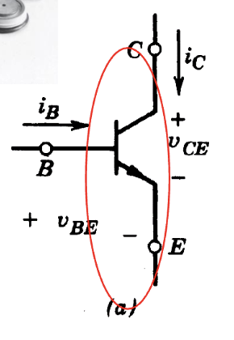 | 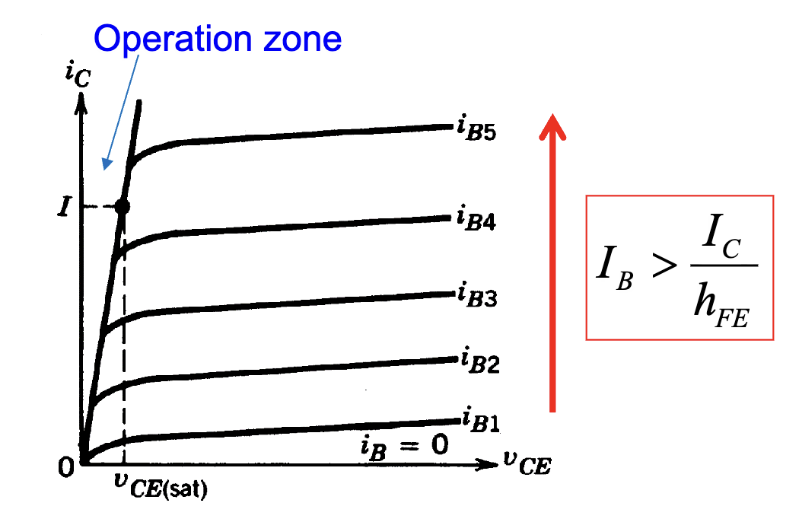 |

三极管。还用介绍三极管吗？

导通压降为 $1\sim 2 V$。有有限的电流和电压额定值，为几百安培和 $1400V$。开关频率为几千 Hz，需要复杂的电流控制驱动电路。

其电流增益为

$$
I_B = \frac{I_C}{h_{FE}}
$$

$F$ 指的是正向传输特性，$E$ 指的是共发射极。

### 达林顿配置 GTR

BJT 是完全可控的电流器件，其导通状态需要持续提供基极电流。为了提高直流电流的增益，减少栅极电流损耗，BJT 通常会使用达林顿结构，也就是下图这样的级联栅极结构。

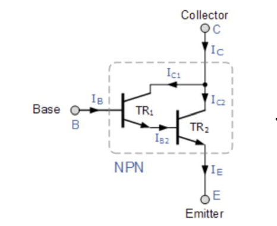

比如图里的情况，就有

$$
\begin{aligned}
  I_C &= I_{C1} + I_{C2} \\
  &= \beta_1 I_B + \beta_2 I_{B2} \\
  &= \beta_1 I_B + \beta_2 \beta_1 I_B + \beta_2 I_B \\
  &= (\beta_1 + \beta_2 + \beta_1 \beta_2) I_B
\end{aligned}
$$

代价是饱和电压 $V_{CE(sat)}$ 会更高，并且驱动电路复杂，开关速度较慢。

### GTR 安全工作区

对于功率半导体器件，安全工作区 (Safe Operating Area, SOA) 是一个重要的概念，指的是器件在特定电压和电流条件下能够不发生损坏的情况下按照预期工作。

全控型器件需要**缓冲电路 (Snubber Circuit)**来控制开关过程中的瞬态 $i_C-V_{CE}$ 轨迹，防止其轨迹落入了安全工作区之外，从而避免器件损坏。

实际的缓冲电路是用来限制开关过渡过程中的电压变化率 $\frac{dv}{dt}$ 和电流变化率 $\frac{di}{dt}$ 的。

| 会破损的轨迹                         | 安全区                           |
| ------------------------------------ | -------------------------------- |
| 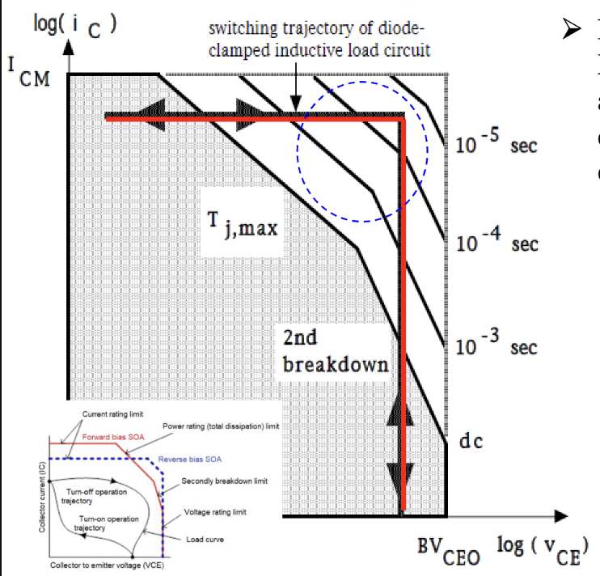 | 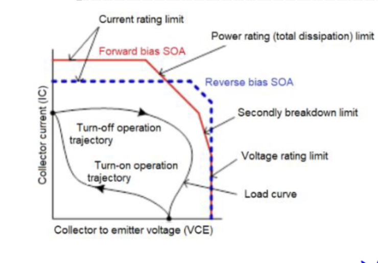 |

右图（红色）是正向偏置工作安全区 (Forward Bias Safe Operating Area, FBSOA) 的图，坐标是双对数坐标，红线区域就是安全工作区的范围。缓冲的目的是让开关的工作点的轨迹都在红线内部。

左图的黑色箭头使用二极管钳位的电流-电压变化轨迹，可以看到其在右上角有一个功率最大点，会有损坏的风险。

## ⾦属氧化物半导体场效应晶体管 (MOSFET)

> 原来人们所说的遇见宿敌的感觉就是这个感觉，模电还是伤我太深了
>
> 你是……[不能忘记的人](https://cateds.github.io/ElectronicDevice.md/lec3.3.html)

| 符号                                | 接入电路                             | 伏安曲线                        |
| ----------------------------------- | ------------------------------------ | ------------------------------- |
| 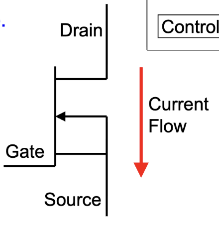 | 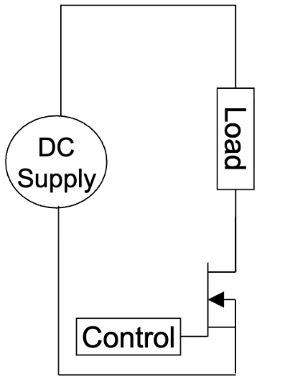 | 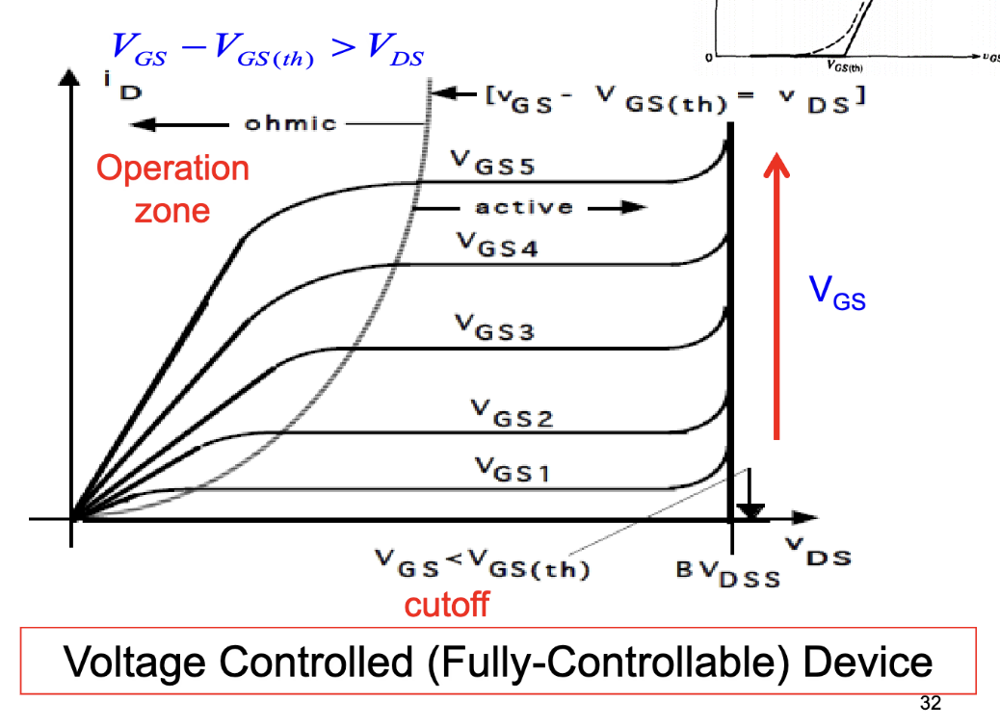 |

MOSFET 有多种尺寸和类型，典型优势包括

- 较快的开关速度，大概 $10\sim100 ns$
- 建大的栅极控制方式，巨大的功率增益
- 易于并联处理更高的电流

对应的缺点是

- 有着 $1000V$，相对较低的阻断电压
- 相对较低，$100A$ 的电流处理能力
- 可能有着相当高的功耗

### 开关与导通

MOSFET 在模拟电路和电子器件中被作为线性放大器使用，但是在这门课中我们只关注 MOSFET 作为开关的特性。在世纪电路中，在栅极施加几伏电压，则可以让电流在漏极和源极之间流动。

MOSFET 可以轻松地导通和关断，只要移除栅极电压就可以让 MOSFET 停止导通。

器件导通时，源极和漏极之间呈现为低电阻，功率损耗与电流的平方成正比。

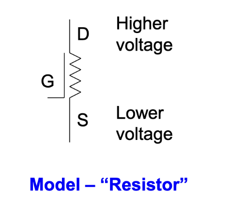

MOSFET 的快速开关速度可以让其在 100kHz 到几 MHz 到频率下工作。其发热时电阻会上升，这让并联运行成为可能，因为电流会根据电阻大小自动在并联的器件之间分配。

源极和漏极之间存在相当大的电容。

### 电路特性

当 MOSFET 导通时，其功率损耗为

$$
p_{on} = I_d^2 \cdot r_{DS(on)}
$$

期中，导通电阻大小为

$$
R \approx \frac{1}{\beta(V_{gs} - V(t))} = \frac{1}{\mu C_{ox}}\frac{L}{W}\frac{1}{V_{gs}-V_t}
$$

也就是 $r_{DS(on)}$ 的大小可以认作一个恒定电阻。

---

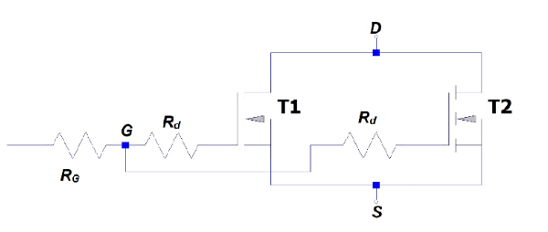

因为 MOSFET 的导通电阻具有正温度系数，也就是其在温度上升后电阻值会增加。对于相同的结温，如果 $T_2$ 的电阻超过了 $T_1$，那么在导通状态下 $T_1$ 将要流过更大的电流，因此相比 $T_2$ 有着更多的功率损耗。此时 $T_1$ 的文帝将随着导通电阻的增加而上升，形成循环。这就是热稳定效应。

### 直流控制

MOSFET 易于导通和关断的特性在直流控制中很有用。

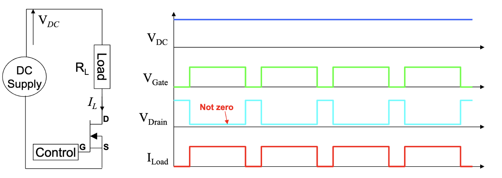

此时可以通过控制门极的高电平和低电平来控制 MOSFET 的导通和关断，进而控制负载的电流大小。我们可以通过控制栅极电压脉冲宽度来控制负载电流的脉冲宽度。这被称为**脉宽调制 (Pulse Width Modulation, PWM)**。

占空比的定义是高电平的持续时间占整个周期的比例。通过调整占空比，我们可以控制负载上的平均电压和功率。

$$
\text{Duty\ Cycle} \phi = \frac{T_{on}}{T_{period}}
$$

在占空比为 $\phi$ 的情况下，计算平均输出电压，可得

$$
V_{AVE} = \frac{1}{T} \int_0^{\phi T} V_{DC} dt = \phi V_{DC}
$$

也就是输出电压和占空比是线性关系。

> 顺带一提，有效值是 $V_{DC} \sqrt{\phi}$，功率因数是 $\frac{1}{\sqrt{\phi}}$，因此占空比越小，功率因数越差。

例题

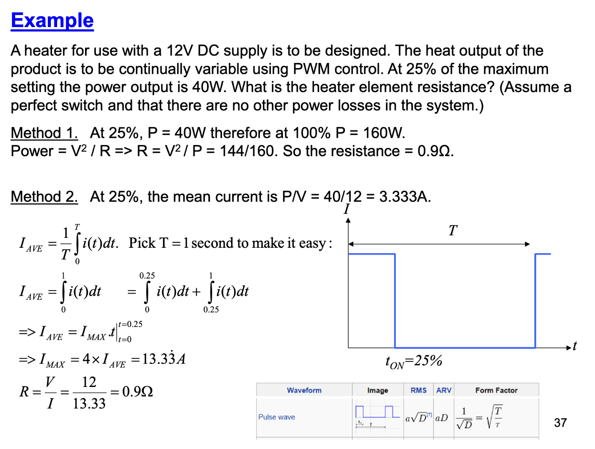

RMS 值是加热值的证明

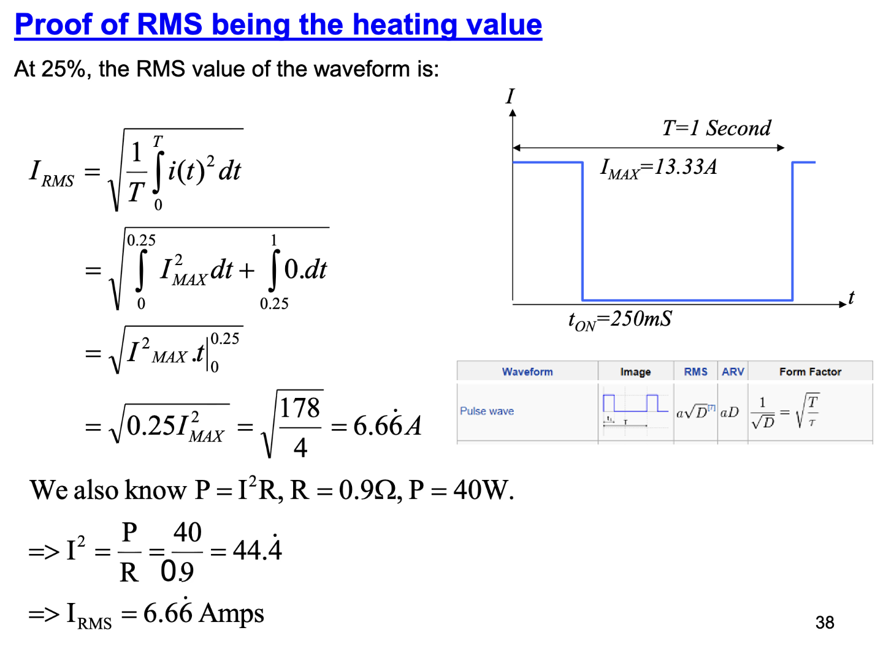

### 功率损耗

#### 导通损耗

MOSFET 的功耗主要由两类组成

$$
功率损耗 = 导通损耗 + 开关损耗
$$

导通损耗指的是在打开时作为一个电阻器的功率损耗，计算方法为

$$
P_{conduction} = I^2_\text{Load\ RMS} R_{DS(on)}
$$

这个值的大小直接取决于开关的占空比。

#### 不适用

MOSFET 不适用于高压大电流大功率的应用场景

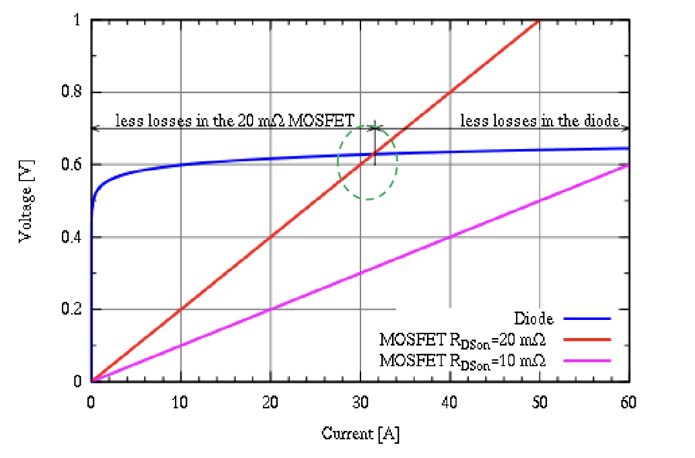

图中展示了二极管，两种 MOSFET 在不同电流下的电压降。蓝色的二极管上的电压几乎不随着电流的增加而增加，保持稳定，但是 MOSFET 的电压与通过其的电流呈线性关系。

在低电流范围内， MOSFET 的电压降低于二极管和 GTR/SCR 的近似恒定压降，损耗更低。但是在大电流情况下，压降大小会超过二极管。因此 MOSFET 的额定值仅仅达到了 $1kV$ 和几百安培。

#### 开关损耗

MOSFET 的每个周期波形有两个开关边沿。在状态切换时，电压下降，电流上升，因此会有一个功率峰值。这就是开关损耗

| 电路                                 | 控制波形                                      | 开关波形                                     |
| ------------------------------------ | --------------------------------------------- | -------------------------------------------- |
| 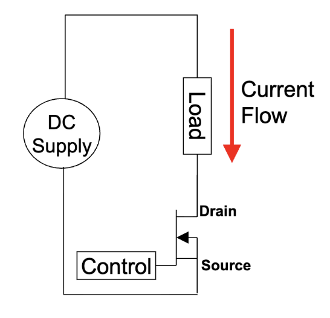 | 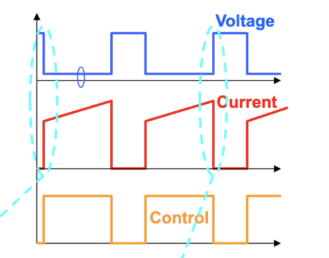 | 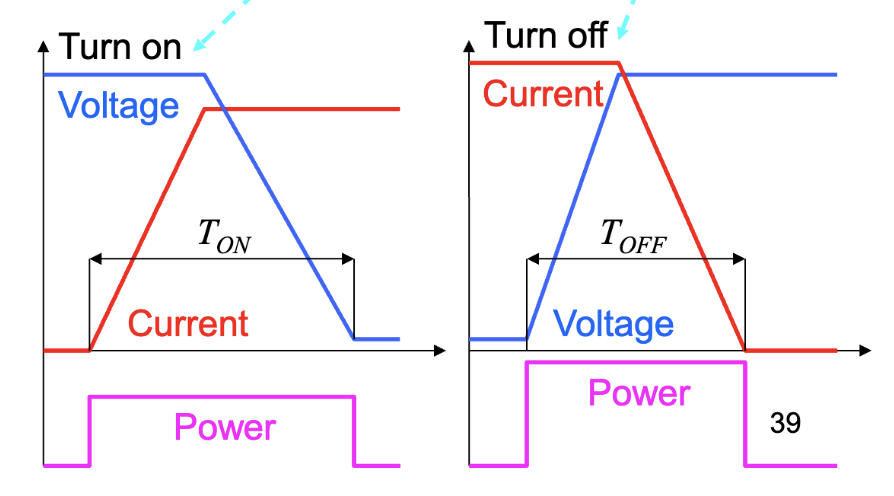 |

在导通过程中，开关时刻 $T_0$ 开始，导通电流上升。直到上升到负载电流后电压开始下降。这个时间点是 $T_{ON}$。$T_{ON}$ 前电压恒定电流上升，$T_{ON}$ 后电压下降电流恒定。因此，单次导通可以近似为

> 这里假定变化是线性的

$$
P_{ON} = E_{A} + E_{B} = \frac{1}{2} I_{ON} V_{DS(Off)} T_{ON}
$$

加上频率后，得到每秒的打开损耗

$$
P_\text{sw(on)} = \frac{1}{2} F_{SW} I_{ON} T_{ON} V_{DS(Off)}
$$

| 导通时伏安特性                       | 关断时伏安特性                        |
| ------------------------------------ | ------------------------------------- |
| 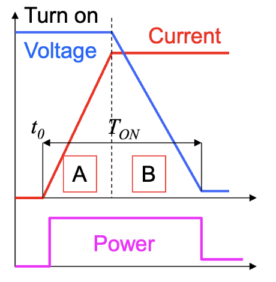 | 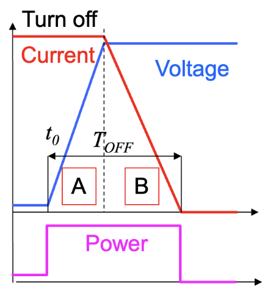 |

关断过程和导通过程时类似的，关断时间 $T_0$ 开始，电压从零开始上升，直到 $T_{OFF}$ 电压上升到 $V_{DS(Off)}$，电流开始下降到 0。关断损耗为

> 仍然，假定变化是线性的

$$
P_{OFF} = E_A + E_B = \frac{1}{2} I_{OFF} V_{DS(Off)} T_{OFF}
$$

进而每秒的关断损耗为

$$
P_\text{sw(off)} = \frac{1}{2} F_{SW} I_{OFF} T_{OFF} V_{DS(Off)}
$$

---

结合一下以上的结果，可以得到总的开关损耗

$$
P_\text{switching} = \left(
  \frac{F_{SW} V_{DS(off)}}{2}
\right)\left(
  T_{ON} I_{ON} + T_{OFF} I_{OFF}
\right)
$$

然后拿出我们之前的导通功耗

$$
P_\text{Conduction} = I^2_\text{Load\ RMS} R_{DS(on)}
$$

总的功率损耗为

$$
\begin{aligned}
  P_\text{Total} = & P_\text{Conduction} + P_\text{Switching} \\
  = & I^2_\text{Load\ RMS} R_{DS(on)} + \\
  &\left(
  \frac{F_{SW} V_{DS(off)}}{2}
\right)\left(
  T_{ON} I_{ON} + T_{OFF} I_{OFF}
\right)
\end{aligned}
$$

其中导通电阻，导通时间，关断时间都是器件本身特性，可以从数据手册上读到。

---

例题

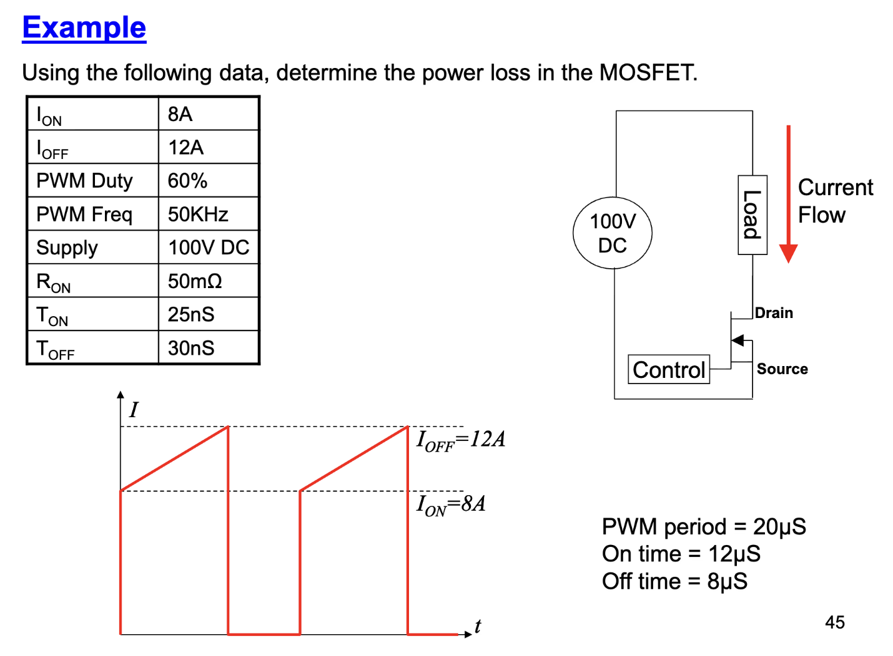

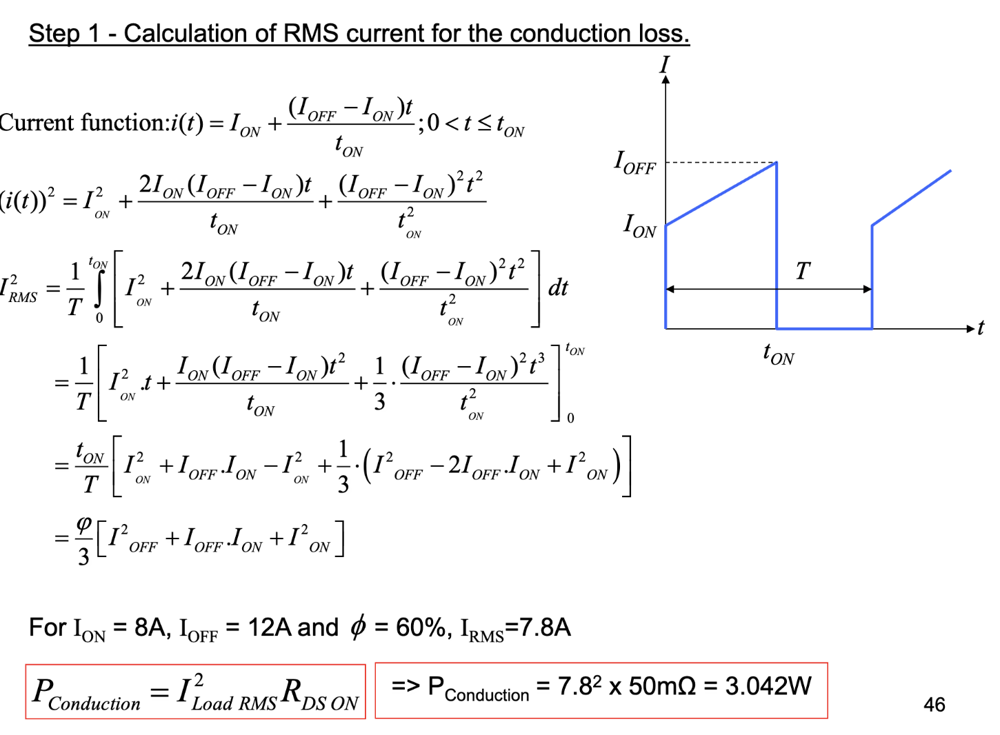

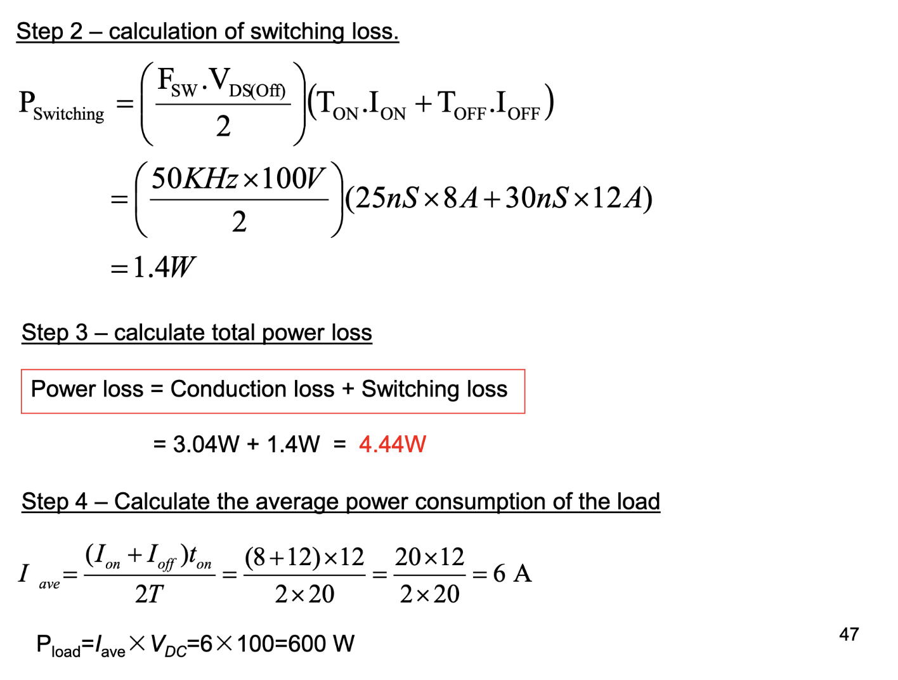

## 绝缘栅极双极型晶体管 (IGBT)

| 器件符号                            | 等效结构                             | 内部结构                           |
| ----------------------------------- | ------------------------------------ | ---------------------------------- |
| 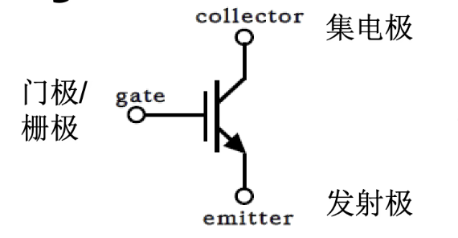 | 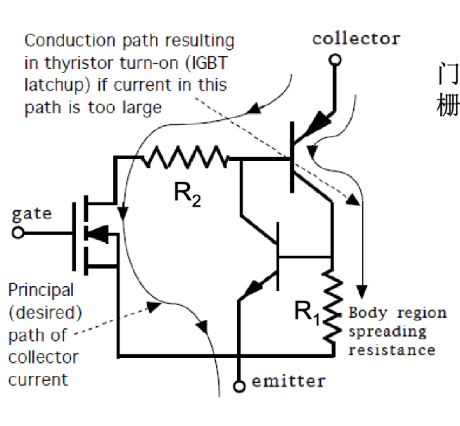 | 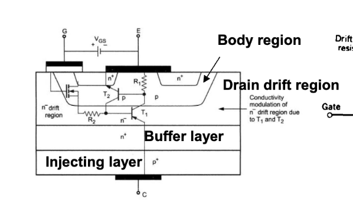 |

绝缘栅极双极型晶体管 (IGBT) 是一种中高功率开关器件，能够以极快的速度工作，承载大电流且导通电压较低。最新一代（第三代）有着极强的稳健性，能够承受过载。其栅极驱动要求和 MOSFET 非常相似。

IGBT 只能单向导通电流。如果电流要反向流动，则必须使用外部二极管与器件反向并联。这个二极管通常被称为反激二极管 (Flyback Diode) 或者续流二极管 (Free-wheeling Diode)。

IGBT 的典型反向阻断范围大概开始于 MOSFET 难以应对的电压点。其很少用于反向电压低于 $600V$ 点应用场合。

> 丰田 Prius 的混合动力系统中的逆变器驱动使用了 IGBT。
>
> 该车因为过于安静，被宣布对视障人士构成危险。
>
> ~~……这是什么黑色幽默吗？~~

### 内部结构

对于 N 沟道的 IGBT ，其内部结构相当于一个 MOSFET，一个 NPN 晶体管和一个 PNP 晶体管的级联。当门极有电压时 MOSFET 导通，让 PNP 晶体管的基极电流增加，进而让 NPN 晶体管导通，最后实现 IGBT 的导通。

集电极电流的期望路径是从基极流向 MOSFET。如果从发射级流出的电流过大，晶闸管可能会被导通并锁定。这是不期望的情况。

其整体表现为和 MOSFET 类似，通过门极电压控制导通关断。导通的压降和 GTR 类似，约为 $2\sim 3V$。

总压降的表达式为

$$
V_{CE(on)} = V_{J1} + V_{drift} + I_C R_\text{channel}
$$

---

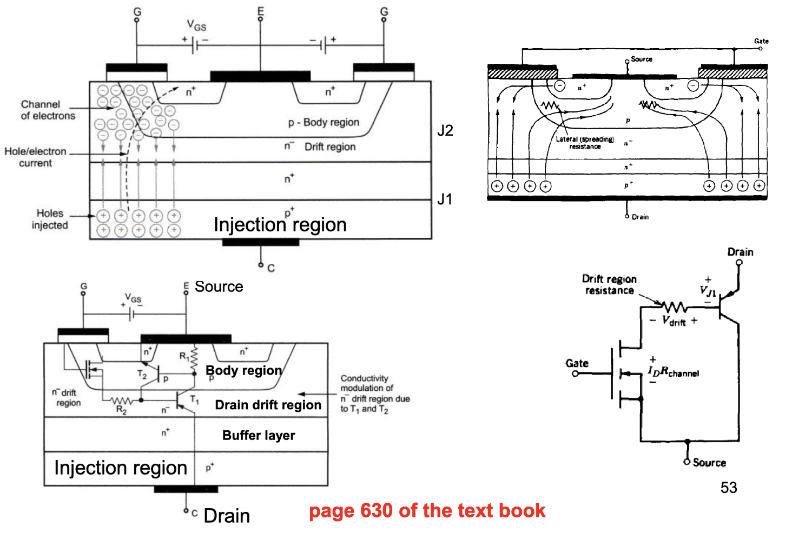

典型的 IGBT 由四层半导体组成

- Body Region (体区) p-
- Drift Region (漂移区) n-
- Buffer Region (缓冲区) n+
- Injection Region (注入区) p+

其主要形成了两个结 $J1$ 和 $J2$，分别是注入区和漂移区之间的结，以及漂移区和体区之间的结。

电导调制 (Conductivity Modulation) 是 IGBT 的一个重要特性。当 IGBT 导通时，大量的少数载流子（空穴）被注入到原本电阻很大的 n⁻ 漂移区中，使该区域的载流子浓度急剧增加，从而电导率大幅提高（电阻大幅降低）。

如果没有电导调制，高压 MOSFET 的漂移区电阻随耐压等级三次方增长，这就是高压 MOSFET 导通损耗巨大的原因。

内部结构和等效电路图之间的关系映射如左下图所示。

### 开启与关闭

| 开启过程                             | 关断过程                              |
| ------------------------------------ | ------------------------------------- |
| 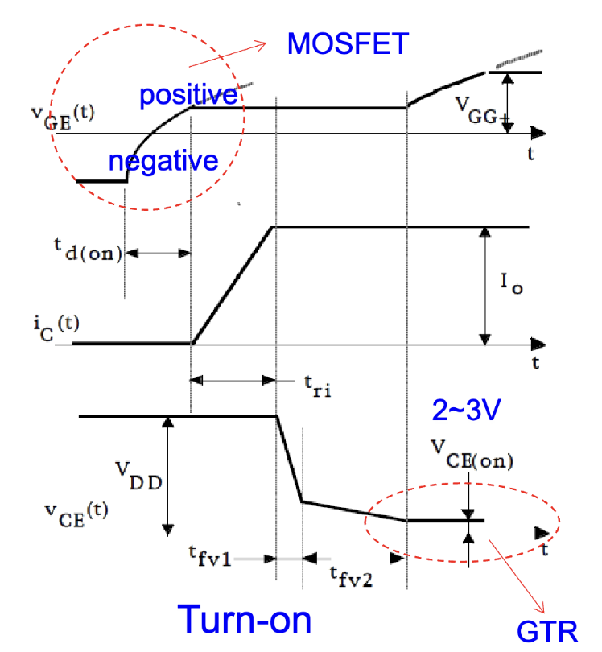 | 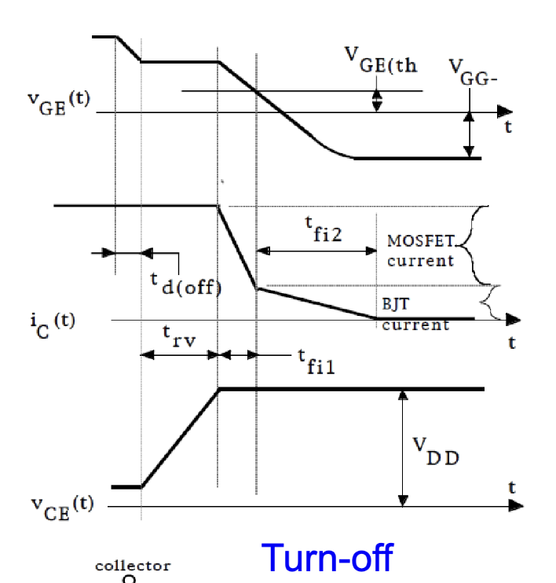 |

导通过程的开始是门极电压 $v_{GE}$ 上升。经过 $t_{d(on)}$ 的延迟时间后，集电极电流$i_C$ 开始上升。接着经过 $t_{ri}$ 后集电极电流上升到最大值 $I_O$，集电极-发射极电压 $v_{CE}$ 开始下降。下降有多短不同过程，分别为 $t_{fv1}$ 和 $t_{fv2}$，直到 $v_{CE}$ 下降到 GTR 的饱和电压 $V_{CE(on)}$。

总开启时间为

$$
t_{on} = t_{d(on)} + t_{ri} + t_{fv}
$$

---

对于关断过程，从门极电压 $v_{GE}$ 下降开始。经过延迟时间 $t_{d(off)}$ 后门极电压停止下降，集电极-发射机电压 $v_{CE}$ 开始上升。经过 $t_{rv}$ 后，$v_{CE}$ 上升到 $V_{DD}$，集电极电流 $i_C$ 开始下降，此时门极电压同步下降并向下超过阈值。阈值前的时间为 $t_{fi1}$，阈值后的时间为 $t_{fi2}$，直到集电极电流下降到 0，门极电压下降到 $V_{GG-}$

总关断时间为

$$
t_{off} = t_{d(off)} + t_{rv} + t_{fi}
$$

$t_{rv}$ 是电压上升时间，$t_{fi1}$ 是 MOSFET 的电流下降时间，$t_{fi2}$ 是 BJT 的电流下降时间。

### 安全工作区

对于 IGBT，MOSFET，BJT，其在数据手册和 SOA 中的电压额定值时峰值大小，因为 SOA 关注的是瞬时状态下实际的电压和电流，而不是平均值或者有效值。

和之前提到的类似，需要缓冲电路来在开关过渡期间为 IGBT 塑造出合适的 $i_C-V_{CE}$ 轨迹，防止其落入安全工作区之外。

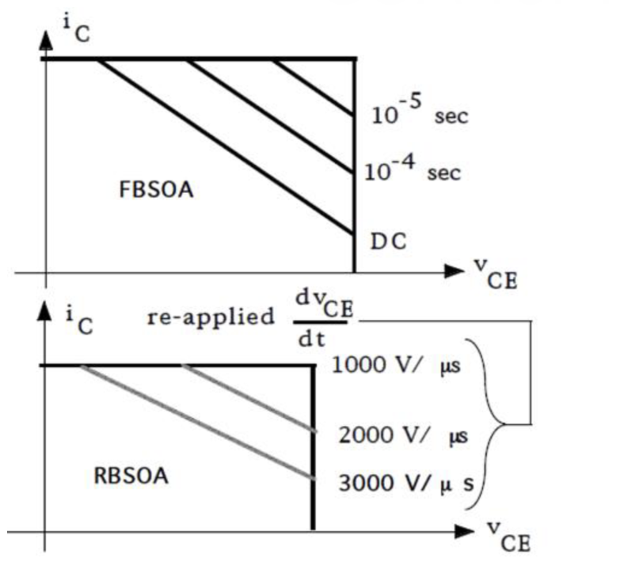

过大的 $\frac{dV_{CE}}{dt}$ 会导致 IGBT 锁定，进而无法控制器件。

## 换流

在电路原理图中，我们通常希望指定器件的操作方式，而不是器件本身。比如**自换流 (Self-Commutated Semiconductor Switch)** 半导体开关。完全由输入控制的器件，比如 MOSFET，IGBT，GTO 都属于这一类。而 SCR 和 TRIAC 之类的无法通过栅极控制来关断，属于**自然换流 (Naturally Commutated)** 器件。

自换流开关的电路符号如图所示

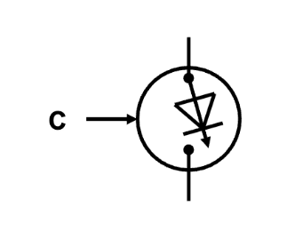

控制信号接在 $C$ 端。二极管符号表示电流可以流通的方向。

自换流开关适用于直流电源，因为他们可以无视源电压的极性、负载电压的极性和负载的性质（如阻性和感性）而关断。
