# Lec.6 热管理

> **_Thermal Management_**
>
> Lecture @ 2026-4-8

## 热管理

电子设备的效率无法达到 $100\%$，因此在工作时一定会以热量的形式失去能量。这种能量损失相当可观。大对数的半导体的最高工作温度为 $125\degree C$，为了防止超过这个温度，需要某种形式的**散热器 (heatsink)**。

保持电子元件的低温的另一个原因是半导体元件的故障率大概每增加 $10\degree C$ 就会增加一倍。因此，热管理对于提高系统的可靠性至关重要。

除了最高温度外，半导体还有一个绝对最大功率额定值。不管温度如何都不能超过这个值，不然会损坏器件。

通常，散热器使用的是铜或者铝之类的良好导热材料制成，待冷却的器件通过机械方式连接在散热器上。

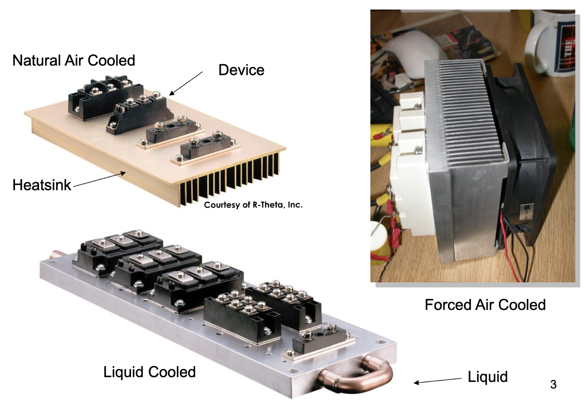

## 热量的传导

热量存在三种传导机制

- **传导 (conduction)**：物体之间相互接触时的主要传热方式
- **对流 (convection)**：热能在固体与流体（如空气与水）之间传递的方式
- **辐射 (radiation)**：热能以电磁波的形式传播的方式

对于半导体器件，主要使用两种空气对流机制

- **自然对流 (natural convection)**：散热器周围的暖空气上升，冷空气下降形成对流，进而带走热量。

  这种散热器性能通常以 “散热鳍片垂直放置于自由空气中” 标称。此时散热器的方向最有利于自然气流产生，且气流路径上没有障碍物。

- **强制对流 (forced convection)**：使用风扇将空气吹过散热器表面以带走更多热量。

  **湍流 (Turbulent flow)** 在这一点上比 **层流 (Laminar flow)** 更有效，因此通常将空气吹向散热器，而不是从散热器上方吸取空气。

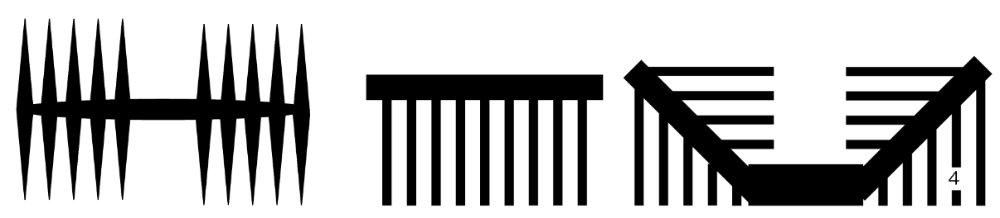

---

散热器耗散热量的能力，也就是功率的流散速率，被称为散热器的**热阻 (thermal resistance)**，单位为 $\degree C / W$。通常使用 $\theta_{XX}$ 表示，其中下标的两个字母指的是两个点。比如 $\theta_{JA}$ 表示的是半导体的结 (Junction) 和环境 (Ambient) 之间的热阻。

$$
\theta = \frac{T_1 - T_2}{P}
$$

通常半导体器件的典型热阻为

- 自然对流：$1\sim 0.1 \degree C / W$
- 强制对流：$0.1\sim 0.01 \degree C / W$
- 水冷：$0.01\sim 0.001 \degree C / W$

热阻越高，热导率越低，散热越困难。

散热器通常由铝型材挤压成型，气流方向沿着挤压方向。挤压件不需要太厚，在自然对流条件下功耗较低，金属的热导率起主要作用。

给散热器涂上黑色涂层可以在 $\Delta T > 50 \degree C$ 的情况下改善辐射特性，并将自由空气热阻降低大约 $15\%$。

降低热阻最有效的方法是最大化表面积，因为主要的散热机制是对流，其与表面积正相关。

## 使用计算机设计散热器

我们可以使用有限元分析来检查不同散热器形状的性能。比如说下图是一个散热器的情况，是一个在平面上添加了四个鳍片的散热器。

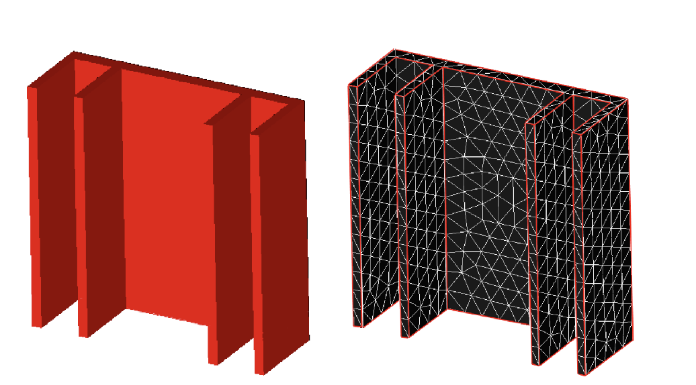

右图是通过单元网格来表示的方式。

计算机将球接控制能量在材料中流动的微分方程，并考虑通过传导等方式向外部截止散热的热量。诱导产生的气流也会被计算进来。

相关参数（比如气流速度）会被用颜色记录下来。这是**计算流体力学 (Computational Fluid Dynamics, CFD)** 的应用等一个例子。

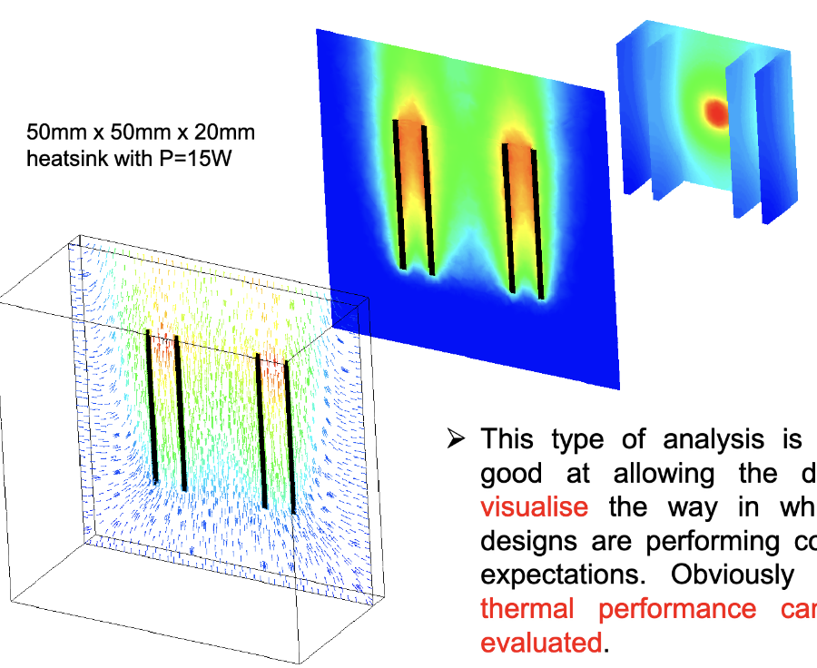

上图是三种可视化的结果。左一是流线图，现实空气在散热器鳍片间的流动方向和速度。中间是温度云图，现实散热器以及周围空气的温度分布。右侧是三维热分布图，显示了散热器整体的温度分布情况。

这种分析方式有利于设计师可视化设计方案的实际表现和与其行为之间差异。实际的热性能也可以用这种方式进行评估。

## 等效热模型

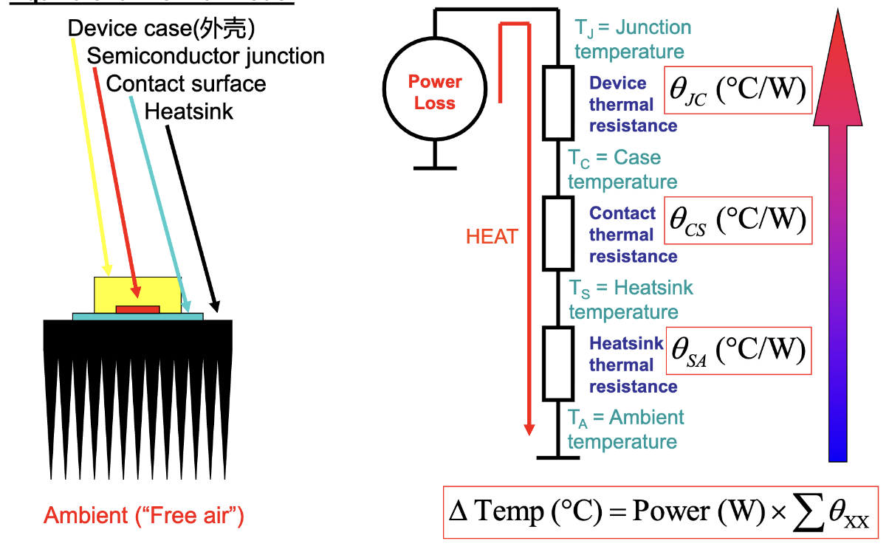

这是一个典型的散热图。上方是工作的器件，包括外科，半导体结，接触层，下方是一个散热器。

它等效的图如右图所示。首先是有个热源，紧接着有三个和电阻类似的元件，它表示的是热阻。三个热阻分别是设备热阻，接触面热阻和散热器的热阻。总温度差的计算方式如下：

$$
\Delta\text{Temp} = \text{Power} \times \sum \theta_{XX}
$$

## 稳态热分析

从之前部分的图考虑，一个功率二极管连接到散热器，一共存在三个热阻。这可以被建模为一串的串联热阻器 (resistors)，每个热阻上的温度降与散热功率有关

$$
\Delta T(\degree C) = \text{Power}(W) \times \theta_{XX}(\degree C/W)
$$

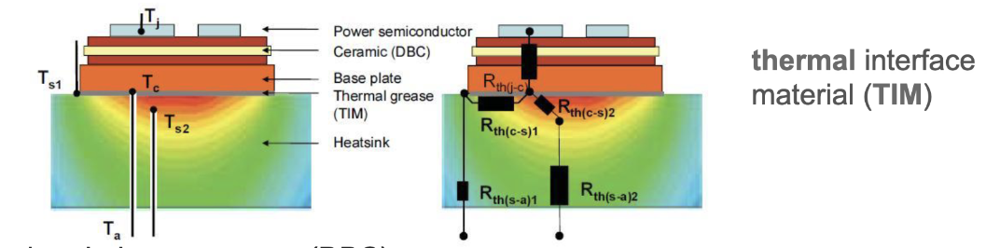

对于功率器件，直接覆铜 (Direct Bonded Copper, DBC) 基板被经常使用，原因为

- 具有极佳的热导率 (thermal conductivity)
- 具有优秀的电气绝缘性能 (electrical insulation)
- 具有良好的热扩散特性 (heat spreading characteristics)

热界面材料 (Thermal Interface Material, TIM) 被用来填充器件和散热器之间的空隙，以改善热传导性能。常见的 TIM 包括导热硅脂、导热垫片和相变材料等。

---

简单的热路分析和电路分析类似，拥有相似性质的概念。比如热阻 $\theta_{XX}$ 类似于电阻 $R$

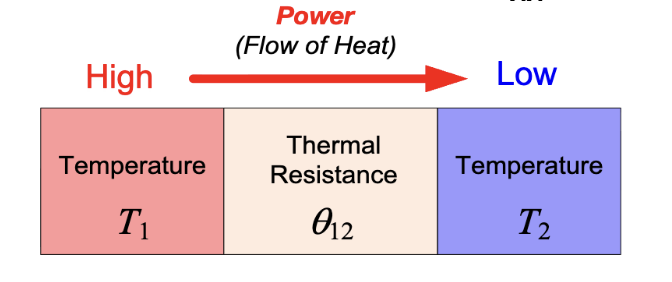

温度降关系类似于欧姆定律

$$
P = \frac{\Delta T}{\theta_{12}}=\frac{T_1 - T_2}{\theta_{12}}
$$

对于稳定状态的热传导和热对流，我们甚至可以用基尔霍夫定律的类似物。

$$
\begin{aligned}
  \text{KVL:}\ &\sum_{xx} \Delta T_{xx} = 0,\ \text{for\ loops}\\
  \text{KCL:}\ &\sum_{xx} P_{xx} = 0,\ \text{for\ nodes}
\end{aligned}
$$

具体的含义是：对任意环路，温度降的和为零。对于任意节点，流入的功率和流出的功率相等。

> 温度是标量值，温度的梯度是保守场；功率的散度为零，功率的流是无源的。

比如说对于这个等效热路，有

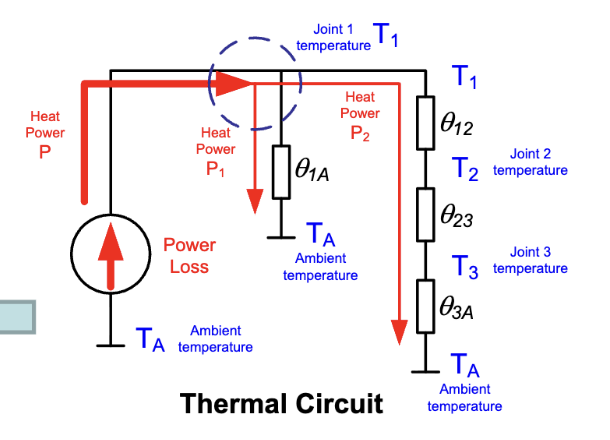

$$
\begin{aligned}
  P &= P_1 + P_2 \\
  \Delta T_{1A} &= \Delta T_{12} + \Delta T_{23} + \Delta T_{3A} \\
\end{aligned}
$$

---

例题

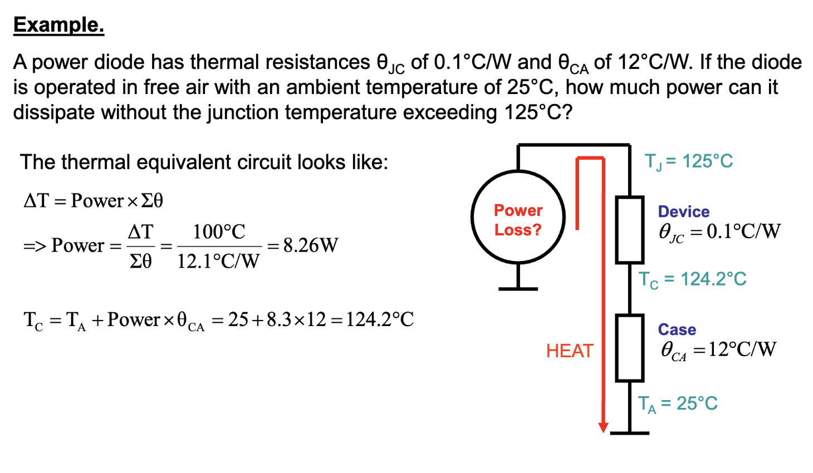

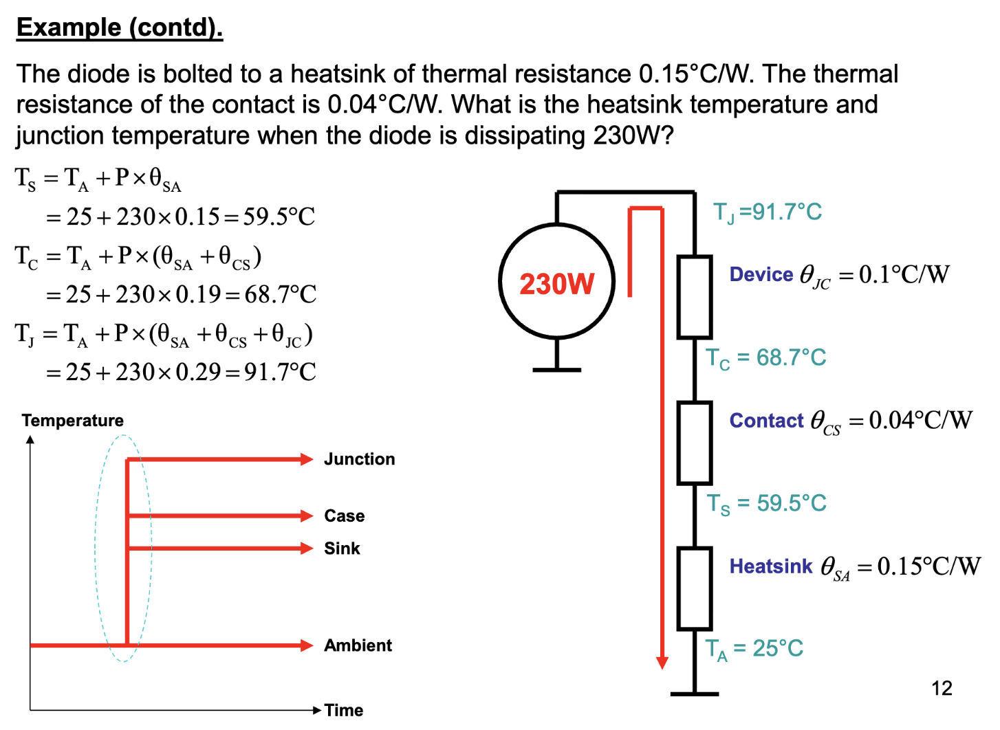

## 瞬态热分析

### RC 热路分析

大型散热器通常使用的是相当大块的铝块来制作，他们无法瞬间改变温度。这种热惯性可以被利用于限制短时间内的温升。这可以提供更经济的设计，或者在短时负载下获得更安全的余量。

对于这种情况，它的性质和电容相似，所以我们可以使用 **热容器 (thermal capacitor)** 来建模。热容器与散热器的热阻器并联连接。

> 诶话说难道比热容的热容就是这个热容——

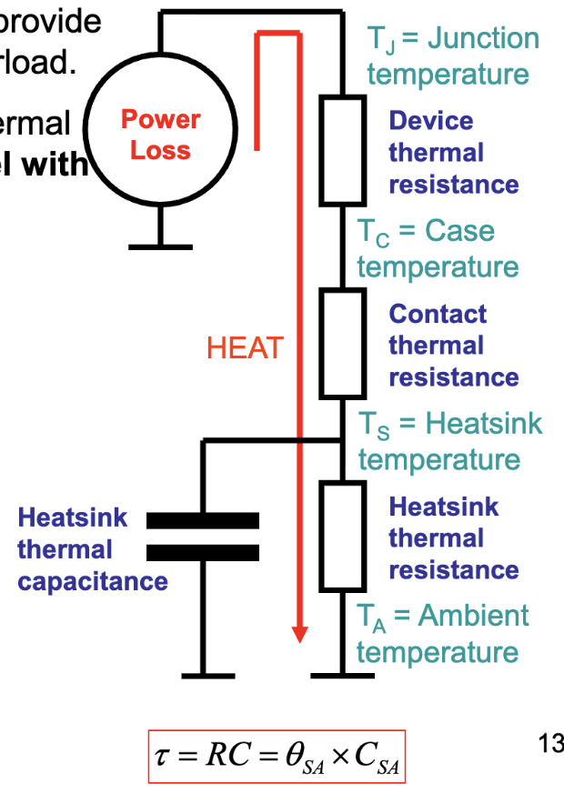

其他元件往往也有热容量，但是他们的值很小，所以我们忽略不计。图中的热容器和热阻器组成了 RC 热路，时间常数为

$$
\tau = RC = \theta_{SA} C_{SA}
$$

我们希望通过这个模型确定散热器温度上升的速率，作为散热器质量和输入功率的函数。

我们把 $T_{SS}$ 设定为散热器的 **稳态温度 (Steady-State Temperature)** ，那么和一阶滤波器类似，散热器温度的时间响应为

$$
T_\text{Actual} = T_\text{Final}\left(
  1-\exp(\frac{-t}{RC})
\right)
$$

因此，在经过了不同的时间常数后，变化量与总变化量的比例为

| 时间 $t$  | 变化量百分比 |
| --------- | ------------ |
| $0.5\tau$ | $39\%$       |
| $\tau$    | $63\%$       |
| $2\tau$   | $86\%$       |
| $3\tau$   | $95\%$       |
| $4\tau$   | $98\%$       |
| $5\tau$   | $99\%$       |

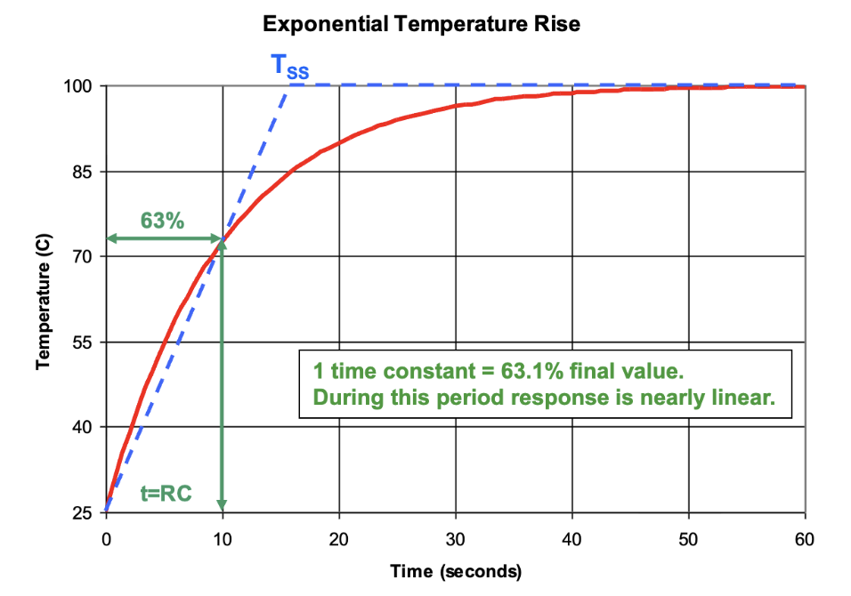

### 热容

**热容量 (thermal capacitance)** 是一个物体储存热量的能力，它的大小是 **比热容 (heat capacity)** 和物体质量的乘积

$$
C_{SA} (\degree C)=\text{Heat\ Capacity} (J/(kg\cdot \degree C)) \times \text{Mass} (kg)
$$

我们近似认为在第一部分的温升是线性的，并假设温升期间没有热量散失，则

$$
\theta_{SA} P = \Delta T = \frac{\text{Power}\times\text{Time}}{\text{Thermal\ Capacitance}}
$$

后半是瞬态温升低近似公式。

下图是之前的模型的温度响应曲线，其中结温度和外壳温度的热惯性很小，几乎瞬态上升。散热器温度上升较慢，有着明显的热惯性。

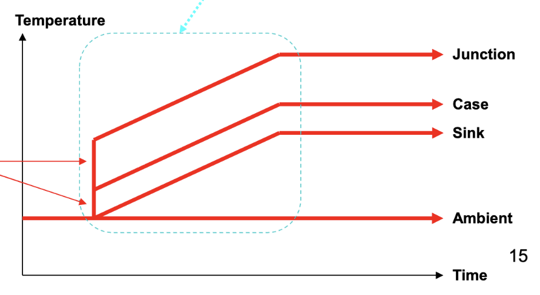

在 $t<\tau$ 的时候，可以假设温度上升为线性速率。此时温度变化速率受散热器质量的限制。

### 脉冲工作

散热器的瞬态操作 (Transient Operation) 需要小心处理，因为散热器的热容较大，冷却时间将比高功率耗散时的加热时间长的多。同时，还需要确保半导体设备不超过结温。

一种工作方式时脉冲工作方式，指的是器件周期工作，在一段周期内运行加热散热器，剩下的周期时间停止工作冷却散热器。如下图所示。

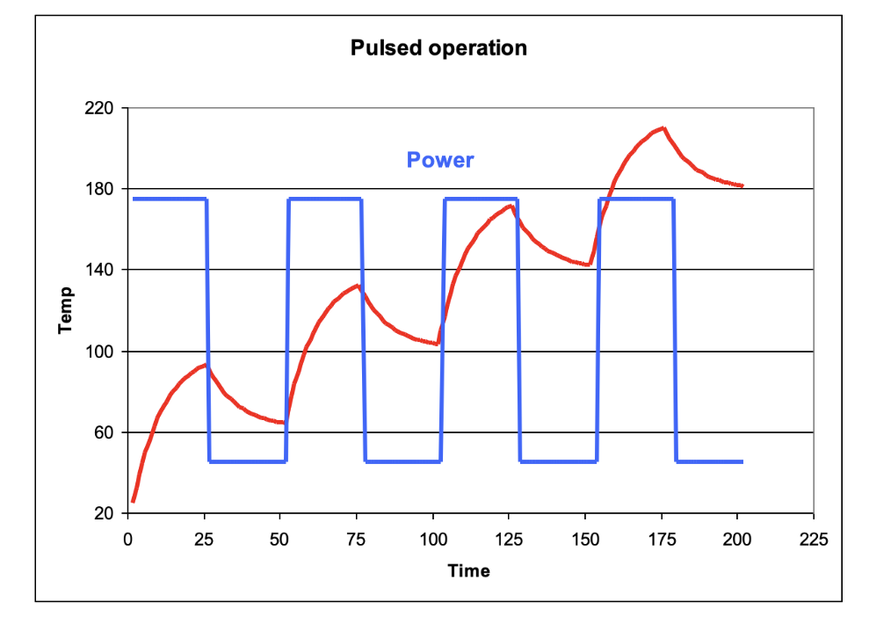

很显然，在脉冲工作中，器件最初可能正常，但是散热器的缓慢冷却意味着最大结温可能很快被超过。所以，在这种工作情况下，不能单独观察单个脉冲，而是要考虑多个脉冲的累积效应，使用足够的占空比。

在大部分情况下，这意味着 $冷却时间 > 加热时间$。

### 智能冷却风扇

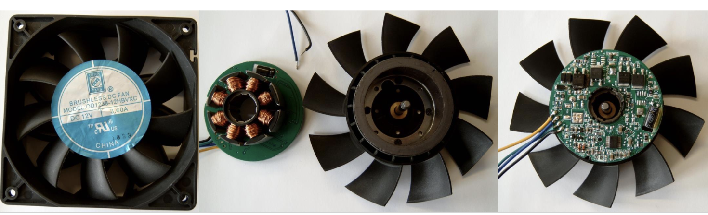

随着电子设备越来越多地融入家庭生活，噪音水平已成为一个大问题。散热的主要设备——风扇的接口也随着时间发生了变化

| 时代             | 接线方式            | 功能                                               |
| ---------------- | ------------------- | -------------------------------------------------- |
| 早期（2005年前） | 2根线（'+' 和 '-'） | 仅提供电源                                         |
| 高端PC/服务器    | 3根线               | 第3根线是转速输出（Tacho Output），每转提供2个脉冲 |
| 现代风扇         | 4根线               | 第4根线是PWM输入                                   |

三线风扇的目的是在风扇停转时可以获知并触发警报。四线风扇则是可以通过 PWM 的占空比来控制风扇转速，通过转速计提供反馈，进而实现精确的温度控制和噪音管理。

通常风扇的转速 RPM 与占空比是线性关系。

---

抛开噪音，风扇的功耗与转速的立方成正比

$$
Power \propto RPM^3
$$

因此较低转速的风扇在功耗方面更高效，且噪音更小。智能风扇控制系统可以根据温度需求动态调整风扇转速，以实现最佳的散热效果和最低的噪音水平。

计算机系统可以测量内部温度，只提供足够的散热保证内部在温度规格范围内。

---

例题

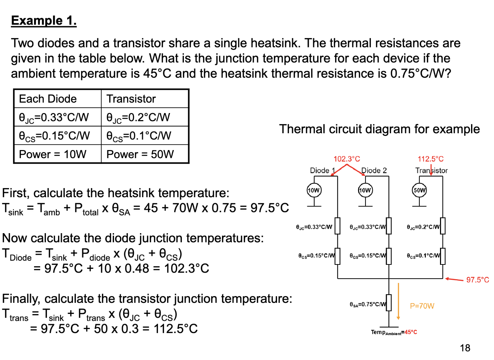

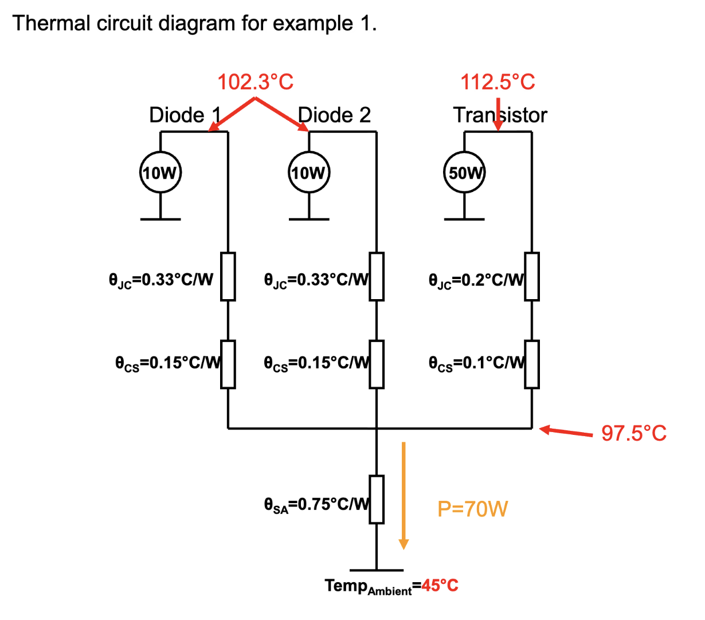

---

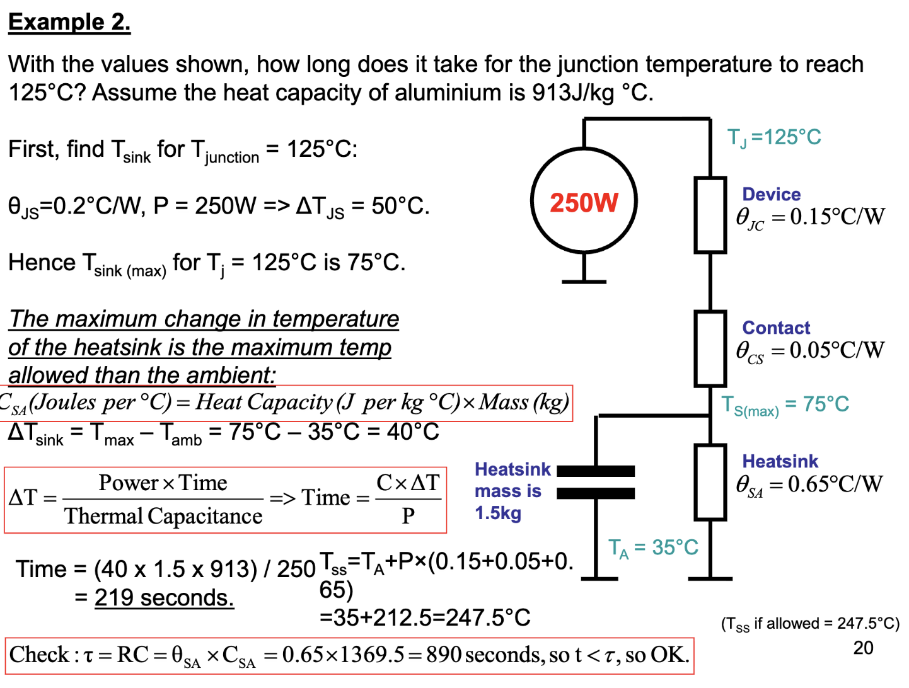

---

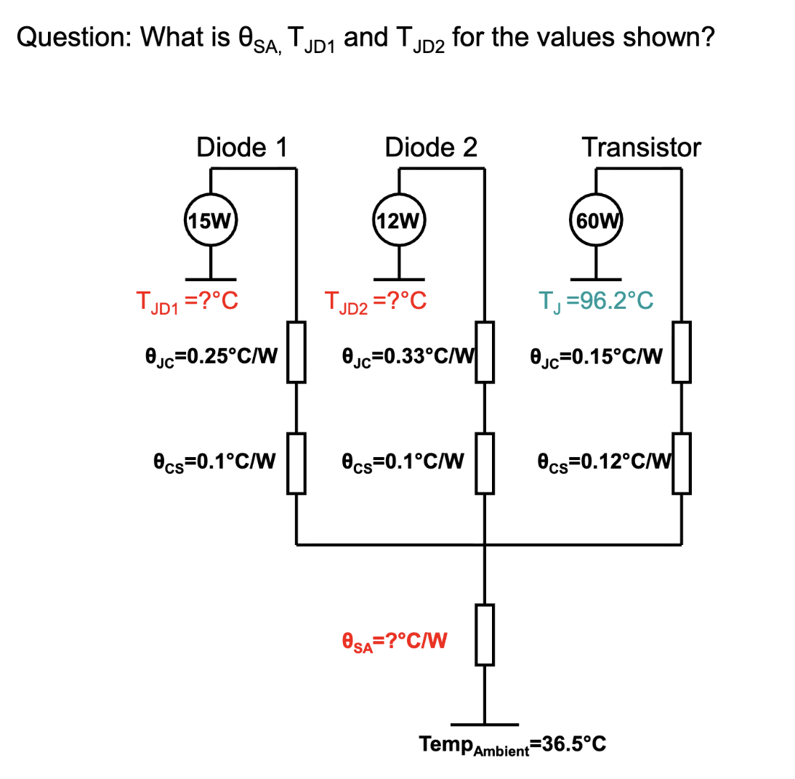

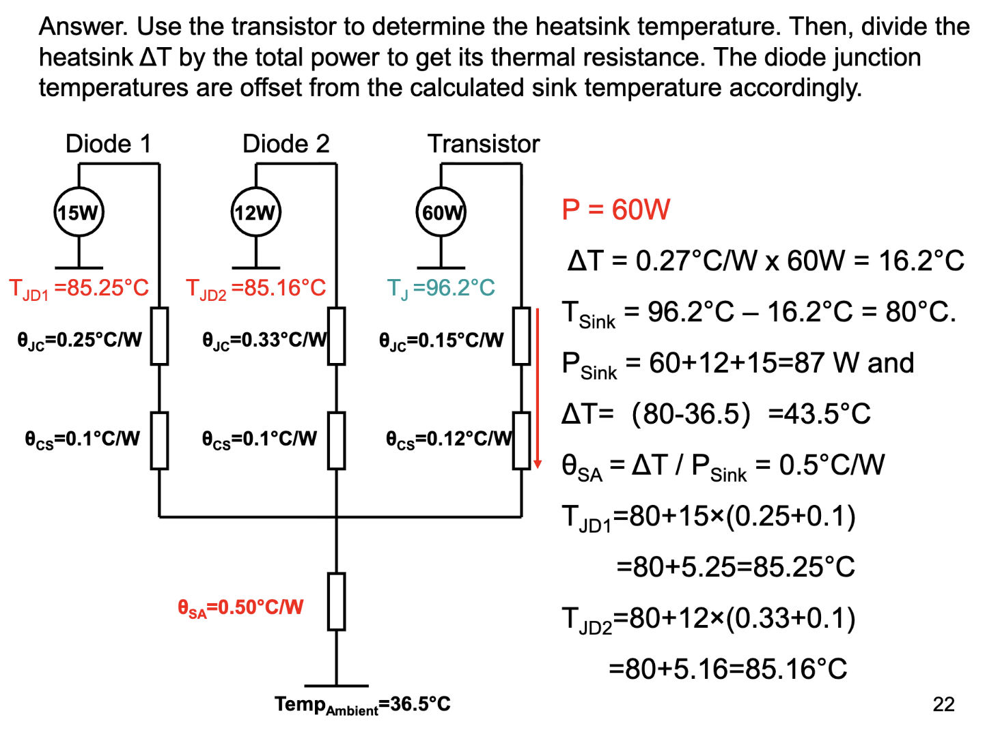

