# Lec.7 DC-DC 开关变换器 - I : 概念和 Buck 变换器

> **_Switched Mode DC-DC Converters - 1: Concepts and Buck Converter_**
>
> Lecture @ 2026-5-11

## 电感

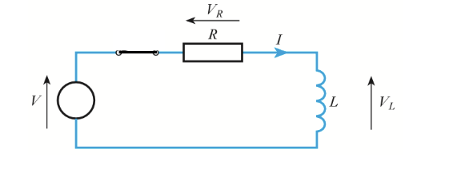

对于普通的 RL 电路，电压方程可以写成如下形式：

$$
V = V_R + V_L = iR + L \frac{di}{dt}
$$

当电阻的值足够小的时候，我们可以认为电阻上的分压值几乎不存在，也就是 $V_R \approx 0$，此时电压方程就可以简化为：

$$
V = L \frac{di}{dt}
$$

理想情况下，电阻压降可忽略，则电感两端电压近似恒等于电源电压，因此电流变化率是恒定的，不能突变。随着电流的上升，能量被存储到了电感中产生的磁场里。

当外加的电压消失时，电感试图维持其内部的电流大小不变，因此两端极性反转，在电压上会有一个反向的电压高峰，可能会损坏电路中的其他元件。

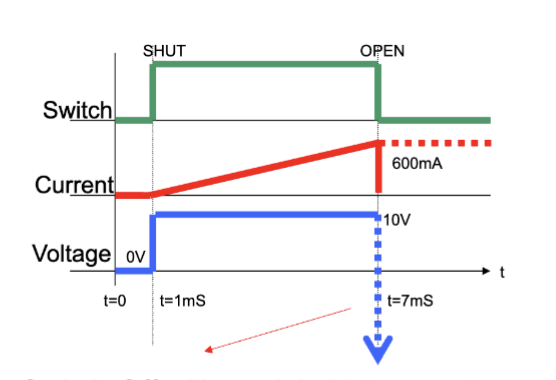

为了避免这种情况，我们可以在电感两端并联一个二极管作为电感在关断情况下的续流路径。这种二极管被称为续流二极管 (freewheeling diode) 或者反激二极管 (flyback diode)。

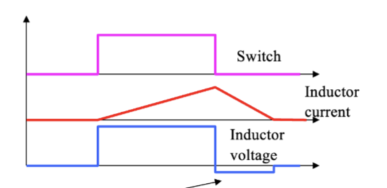

假设这里讨论的电感是一个理想电感，那么在电感被充能和放能的过程中，总能量是一定的。

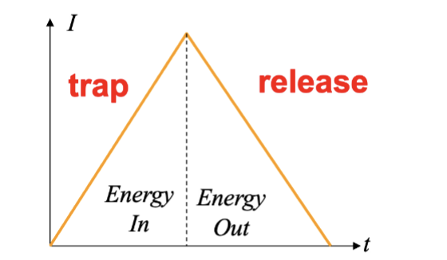

## DC-DC 变换器

### 为什么需要 DC-DC

在典型的电子设备——比如手机——中，电池电压需要被转换成多种不同的直流电压，供不同的元件使用，包括微处理器，显示屏，射频放大器和摄像头等。他们通常有着不同的电压大小要求，比如 $+5V$，$+3.3V$，$+1.8V$，如果是电脑电源的话甚至 $-5V$ 和 $+12V$ 等等。

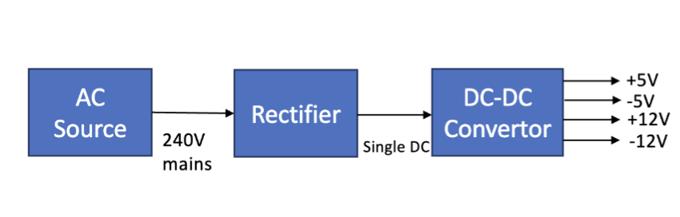

因此，我们需要一种高效的设备来提供直流之间的不同电压之间的转换，并且提供稳压效果。这就是 DC-DC 变换器的作用。

通常，这里的方案有

- 线性 DC-DC 变换器
- 开关型 DC-DC 变换器，或者叫做开关电源 (Switched Mode Power Supply, SMPS)

### 线性 DC-DC 变换器

线性变换器的方案是通过晶体管实现的。通常的方案是调节晶体管两端的电压，使得输出电压保持在一个恒定的值上。

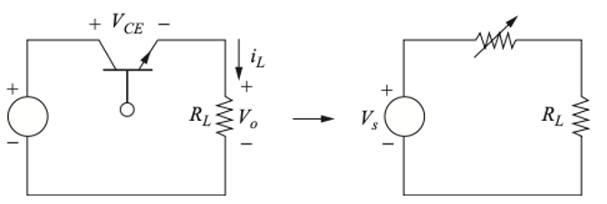

这种方案被称为线性 DC-DC 变换器或者线性稳压器 (Linear Regulator)。这个名称来源于它的工作原理：晶体管工作在线性区。

这种方案有很明显的缺点：效率较低。晶体管实际上是作为可调电阻接入电路的，因此会有输入电压和输出电压之间的压降加在晶体管上，导致功率损耗。换句话说，输出效率是

$$
\eta = \frac{P_o}{P_S} = \frac{V_o}{V_S}
$$

因此，需要探索更加高效的方案——也就是开关电源

### 开关模式 DC-DC 变换器 (SMPS)

在开关电源 (Switched Mode Power Supply, SMPS) 中，晶体管只有完全导通和完全截止的状态作为电子开关工作。

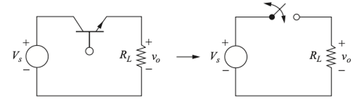

当认定输入是直流时，输出电压可以看作是一个 PWM 波形。如果通路时间为 $t_{on}$，关断时间为 $t_{off}$，那么可以认为占空比是

$$
D = \frac{t_{on}}{t_{on} + t_{off}}
$$

因此，平均输出电压可以表示为

$$
V_o = D V_S = \frac{t_{on}}{t_{on} + t_{off}} V_S
$$

因为在导通的情况下，晶体管的压降很小，所以效率可以非常高，理论上可以达到 100%。

> 当然直接输出 PWM 并不等于对应的 DC 电压，我们还需要一些滤波电路来平滑输出电压，去掉高频的纹波成分。这就是后面我们要介绍的 Buck 变换器了。

## 不同种类的 DC-DC 变换器

通常，开关电源有很多类型

- Buck 变换器：输出电压小于输入电压
- Boost 变换器：输出电压大于输入电压
- Buck-Boost 变换器：输出电压可以大于或者小于输入电压
- 反激变换器 (flyback converter)：输出电压可以大于或者小于输入电压，且具有电气隔离

不同类型之间的区别在于它们的电路结构不同，导致它们的工作原理和性能特点也不同。我们在后续的课程中会介绍这些不同类型的 DC-DC 变换器。

典型的开关电源块可以看作是这样的构型：可以看作是一个开关和一个包含电感的平均电路的组合。

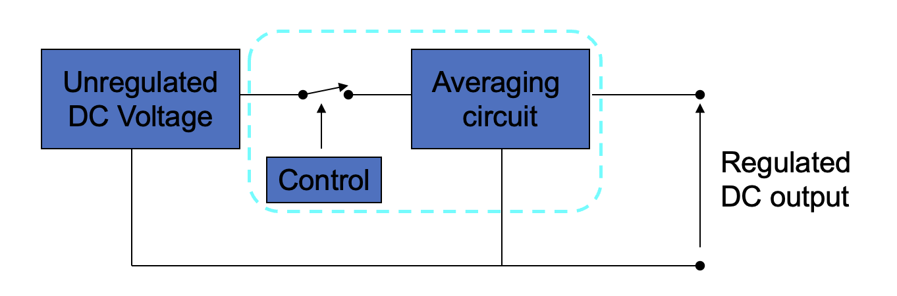

## Buck 变换器

### 电路原理

> 速通： [三分钟看懂！开关电源原理 Buck降压电路动画讲解！](https://www.bilibili.com/video/BV1QJSFBVEHu/?spm_id_from=333.337.search-card.all.click)

Buck 变换器的电路结构如下

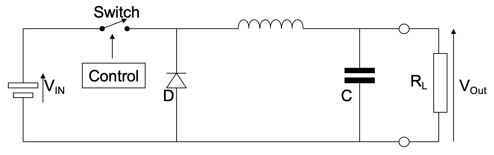

可以看到 Buck 降压变换器的基本结构是由一个开关，一个电容，一个电感和一个续流二极管组成的。

当开关闭合时，电流流过电感进入电容器，给电容器充电。此时二极管反向偏置，在理想情况下不导通任何电流。此时电流的变化率被电感限制，因此充电速率是恒定的。在特定时刻，开关断开，此时流过电感器的电流大小为 I ，能量存储在磁场中。

当开关断开时，为了维持电流的连续性，电感器两端的电压极性反转，二极管被正向偏置，导通电流。此时电流流过二极管进入电容器继续给电容器充电，同时也为负载供电。随着电感器中的能量下降，电流减小，直到下一个开关闭合时刻。

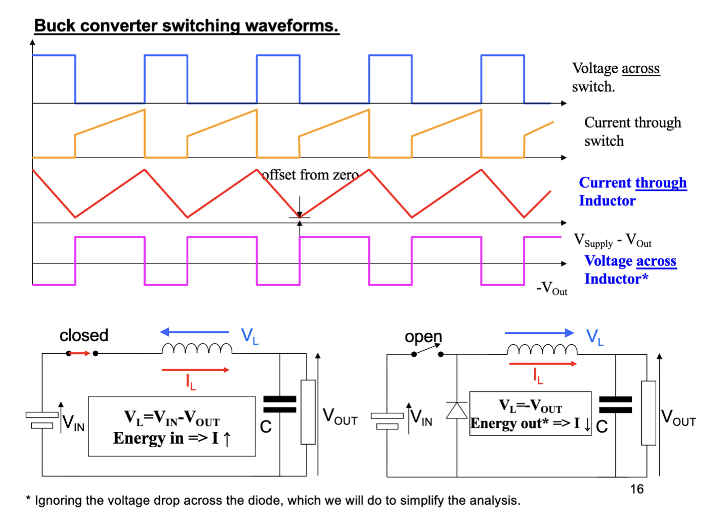

开关频率、电源电压、电感值都被选择为特定值，使得电感器中始终有电流流过。这被称为 **连续模式 (Continuous Mode)**，也就是电感器中的电流是连续的。

通常会把实现这个功能的一整套电路集成在一个芯片中，称为 Buck 变换器芯片。Buck 变换器芯片通常包含一个高效的开关，一个电压反馈控制电路，以及一些保护功能，比如过流保护和过热保护等。

### 输入输出关系

在 Buck 电路中，电感电压的积分等于电感中磁链的变化量。为了稳定周期运行，在一个周期内，电感电压的积分必须为零，也就是

$$
\begin{aligned}
  \int_0^T V_L dt &= 0 \\
  \int_0^{t_{on}} (V_i - V_o) dt + \int_{t_{on}}^T (-V_o) dt &= 0 \\
  V_i t_{on} - V_o t_{on} - V_o T + V_o t_{on} &= 0 \\
  V_i t_{on} & = V_o T
\end{aligned}
$$

也就是说， $V_o = D V_i$，其中 $D$ 是占空比。

---

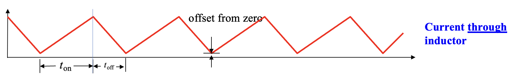

也可以从通过电感的电流大小来分析输入输出关系，具体的等量关系是

$$
V_L = L \frac{di}{dt} \Rightarrow \frac{di_L}{dt} = \frac{V_L}{L}
$$

当闭合开关时，有

$$
\frac{\Delta I_{L\ closed}}{t_{on}} = \frac{V_i - V_o}{L}
$$

同理，当开关断开时，有

$$
\frac{\Delta I_{L\ open}}{t_{off}} = \frac{-V_o}{L}
$$

因为电流具有周期性，也就是

$$
\Delta I_L = \Delta I_{L\ closed} + \Delta I_{L\ open} = 0
$$

化简，可以得到

$$
\frac{V_i}{V_o} = \frac{t_{on} + t_{off}}{t_{on}} = \frac{1}{D}
$$

因此，得到了相同的 $V_o = D V_i$ 的关系。

### 电感电流

基于上面的结论，我们可以计算出开关电源的输入输出功率

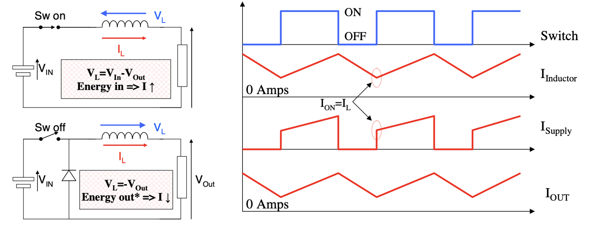

在理想情况下，电感和电容都不会损耗功率，二极管在导通时也没有压降，因此输入功率和输出功率是相等的，也就是效率为 100%，也就是

$$
V_o I_{o(mean)} = V_i I_{i(mean)}
$$

也就是有

$$
I_{o(mean)} = \frac{I_{i(mean)}}{D}
$$

假设输出负载为 $R$，则平均通过电感的电流为 $\frac{V_o}{R}$ 。考虑到非理想情况，则最大值和最小值可以写为

$$
\begin{aligned}
  I_{L(max)} &= I_{o(mean)} + \frac{\Delta I_L}{2} \\
  I_{L(min)} &= I_{o(mean)} - \frac{\Delta I_L}{2}
\end{aligned}
$$

这里的 $\Delta I_L$ 是电感电流的纹波大小，可以通过之前的等式计算出来。

### 纹波

在之前的计算中，我们假设了一个结论——电容器的电容是非常大的，也就是输出电压永远是稳定的。这个条件实际上只有在电容器的容值为无穷大的时候才能满足，在实际的电路中，电容器的容值是有限的，因此输出电压会有一个纹波成分。

$$
i_C = i_L - i_R \Rightarrow \Delta Q = C \Delta V_o
$$

进而推出

$$
\Delta V_o = \frac{T \Delta I_L}{8 C}
$$

根据我们对电感电流的计算，可以得到

$$
\Delta I_L = \frac{V_o}{L} t_{off}
$$

带入，可以表示为

$$
\frac{\Delta V_o}{V_o} = \frac{1-D}{8CLf^2}
$$

也就求出了对于 Buck 变换器来说，输出电压纹波和占空比、电容值、开关频率之间的关系。占空比越大，电容值越大，开关频率越高，输出电压的纹波就越小。

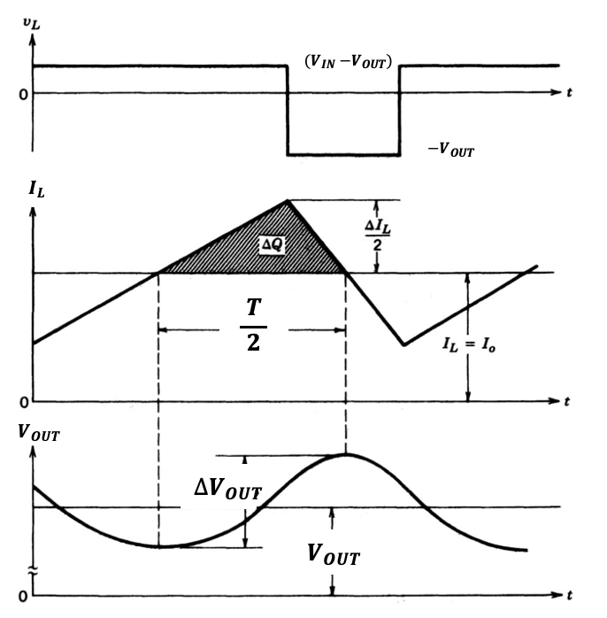

想做题就有做不完的题

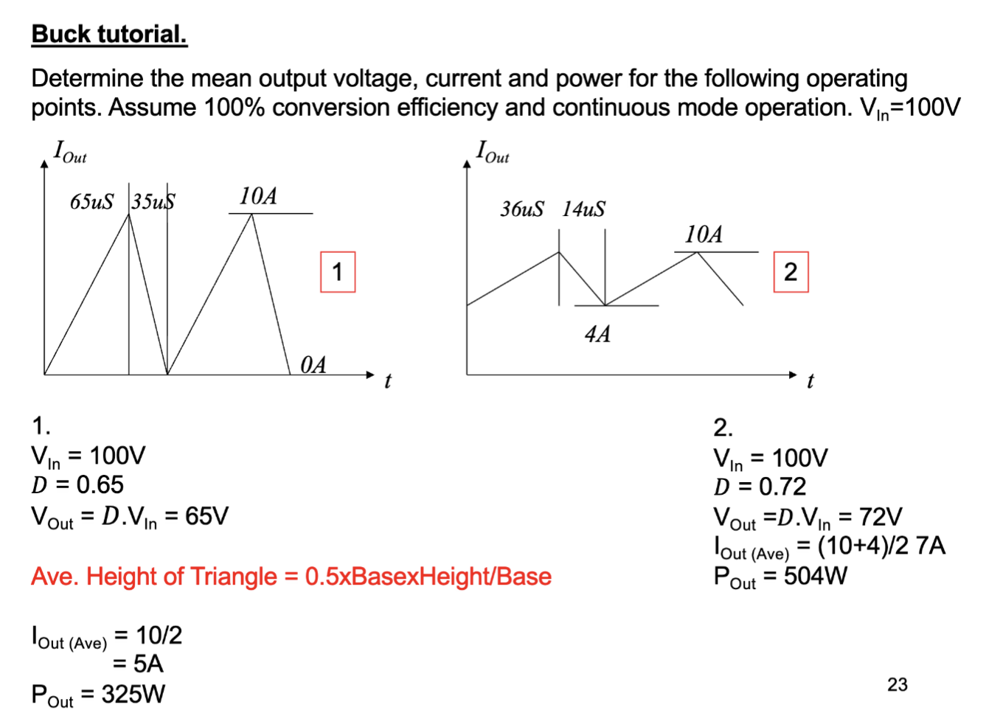

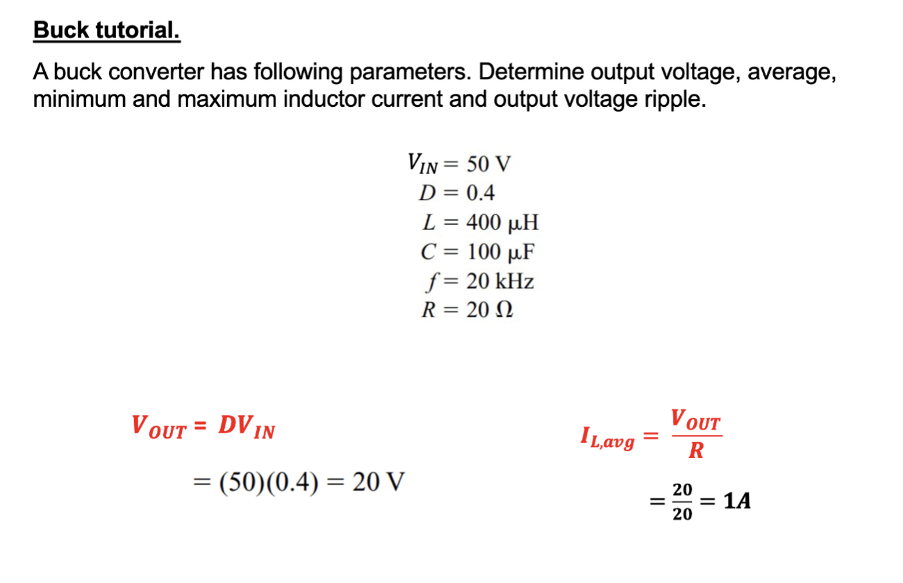

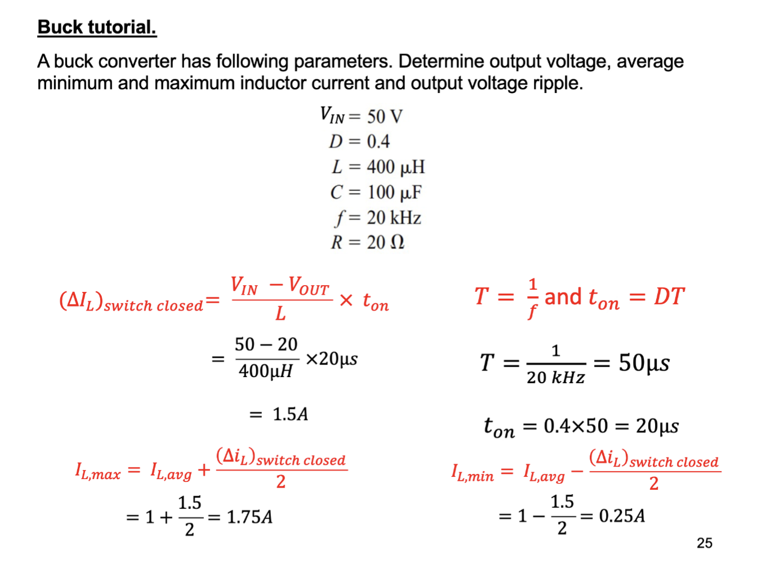

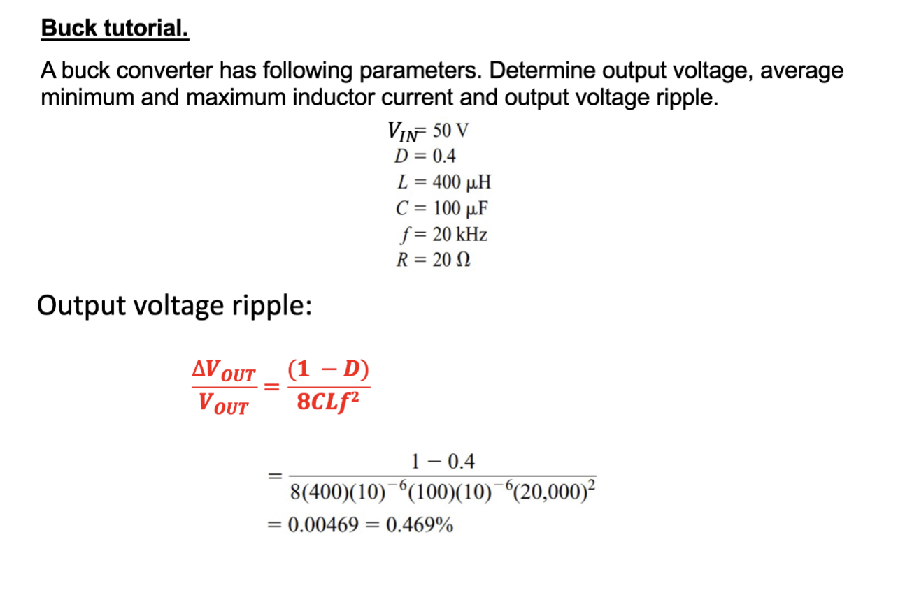

## 开关电源的优势和劣势

可以看到线性电源易于构建，但是效率很低，即使是中等规模的电源场景，开关电源的效率优势也可能相当显著

1. 效率更高，同等功率发热更低，需要更小的散热器
2. 通常不需要外加风扇主动散热
3. 功率密度更高，体积更小
4. 通常更轻

但是也有值得考虑的缺点

- 开关电源的电气噪音很大

更具体的说，开关电源的输出电压会高频变化，因此会向外辐射高频电磁波，造成辐射干扰。同时输出纹波可能会对外部敏感电路产生干扰，还会有传导噪声的问题。
