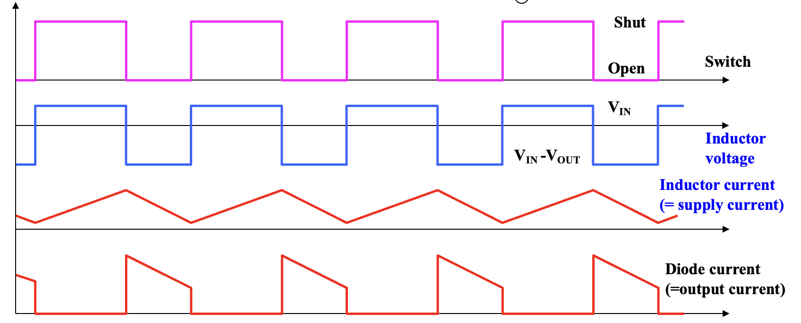
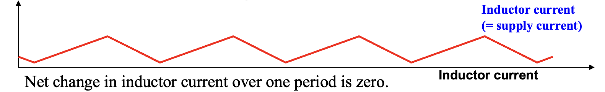

# Lec.8 DC-DC 开关转换器 - II : Buck 转换器 & Buck-Boost 转换器

> **_Switched Mode DC-DC Converters - 2: Boost Converter, Buck-Boost Converter_**
>
> Lecture @ 2026-5-11

## Boost 转换器

### 电路原理

Boost 转换器的电路图如下所示：

Boost 是一个升压转换器，用于将较小的输入电压 $V_{in}$ 转换成较大的输出电压 $V_{out}$。Boost 转换器的工作原理如下

假设电路工作在连续模式，也就是电流始终在电感器中流动。在理想情况下，也就是二极管没有压降，电感没有内阻，然后

- 当开关闭合时
  - 电容 $C$ 上的电压 (稳态工作时为 $V_{out}$) 使二极管工作在反向偏置状态，视为没有导通。
  - 电感器在包含电源的闭合回路中，因此电感器中的电流 $i_L$ 以恒定的速率增加，电感器中储存的能量也增加。也就是电感器被充电。
  - 此时电感器的极性是 $V_{in}$ 的正极连接到电感器的正极，负极连接到电感器的负极。
- 接着，当开关断开时
  - 电感器试着维持电流流动，放电，极性反转，电压上升，直到电源和电感器的总电压大小大于电容器上的电压 $V_{out}$，二极管导通，电流流过二极管进入电容器，电感器中的能量被转移到电容器中。

在整个循环过程中，各个参数是这样变化的

开关定时开启和关断，对应电感器的极性变化、电感器的电流变化方向、二极管的导通状态变化等。

### 输入输出关系

因为电感等电压等积分等于电感的磁通量的关系，我们可以得到在一个周期内电感器两端的电压积分为零。这是稳态工作时的条件。也就是说

$$
\begin{aligned}
  \int_0^T V_L(t) dt &= 0 \\
  \int_0^{t_{on}} V_{in} dt + \int_{t_{on}}^T (V_{in} - V_{out}) dt &= 0 \\
  V_{in} - V_{out} &= - V_{out} D \\
  V_{in} &= V_{out} (1 - D) \\
  V_{out} &= \frac{V_{in}}{1 - D}
\end{aligned}
$$

因此，输入和输出电压的关系为 $V_{out} = \frac{V_{in}}{1 - D}$，其中 $D$ 是占空比。

---

类似的，我们也可以通过每个周期结束后通过电感的电流大小应该保持不变来分析输入输出关系。具体的等量关系是

$$
v_L = L \frac{d i_L}{dt} \Rightarrow \frac{di_L}{dt} = \frac{v_L}{L}
$$

接着考虑通断两个状态下的电流变化

$$
\begin{aligned}
  \frac{\Delta i_{L\ closed}}{t_{on}} = \frac{V_{in}}{L} &\Rightarrow \Delta i_{L \ closed} = \frac{V_{in} t_{on}}{L} \\
  \frac{\Delta i_{L\ open}}{T - t_{on}} = \frac{V_{in} - V_{out}}{L} &\Rightarrow \Delta i_{L \ open} = \frac{(V_{in} - V_{out})(T - t_{on})}{L}
\end{aligned}
$$

根据等量关系，有

$$
\Delta i_L = \Delta i_{L\ closed} + \Delta i_{L\ open} = 0
$$

带入，可以得到

$$
V_{out} = V_{in} \frac{T}{T-t_{on}} \Rightarrow V_{out} = \frac{V_{in}}{1 - D}
$$

也就得到了相同的输入输出关系 $V_{out} = \frac{V_{in}}{1 - D}$。

### 电感电流

类似的，假设 Boost 转换器是一个理想电路，也就是输入输出功率相等 $P_{in} = P_{out}$，可以得到

$$
\begin{aligned}
  V_{in} I_{L,avg} &= V_{out} I_{out} \\
  V_{in} I_{L,avg} &= \frac{V_{out}^2}{R} \\
  V_{in} I_{L,avg} &= (\frac{V_{in}}{1-D})^2 \frac{1}{R} \\
  I_{L,avg} &= \frac{V_{in}}{(1-D)^2 R} \\
\end{aligned}
$$

因此电感电流的平均电流为 $I_{L,avg} = \frac{V_{in}}{(1-D)^2 R}$。然后加上输入输出关系里求出来的单周期内的电流变化量，可以得到电感电流的最大值和最小值为

$$
\begin{aligned}
  I_{L,max} &= I_{L,avg} + \frac{\Delta i_{L\ closed}}{2} = \frac{V_{in}}{(1-D)^2 R} + \frac{V_{in} t_{on}}{2L} \\
  I_{L,min} &= I_{L,avg} - \frac{\Delta i_{L\ closed}}{2} = \frac{V_{in}}{(1-D)^2 R} - \frac{V_{in} t_{on}}{2L}
\end{aligned}
$$

### 输出电压纹波

假设通过二极管的电流的所有纹波分量都流过了电容器，而平均值流过负载电阻，即有

$$
i_C = i_L - I_R
$$

然后

$$
\begin{aligned}
  & \Delta Q = C \Delta V_{out} = C \frac{\Delta V_{out}}{C} \\
  \Rightarrow\ & \Delta V_{out} = \frac{I_o t_{on}}{C} = \frac{V_{out} t_{on}}{RC} \\
  \Rightarrow\ & \frac{\Delta V_{out}}{V_{out}} = \frac{DT}{RC}
\end{aligned}
$$

因此，纹波电压和输出电压的关系为 $\frac{\Delta V_{out}}{V_{out}} = \frac{DT}{RC}$。

> [!NOTE]
>
> Work In Progress, to be continued.
