# Lec.9 DC-DC 开关变换器 - III: 反激变换器和缓冲电路

> **_Flyback Converter and Snubber Circuit_**
>
> Lecture @ 2026-5-14

## 反激 (Flyback) 变换器

### 工作原理

在之前提到的 Buck-Boost 变换器中，我们得知 Buck-Boost 变换器可以通过占空比产生电压大小高于或者低于输入电压、极性相反的输出电压。

问题在于，在这种情况下输入和输出之间没有电气隔离。如果我们需要在输入和输出之间提供电气隔离，则需要使用其他的方法。

---

**反激变换器 (Flyback Converter)** 就是其中的一种方案。反激变换器的电路图如下所示：

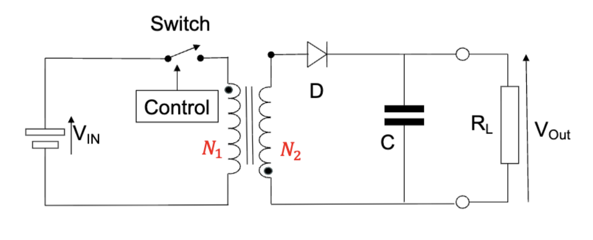

> 变压器两侧用了 **点标记法(dot convention)** 来标记极性关系，表示的是当电流流入初级点位端时，次级绕组两侧的电压极性和初级点位端相同或者相反。

反激变换器的原理和 Buck-Boost 变换器的原理类似，但是在其中添加了一个变压器作为电感，进而实现了电气隔离。

这里认为初级绕组的匝数是 $N_1$，电感是 $L_p$，次级绕组的匝数是 $N_2$，电感是 $L_s$。

- 当开关闭合时，电流在初级绕组上从初始值线性增加，进而磁芯磁通量从初始值线性增加。此时因为次级绕组的极性，次级绕组中没有电流流动
- 当开关断开时，初级绕组电感器两端的电压反向。因此次级绕组的极性相反，二极管导通，电流因为磁芯中存储的能量而流动。

因此，与普通的 Buck-Boost 变换器不同，线圈匝数比也会影响输入输出电压的关系。

### 输入输出关系

电感电压的积分等于电感的磁链的变化量，而在一个重复周期内，磁链的变化量为零，因此可以得到输入输出关系：

$$
\begin{aligned}
  \int_0^T V_{L,\mathrm{primary}} dt &= 0 \\
  \int_0^{t_{on}} V_{in} dt + \int_{t_{on}}^T \left(-\frac{N_1}{N_2} V_{out}\right) dt &= 0 \\
  V_{in} t_{on} - \frac{N_1}{N_2} V_{out} (T - t_{on}) &= 0 \\
  V_{in} DT &= V_{out} \frac{N_1}{N_2}(T-DT) \\
  V_{out} &= V_{in} \frac{D}{1-D} \frac{N_2}{N_1}
\end{aligned}
$$

因此，最终的输入输出关系为

$$
V_{out} = V_{in} \frac{D}{1-D} \frac{N_2}{N_1}
$$

---

和之前的几种 DC-DC 变换器一样，反激变换器也工作在连续情况下，也可以通过电流的周期性来分析输入输出关系。

$$
V_L = L \frac{di}{dt} \Rightarrow \frac{di_L}{dt} = \frac{V_L}{L}
$$

然后考虑开关闭合和断开两种状态下的电流变化：

$$
\begin{aligned}
  \frac{\Delta i_{L,\mathrm{closed}}}{t_{on}} = \frac{V_{in}}{L_p} \\
  \frac{\Delta i_{L,\mathrm{open}}}{T - t_{on}} = \frac{V_{out}}{L_s}
\end{aligned}
$$

同时，因为周期电流变化量为 0，

$$
\begin{aligned}
  \Delta i_{L,\mathrm{closed}} + \Delta i_{L,\mathrm{open}} &= 0 \\
  \frac{V_{in} DT}{L_p} - \frac{V_{out} N_1 T(1-D)}{N_2 L_p} &= 0 \\
\end{aligned}
$$

进而化简，可以得到

$$
V_{out} = V_{in} \frac{D}{1-D} \frac{N_2}{N_1}
$$

### 电感电流

同样的，根据理想情况下的功率关系（变压器、二极管、电容都是理想的情况下没有功率耗散），有

$$
V_{in} I_{in} = V_{out} I_{out}
$$

代入 $V_{out}$ 的表达式以及负载为 $R$ 的欧姆定律，可以算出来平均电流

$$
\begin{aligned}
  I_{Lp,avg} &= \frac{V_{out}^2}{V_{in} DR} \\
  &= \frac{V_{in}}{R} \frac{D}{(1-D)^2} (\frac{N_2}{N_1})^2
\end{aligned}
$$

同理，我们之前计算单位周期内电感电流的变化量，可以得到电感电流的最大值和最小值

$$
\begin{aligned}
  I_{Lp,\max} = I_{Lp,avg} + \frac{\Delta i_{L,\mathrm{closed}}}{2} &= \frac{V_{in}}{R} \frac{D}{(1-D)^2} (\frac{N_2}{N_1})^2 + \frac{V_{in} DT}{2 L_p} \\
  I_{Lp,\min} = I_{Lp,avg} - \frac{\Delta i_{L,\mathrm{closed}}}{2} &= \frac{V_{in}}{R} \frac{D}{(1-D)^2} (\frac{N_2}{N_1})^2 - \frac{V_{in} DT}{2 L_p}
\end{aligned}
$$

### 输出电压纹波

其实这里的输出电压纹波关系和 Buck-Boost 变换器的关系是一样的。在反激变换器中，二极管导通时电流流过电容器，二极管截止时电流不流过电容器。

复用一下结论

$$
\frac{\Delta V_{out}}{V_{out}} = \frac{DT}{RC}
$$

## 缓冲电路

缓冲电路的功能是降低电力电子变换器在开关过程中对器件施加的电气应力，使其处于器件的电气额定值范围内。

这并不是电力电子变换器的基本组成部分，而是外部补充，主要目的是降低功率半导体器件的应力。

### 功能与分类

缓冲电路通常提供这些功能

- 在关断瞬态期间限制器件的电压
- 在导通瞬间限制器件电流
- 限制半导体器件在导通时的电流上升率
- 限制半导体器件在关断时的电压上升率
- 在器件导通/关断时塑造其开关轨迹

通常，在电路拓扑上，缓冲电路主要分为三大类

- **无极性串联 RC 缓冲电路**
  - 通常用于保护二极管和晶闸管
  - 用于抑制振铃效应
- **极性 RC 缓冲电路**
  - 用作关断缓冲电路，塑造可控开关的关断开关轨迹，在器件关断期间限制电压上升率
  - 用作过电压缓冲器，将施加在受控开关的电压钳位到安全值
- **极性 LR 缓冲电路**
  - 用作导通缓冲器，以塑造受控开关的开通开关轨迹
  - 限制器件导通期间的电流上升率

### 振铃效应

在实际的电子开关的端子之间存在寄生电容，而电路板的走线会在元件之间引入杂散电感，因此会在电路中形成 LC 谐振回路。

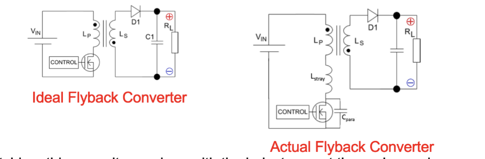

因此，在开关过程中，电感与电容以无阻尼谐振频率发生振铃。频率为

$$
f_o = \frac{1}{2\pi \sqrt{LC}}
$$

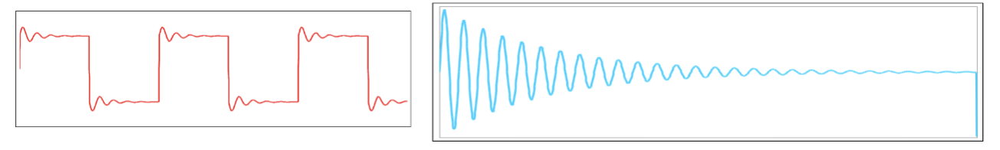

这个效应就叫做 **振铃效应 (Ringing Effect)**

在寄生电路中，通常电阻非常低，无法有效耗散振荡器中的能量，因此振荡可以持续相当多的周期。

### 非极性串联 RC 缓冲电路

对应地，缓冲器被引入电路中来防止电路在开关过程中产生振铃。也就是如下图所示

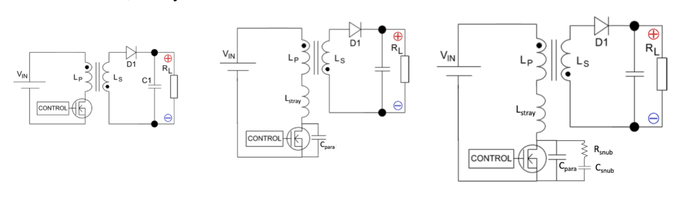

> 理想电路 (左一)；实际电路 (左二)；添加缓冲电路后的电路 (右)

此时，如果设计得当，RC 缓冲器将会抑制振铃并限制开关过程中的过冲。通常

- 当缓冲电容是寄生电容的三倍时，可以获得最佳性能
- 使用的电阻大小等于未修改的谐振电路的特征阻抗
  - 具体的计算方式是 $R_{snub} = \sqrt{\frac{L_{stray}}{C_{para}}}$

我应该不用继续说这是什么了

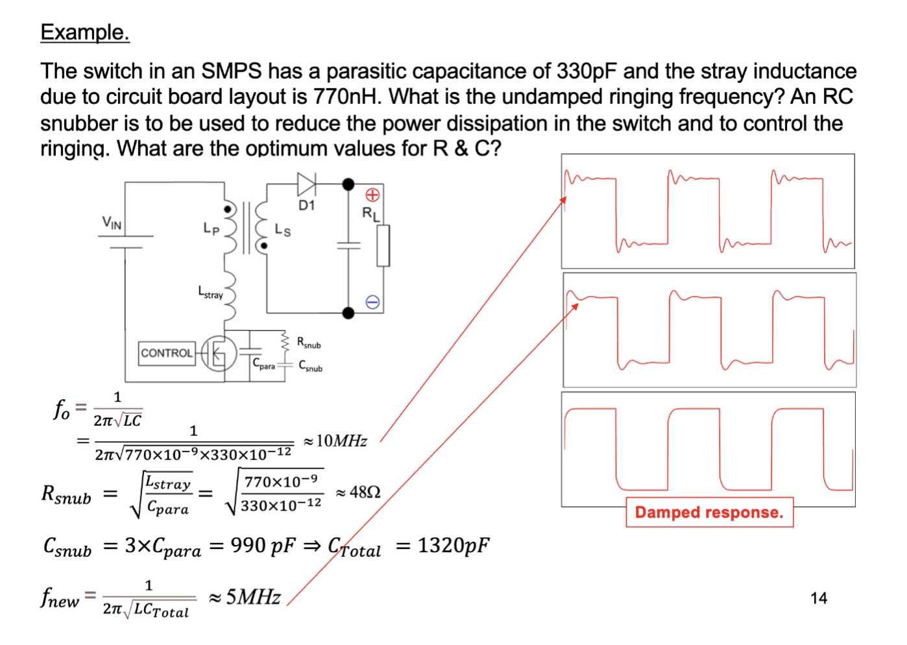

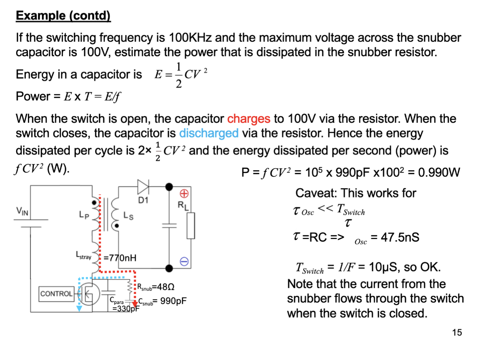

### 极性 RC 缓冲电路 (关断缓冲器)

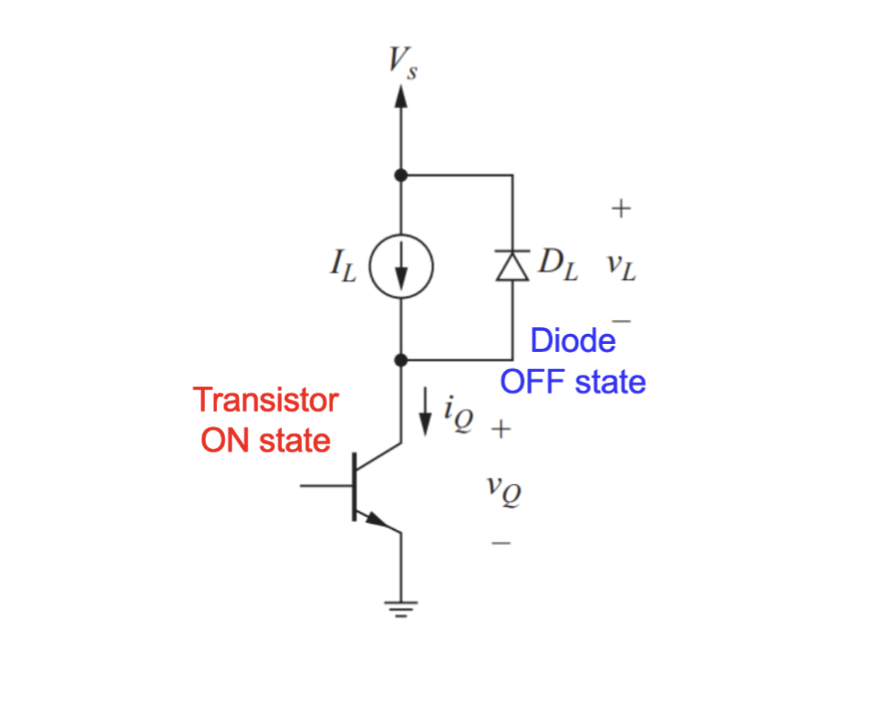

这是关断期间的电路等效图。此时，电感等效一个电流源，二极管反向偏置，三极管处于导通状态。此时，在关断过程中，会有一段三极管上电压上升，通过电流下降的过程，进而产生一个功率峰值。

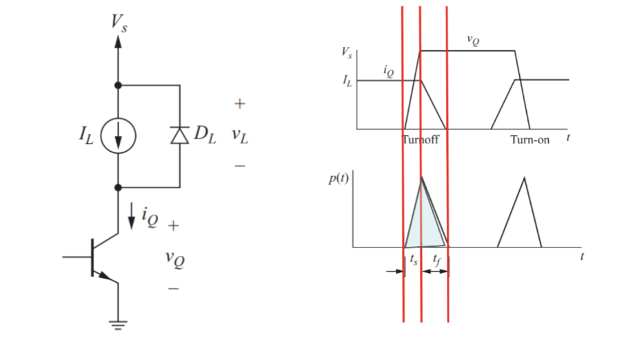

为了解决这个功率峰导致的器件损坏和发热问题，可以引入一个关断缓冲器来限制，如图所示

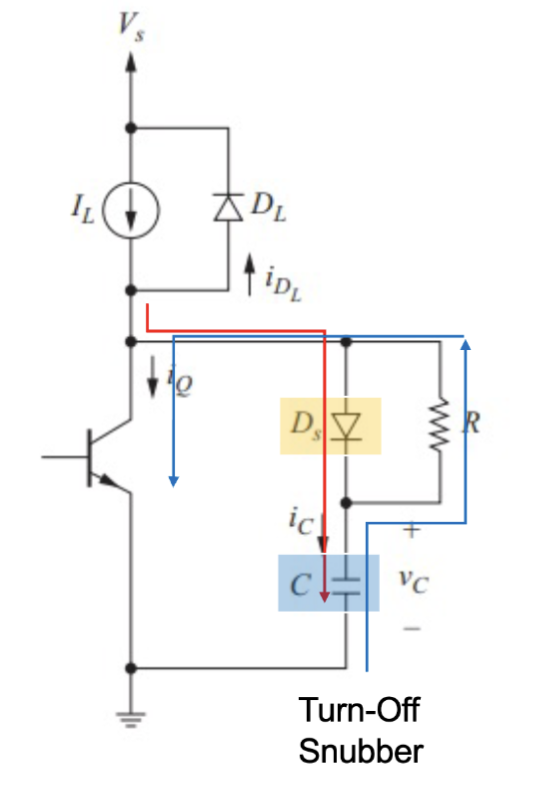

缓冲电路在关断过程中为负载电流提供了另一条路径。

- 随着晶体管的两端电压的上升，缓冲二极管 $D_s$ 正向偏置，电容开始充电
- 电容器降低了晶体管两侧电压变化率，进而延迟了电压从低到高的过渡过程
- 最终电容器充电至晶体管两端的最终关断电压，并在晶体管关断期间保持充电状态。
- 当晶体管导通时，电容器通过缓冲电阻和晶体管放电。

最终，在这一个周期内，原本在三极管上产生的功率被转移到了电阻 $R$ 中，而后者更容易散热。

对的，还是问题

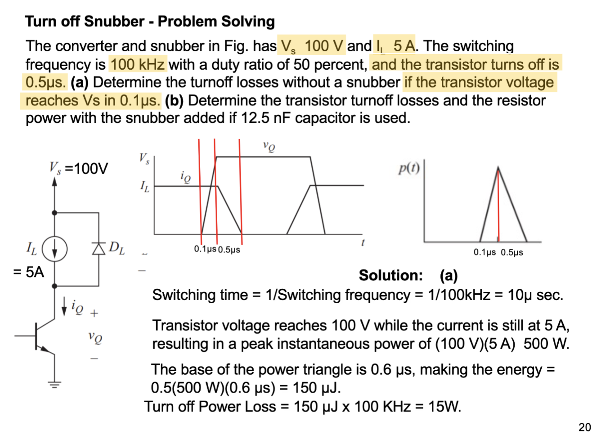

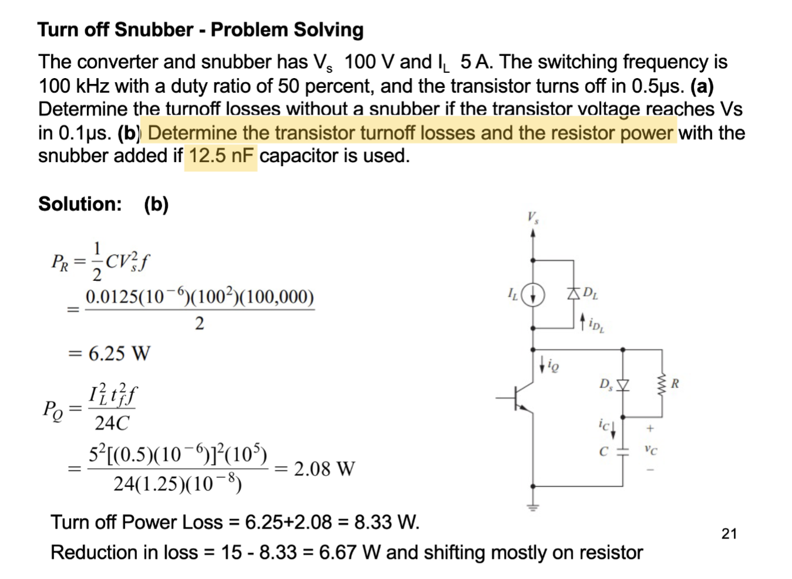

### 极性 RL 缓冲电路 (导通缓冲器)

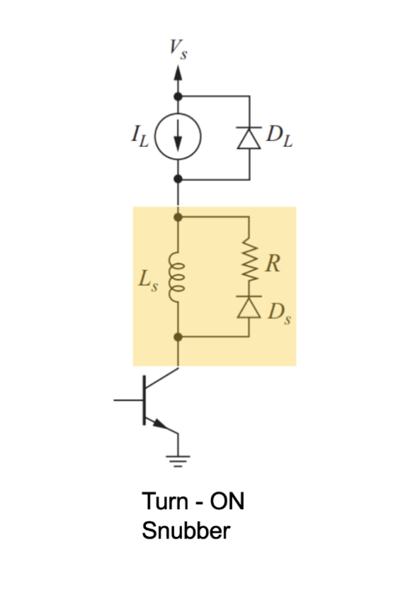

导通缓冲电路可以保护器件在导通过程中免受高电压和高电流同时作用的影响。和关断缓冲电路类似，导通缓冲电路的目的也是通过改变电压-电流波形进而产生功率损耗。

与晶体管串联的电感可以减缓电流上升速率，并能够减少高电流和高电压的重叠。缓冲二极管 $D_s$ 在导通期间处于关断状态，此时存储在缓冲电感器中的能量在电阻器中耗散。

具体来说

- 当导通时，随着晶体管两端电压的下降，缓冲二极管 $D_s$ 反向偏置，电感器开始充电
- 电感 $L_s$ 限制了电流上升率，电源电压分摊在晶体管和电感上
- 当晶体管完全导通后，电感电流稳定在负载电流，能量储存在电感中
- 当晶体管关断时，电感电压反向，$D_s$ 正偏导通，电感储能通过 $D_s$ 和电阻释放

还是问题

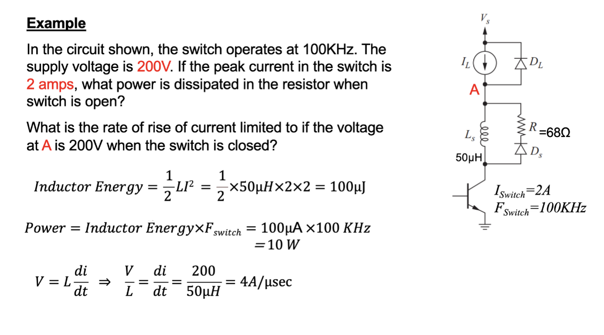

### 缓冲电路总结

如果同时把我们之前提到的极性 RC 缓冲电路和极性 RL 缓冲电路都引入到电路中，那么我们就可以同时限制器件在导通和关断过程中的电压和电流应力，进而保护器件的安全。具体等效电路长这样

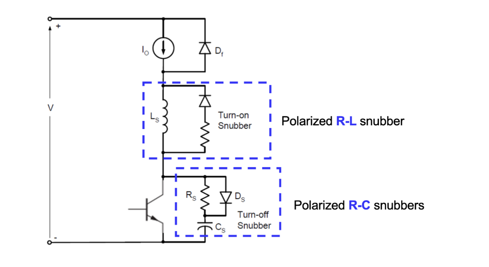

### 取舍和设计原则

设计缓冲电路时，有几个关键点需要注意

- 调整缓冲电路总是需要一定程度的实验，直接精密设计是不可能的

  > 但是可以预测所需功能

- 最终的电路可能是一个折衷方案——一个用于控制关断电压尖峰的容性缓冲电路可能会在导通时引起电流尖峰；同样，控制电流尖峰可能会在另一个边沿引入电压尖峰

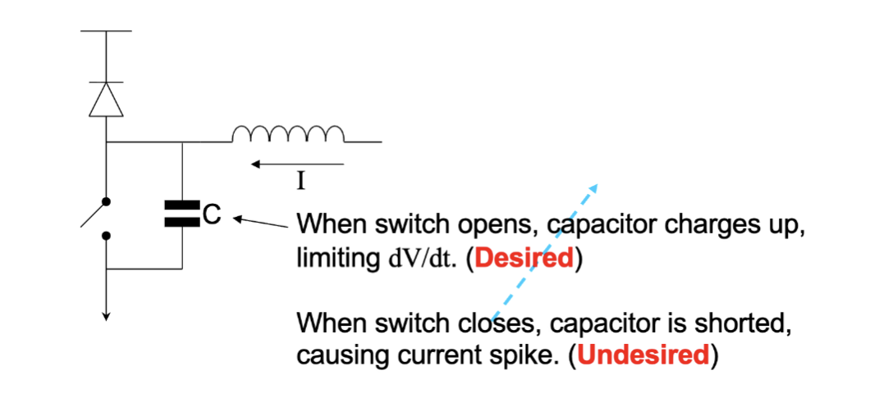
